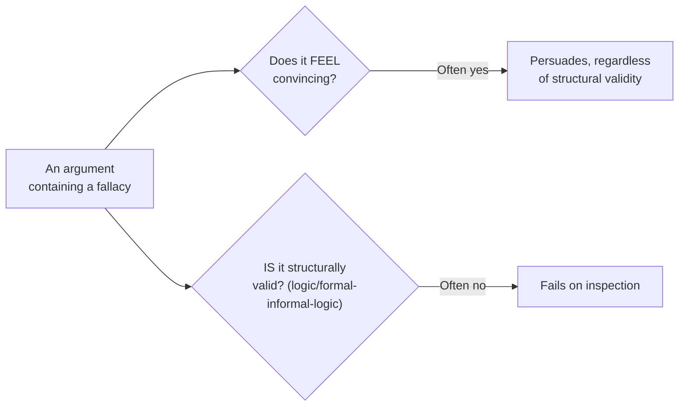

## Why fallacies work even on careful people



Validity (covered in `logic/formal-informal-logic`) and persuasiveness are separate axes — that's precisely why fallacies are worth memorizing by name: they're the specific, recurring shapes that land in the top-left of this diagram (invalid, but persuasive) often enough that recognizing the pattern on sight is more reliable than re-deriving from scratch each time why a given argument feels off.

## Five patterns, with real engineering-context examples

| Fallacy                       | The move                                                                        | Engineering example                                                                                                  |
| ----------------------------- | ------------------------------------------------------------------------------- | -------------------------------------------------------------------------------------------------------------------- |
| False dichotomy               | Presenting two options as exhaustive when others exist                          | "If it's not the database, it must be the network" — ignores app code, caching, client behavior                      |
| Straw man                     | Refuting a distorted, weaker version of the actual position                     | "So you're saying we should never write tests?" in response to "this specific test is low-value"                     |
| Ad hominem                    | Attacking the person instead of the claim                                       | "Of course you'd defend microservices, you championed that migration" — doesn't address whether the claim is correct |
| Appeal to authority (misused) | Citing authority in an unrelated domain as if it settles this claim             | "She's a brilliant systems architect, so her opinion on the onboarding UX is correct"                                |
| Slippery slope                | Claiming a bounded first step inevitably cascades, with no real mechanism shown | "If we approve one exception to the style guide, we'll have no style guide at all"                                   |

Every example is a real, common shape of technical-discussion argument — not an abstract logic-textbook case — because these patterns show up in code review threads, incident retros, and architecture debates at least as often as in formal debate.

## False dichotomy, made checkable

The false-dichotomy pattern is directly related to the truth-table validity checker from `logic/formal-informal-logic` — it's about whether a _claimed_ set of possibilities is actually the _complete_ set:

```js
// possibility-space.mjs — models "is this dichotomy actually exhaustive?"
function isFalseDichotomy(claimedOptions, actualPossibilities) {
  // A dichotomy is false if the actual possibility space contains
  // something not covered by what was claimed as "the only two options."
  return actualPossibilities.some((p) => !claimedOptions.includes(p));
}

const claimed = ["database", "network"];
const actual = [
  "database",
  "network",
  "application code",
  "client cache",
  "third-party API",
];

console.log(isFalseDichotomy(claimed, actual)); // true — three real possibilities were excluded
```

This isn't a claim that every either/or statement is a fallacy — genuine dichotomies exist ("the deploy either succeeded or it didn't"). The fallacy is specifically presenting an _incomplete_ possibility space _as if_ it were exhaustive, and the check is always the same: can you name a third option the claim silently excluded? If yes, the dichotomy was false; if the space genuinely only has two members, it wasn't a fallacy at all.

## Why naming the pattern is the practical payoff

Saying "that feels like a straw man" is a vague objection the other person can dismiss. Saying "the position you're refuting isn't the one I stated — I said this specific test is low-value, not that we should never test" restates the real position and names exactly where the distortion happened. The name is a shortcut to a precise, specific correction, not a label for its own sake.
