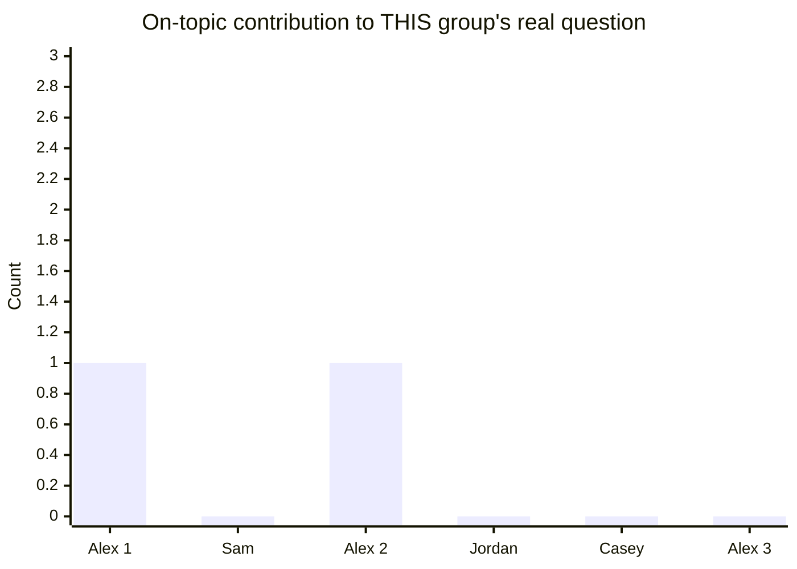

import Scenario from "../../../components/Scenario.astro";

<Scenario label="The scenario">
  <Fragment slot="facts">
    

      

        4 of 6
        showed up last Friday
      

      

        

      

    

    

      
💼 One friend had a work deadline

      
😅 One friend just forgot

      
🎲 One year of weekly game night, unbroken until now

    

  </Fragment>

Six friends have run a weekly Friday game night for over a year. Last week
two people missed it, dropping attendance to 4 of 6. Someone posted "either
we commit every week, or admit it's over" in the group chat. What follows is
what actually got typed in response, before anyone stepped back to ask what
was really being argued.

</Scenario>

## The thread

A real-shaped group-chat disagreement, annotated line by line — every fallacy here is the kind that reads as reasonable in the moment and only looks obviously flawed once named:

> **Alex:** "Either we commit to showing up every single week from now on, or we admit game night is basically over." _(False dichotomy — "commit every week" and "admit it's over" aren't the only two options; a reminder text, rotating who hosts, or just accepting the occasional miss are all real alternatives the framing excludes.)_
>
> **Sam:** "So you want us to guilt-trip anyone who's ever busy or sick?" _(Straw man — Alex proposed committing or quitting, not guilt-tripping anyone. Responding to an extreme, easier-to-attack version is easier than engaging the actual claim.)_
>
> **Alex:** "That's not what I said. I just think we need to actually decide something instead of letting it fade out." _(Correctly restates the real position — this is the actual fix for a straw man: name the real claim precisely, don't just object to the distortion in the abstract.)_
>
> **Jordan:** "Well, my uncle's a therapist, and he says friend groups always fall apart once people start skipping regular things, so we're probably already doomed." _(Appeal to authority, misused — a therapist's general expertise on group dynamics is real and relevant to patterns in general, but it doesn't settle whether *this specific group*, after *one* missed week, is actually declining; the claim under discussion is about this group, which general authority alone doesn't resolve.)_
>
> **Casey:** "You only think we're fine because you're the one who always picks the games and doesn't want to lose that." _(Ad hominem — even if true, this doesn't engage with whether the group is actually fine; it attacks the position's source instead of its content, and would be equally true, and equally irrelevant, if the group genuinely were fine.)_
>
> **Alex:** "If we let two people skip without any consequence, everyone's going to start skipping and this is just going to quietly die." _(Slippery slope — two people missing once doesn't establish a mechanism by which every future miss cascades into the group's end; the claim needs an actual reason this can't be a one-off, not just the assertion that it can't.)_

## What the annotated version reveals

Six messages, five distinct fallacies, and not one of them is a deliberate manipulation — every participant plausibly believes what they're saying is a reasonable contribution to the thread. That's the actual point of learning to name these patterns: they don't require bad faith to occur, and they derail a discussion just as effectively either way. The thread's real question — is a two-person miss actually a sign of decline, and if so, what's a reasonable fix — keeps getting pulled into fallacious tangents instead.

Counting only on-topic contribution to that real question (not word count, which doesn't track this at all — Jordan's message is nearly as long as Alex's first one, but contributes zero checkable specifics about _this_ group):

Only Alex's two on-topic messages use the shared attendance context or return to the real decision. Sam, Jordan, and Casey's messages are all fluent, confident, and about zero checkable facts regarding whether this specific group is actually declining.

## A version that stays on the real question

> **Alex:** "Two of us missed last Friday for real reasons — I don't think that means we're doomed, but I do think we should try something so it doesn't become a habit. What if whoever's hosting sends a reminder the day before?"
>
> **Casey:** "That seems reasonable. If attendance is still dropping after a month of reminders, then maybe we actually talk about whether the group's interest has changed."
>
> **Alex:** "Deal — let's check back in four weeks and look at actual attendance, not just how the last one felt."

Same underlying facts, same people, same disagreement-adjacent territory — but every message engages with the actual claim (is this a one-off dip or a real trend, and what's a low-cost fix to test that) instead of a distorted, authority-based, or person-directed substitute for it.

## Failure modes

- **Using fallacy names as a way to win, not to clarify.** Shouting "straw man!" without restating the actual position (the way Alex did correctly above) is itself a rhetorical move, not a substantive correction — the name only earns its keep when paired with what the real claim actually was.
- **Seeing fallacies everywhere, including in valid arguments.** Not every either/or statement is a false dichotomy (some things really are binary — "the invite either went out or it didn't"), not every appeal to a person's expertise is misused (a doctor's opinion on a medical question is legitimately weighted more), and not every reference to someone's role is an ad hominem (context about who's speaking is sometimes genuinely relevant, just not sufficient on its own). Over-applying the labels erodes their usefulness the same way crying wolf does.
- **Missing that multiple fallacies can compound in a single thread.** The example thread has five in six messages — in real disagreements, one fallacious move often provokes a fallacious response (Sam's straw man responding to Alex's false dichotomy), and untangling a compounded thread requires addressing each move separately, not with one blanket objection.
- **Assuming naming the fallacy settles the underlying disagreement.** Correctly identifying that Sam straw-manned Alex doesn't yet answer whether attendance is actually declining or what to do about it — the fallacy-free version above still requires a real judgment call (try reminders, check back in a month); removing the fallacies clears the path to that judgment, it doesn't replace it.

A useful response template is:

> "I think this is drifting into **[fallacy name]**. My version of the
> real claim is **[X]**. The question we still need to answer is **[Y]**."

For authority and credibility questions, connect this with
`learning-craft/weighing-credibility`.

## Beyond this example

  🎲 This game-night thread
  &rarr;
  💬 Your own group chats, family debates, work disagreements

This thread is one case, not the whole territory — a few questions to test whether the model actually transferred, not just this specific chat:

- What would change about the thread if, instead of a one-off dip you could plausibly explain away, attendance had actually been declining for two straight months? Which of the five fallacies gets _harder_ to dismiss once the underlying worry has real evidence behind it, and which stays exactly as fallacious regardless?
- Which real disagreements in your own life map onto Alex, Sam, Jordan, and Casey here — someone proposing a false choice, someone distorting it to argue against, someone borrowing unrelated authority, and someone attacking the messenger?
- If a fifth person joined the thread who's been quietly wanting an excuse to stop coming to game night, which of the five fallacies would they be _most_ tempted to reach for, and why might spotting that motive matter as much as spotting the fallacy itself?
