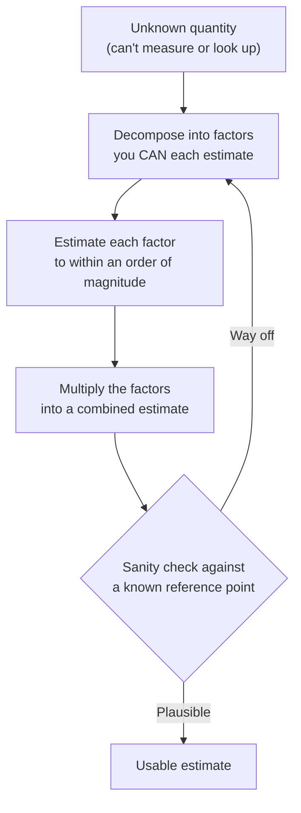

import LevelIntro from "../../../components/LevelIntro.astro";
import Checkpoint from "../../../components/Checkpoint.astro";

L1 showed the whiteboard move — four rough numbers multiplied together —
landing within 25% of a real measurement taken six months later.
`logic/problem-decomposition` already covers _how_ to break a vague
problem into workable pieces in general; this level is the specific
numeric technique built on top of it: once the pieces are numbers you
can each estimate, multiplying your best guesses together is
mathematically better than guessing the total directly. **Why does that
work — isn't multiplying four guesses just stacking four chances to be
wrong?**

<LevelIntro
  items={[
    "The decompose → estimate → multiply → sanity-check loop",
    "Why factor errors partially cancel instead of compounding",
    "What makes a decomposition trustworthy, not just plausible",
  ]}
/>

## The loop: decompose, estimate, multiply, sanity-check

Two classic Fermi questions, side by side — one abstract, one
engineering-flavored, decomposed the same way:

| Question                                      | Factor 1                 | Factor 2                         | Factor 3                          | Factor 4                                    |
| --------------------------------------------- | ------------------------ | -------------------------------- | --------------------------------- | ------------------------------------------- |
| How many piano tuners work in Chicago?        | City population          | Households per piano-owning rate | Tunings needed per piano per year | Tunings one tuner can do per year           |
| How many app servers does a new feature need? | Peak requests per second | CPU-milliseconds per request     | CPU capacity per server           | (divide, don't multiply, for the last step) |

Both follow the same shape: a quantity nobody has directly measured,
broken into a short chain of factors that are each easier to reason
about than the original question — population is roughly known,
piano-ownership rates are roughly known, and so on down the chain.

## Why the combined guess tends to land closer than one big guess

**If each of those factors could individually be off by a factor of 2 in
either direction, doesn't multiplying four of them together risk being
off by 2×2×2×2 = 16x?** That's the naive worry — and it's the wrong
intuition, because it assumes every factor errs in the _same direction_
at once. Here's the concrete version, worked out for three factors
instead of four to keep the table short:

Suppose each factor's true value is either half your guess or double
your guess (the two extreme corners of "off by a factor of 2"). With 3
factors, there are 2³ = 8 equally-plausible combinations of which way
each factor actually errs:

| Factor 1 | Factor 2 | Factor 3 | Combined error     |
| -------- | -------- | -------- | ------------------ |
| ×0.5     | ×0.5     | ×0.5     | ×0.125 (worst low) |
| ×0.5     | ×0.5     | ×2       | ×0.5               |
| ×0.5     | ×2       | ×0.5     | ×0.5               |
| ×2       | ×0.5     | ×0.5     | ×0.5               |
| ×0.5     | ×2       | ×2       | ×2                 |
| ×2       | ×0.5     | ×2       | ×2                 |
| ×2       | ×2       | ×0.5     | ×2                 |
| ×2       | ×2       | ×2       | ×8 (worst high)    |

Only 2 of the 8 combinations (25%) reach the extreme ×8 or ×0.125 — the
case where every single factor happens to err in the same direction.
The other 6 (75%) land within a factor of 2 of the true answer, because
some factors ran high while others ran low and the errors **partially
canceled** in the product. The naive "off by up to 16x" bound (for four
factors) is a real mathematical upper limit, but it's the least likely
outcome, not the typical one — it requires every independent guess to
be wrong in the same direction simultaneously. L3 extends this exact
table to real ranges instead of clean ×0.5/×2 corners, and shows the
effect gets even stronger as more independent factors are added.

<Checkpoint question="A colleague says: 'If any one of my four factors could be off by 2x, my final answer could be off by up to 16x — so this technique is basically useless for anything precise.' What's true and what's misleading about that statement?">

The 16x figure is a real, correct upper bound — it's not wrong
arithmetic. What's misleading is treating that worst case as the
_typical_ case. Reaching 16x off requires all four independently-guessed
factors to happen to err in the same direction at once, which is one
specific outcome out of many roughly-equally-likely combinations of
which way each factor could err. Most combinations mix some factors
running high with others running low, so the errors partially cancel in
the product — which is exactly the pattern the 3-factor table above
shows numerically: three-quarters of the corner combinations land within
a factor of 2 of the truth, not out at the 8x extreme. The technique
isn't claiming precision; it's claiming the _typical_ multi-factor
estimate is much closer than the worst-case bound suggests, which is a
different and much more defensible claim.

</Checkpoint>

## Picking a decomposition you can actually trust

**Given that the technique's strength depends on the factors' errors
being roughly independent, what makes one decomposition better than
another?** Two things: whether each factor is something you can
genuinely reason about with real confidence, and whether the whole chain
can be checked against something already known.

- **Choose factors you can each defend, not just numbers that multiply
  to something plausible.** "200,000 active users" is defensible — it's
  close to a real dashboard number someone half-remembers. "Some users
  generate way more events than others, so let's just call it 40 events
  average" is a real judgment call, made explicitly, not hidden inside a
  suspiciously precise-looking final number.
- **Sanity-check the result against a reference point whenever one
  exists.** If a similar, already-shipped feature logs roughly 1 GB/day
  per 100,000 users, and the new estimate implies 4 GB/day per 200,000
  users, that's the same rate — a plausibility check that costs another
  thirty seconds and catches an estimate that's off by 10x before anyone
  budgets against it.
- **Watch for factors that aren't actually independent.** The 75%-land-
  within-2x result above depends on each factor's error being roughly
  unrelated to the others'. If "events per user per day" and "bytes per
  event" both quietly assume the same optimistic rollout timeline, they're
  not really two independent guesses — they're one guess wearing two
  labels, and their errors will tend to move together rather than cancel.
  This is the same "non-overlapping" property `problem-decomposition`
  already asks you to check for a decomposition in general, applied here
  to the specific risk of correlated estimation errors.

<Checkpoint question="Someone decomposes 'how much support staff will we need' into (a) number of new customers and (b) tickets per new customer, where both numbers were pulled from the same optimistic 'best case adoption' slide in the same pitch deck. Does this decomposition still get the error-cancellation benefit described above?">

Probably not, or at least not fully. The error-cancellation argument
depends on each factor's guess being wrong for its own, roughly
unrelated reason — one running high because of a seasonal quirk,
another running low because of a measurement blind spot, and so on.
Here, both factors were pulled from the same optimistic slide, so if
that slide's overall optimism is wrong, both factors are likely to be
wrong in the _same_ direction (both too high) rather than in offsetting
directions. That's exactly the correlated-factors failure mode: the
decomposition still produces a number, but it no longer gets to claim
the "errors partially cancel" property, because the two guesses aren't
actually independent — they share a single root assumption.

</Checkpoint>

## When Fermi estimation is the right tool — and when it isn't

Fermi estimation is for fast sizing and go/no-go decisions: is this
worth building, roughly how big a budget line does it need, is a
proposed architecture even in the right ballpark before investing real
measurement effort. It's the wrong tool the moment precision actually
matters and is genuinely obtainable — a launch-blocking capacity
decision, a contractual SLA commitment, anything where being wrong by
25% carries real cost and a real measurement is available in the time
you have. The five-minute estimate in L1 was the right call because the
decision (raise a budget line or not) tolerated a 25%-ish error and the
deadline (Friday) didn't allow for a real measurement. If the deadline
had instead been "before we sign a contract guaranteeing storage
capacity," the two-week measurement would have been the only responsible
choice.
