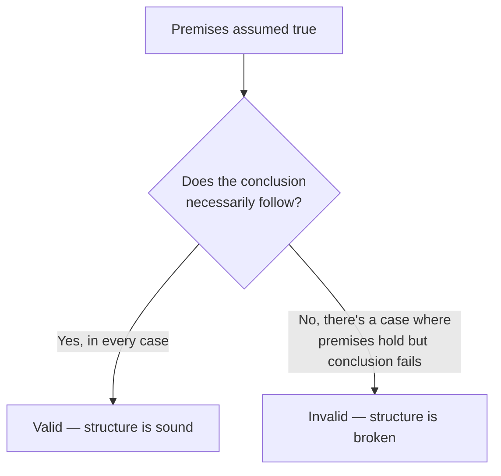
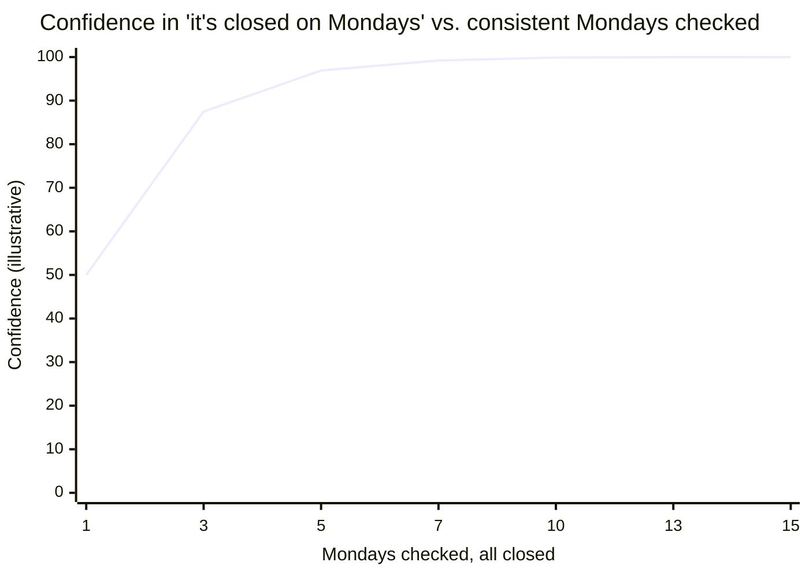

## The lights-are-on problem

The bakery from L1 has a rule: the lights are always on while it's open (they turn them on right before unlocking, off right after closing). One Monday, a friend walks by and sees the lights on. "The lights are on, so it's open," they say, and heads over. Is that reasoning actually forced by the facts, the way "if it's open, the lights are on; it's open; therefore the lights are on" would be — or does it only sound that way?

Validity never asks "is this true in reality" — it asks "if I grant the premises, am I forced into the conclusion." That's testable with the bakery's own rule: "if open, then lights on" is the premise everyone agrees on. The question is which direction the reasoning is allowed to run.

## Four shapes, same two premises, different validity

Every version below starts from the same house rule — "if the bakery is open, the lights are on" — and adds one more fact. Which additions force a conclusion, and which just look like they do?

| Name                     | Added fact             | Conclusion             | Valid? |
| ------------------------ | ---------------------- | ---------------------- | ------ |
| Modus ponens             | The bakery is open     | The lights are on      | Yes    |
| Modus tollens            | The lights are not on  | The bakery is not open | Yes    |
| Affirming the consequent | The lights are on      | The bakery is open     | **No** |
| Denying the antecedent   | The bakery is not open | The lights are not on  | **No** |

Modus tollens is valid for a reason worth sitting with: if being open guarantees the lights are on, then the lights being off guarantees it isn't open — there's no way to be open with the lights off, given the rule. But the reverse doesn't hold: the lights being on doesn't guarantee it's open, because the rule never said lights-on happens _only_ while open. Maybe the cleaning crew leaves them on Monday mornings before the shop opens. Affirming the consequent smuggles in an unstated assumption — that the rule works in both directions — that was never actually claimed.

## Where the friend's reasoning actually breaks

So: "the lights are on, so it's open" is affirming the consequent — invalid, structurally, even though it feels exactly as natural as "it's open, so the lights are on." The house rule only promised one direction (open implies lights on). Nothing was ever said about what lights-on implies. The friend needs an additional premise — "the lights are on _only_ when it's open" — to make the argument valid, and that premise might not even be true (the cleaning crew).

## Where deduction runs out: the three-Mondays claim

Modus ponens and its cousins are all about a rule that's assumed to hold with certainty. But "we've checked three Mondays, closed every time" from L1 was never a rule like that — nobody claimed there's a law of nature forcing the bakery shut every Monday. It's an **inductive** argument: a generalization from observed cases to a claim about unobserved ones, and its conclusion is a matter of degree, not a forced yes/no.

Does more evidence make an inductive claim behave _more_ like a deductive one? Not exactly — it gets stronger, meaning more of a good bet, but it never converts into "no exception is possible" the way a valid deductive argument's conclusion is guaranteed by its premises. One consistent Monday is weak evidence. Ten consistent Mondays is strong evidence. A thousand is very strong evidence. None of them, on their own, rule out a Monday it happens to be open — they just make that outcome look less and less likely to bet on.

The curve climbs fast at first and flattens out approaching, but never touching, 100% — that gap is exactly the difference between an inductive conclusion and a deductively valid one. (This particular curve is a simplified illustration, not a rigorous statistical model — the real math behind updating confidence from evidence is its own field. The shape — climbing, flattening, never reaching certainty — is the part worth remembering.)

## Where informal logic picks up

Formal structure alone doesn't catch what went wrong with the third friend from L1 ("it was open once, so 'always closed' is just wrong"). Both "closed every Monday, no exceptions" and "closed most Mondays, usually" use ordinary words that sound almost interchangeable in casual speech — but they make different-strength claims, and a single counterexample does different amounts of damage to each:

| Claim as stated            | Type                              | Does one exception refute it?                    |
| -------------------------- | --------------------------------- | ------------------------------------------------ |
| "It's closed every Monday" | Universal (deductive-style claim) | Yes — one open Monday makes it false             |
| "It's closed most Mondays" | Inductive generalization          | No — it weakens the pattern, doesn't disprove it |

Informal logic is the discipline of noticing _which_ of these two someone actually meant — often from tone and context rather than an explicit "every" or "most" — before deciding whether a single counterexample settles the argument or just nudges it.
