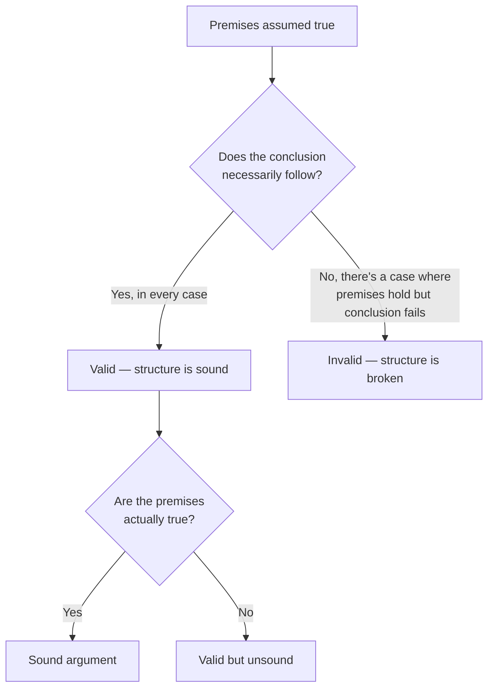

## Validity as a structural test



Validity never asks "is this true in reality" — it asks "if I grant the premises, am I forced into the conclusion." That's why you can test validity with obviously false premises and it still works as a check: "All cats are reptiles. Fido is a cat. Therefore Fido is a reptile" is **valid** (the structure forces the conclusion) even though every claim in it is false.

## The pattern that's always valid: modus ponens

```python
# Modus ponens — valid in every case, regardless of what P and Q stand for
if P:
    Q  # premise: "if P then Q"
# premise: P is true
# conclusion: therefore Q is true
```

Any argument matching this shape is valid, full stop — "if it's raining, the ground is wet; it's raining; therefore the ground is wet" and "if the deploy failed, the alert fires; the deploy failed; therefore the alert fires" are the same structure with different content.

## The pattern that looks the same but isn't: affirming the consequent

```python
# Affirming the consequent — INVALID, despite looking almost identical
if P:
    Q  # premise: "if P then Q"
# premise: Q is true
# conclusion: therefore P is true      <-- does NOT follow
```

"If the deploy failed, the alert fires. The alert fired. Therefore the deploy failed." This _feels_ like modus ponens because it has the same "if P then Q" premise — but the alert could have fired for a dozen other reasons. Knowing Q is true tells you nothing about whether P specifically caused it, unless P is stated as the _only_ thing that causes Q.

## Four structures worth memorizing on sight

| Name                     | Structure                           | Valid? |
| ------------------------ | ----------------------------------- | ------ |
| Modus ponens             | If P then Q; P; therefore Q         | Yes    |
| Modus tollens            | If P then Q; not Q; therefore not P | Yes    |
| Affirming the consequent | If P then Q; Q; therefore P         | No     |
| Denying the antecedent   | If P then Q; not P; therefore not Q | No     |

Modus tollens is valid for the same reason affirming the consequent isn't: if P guarantees Q, then Q's absence guarantees P's absence (there's no way to have P without Q, so no-Q rules out P) — but Q's presence doesn't rule out other causes, and P's absence doesn't rule out Q happening anyway through some other path.

## Where informal logic picks up

Formal structure alone doesn't catch everything wrong with real arguments. "Senior engineers ship fast" and "Fast shippers are senior engineers" look like they're using the same terms, but the second silently reverses the relationship (affirming the consequent again, dressed as a definition) — informal logic is the discipline of noticing _this specific move_ happening inside ordinary sentences, where formal notation isn't going to be written out explicitly.
