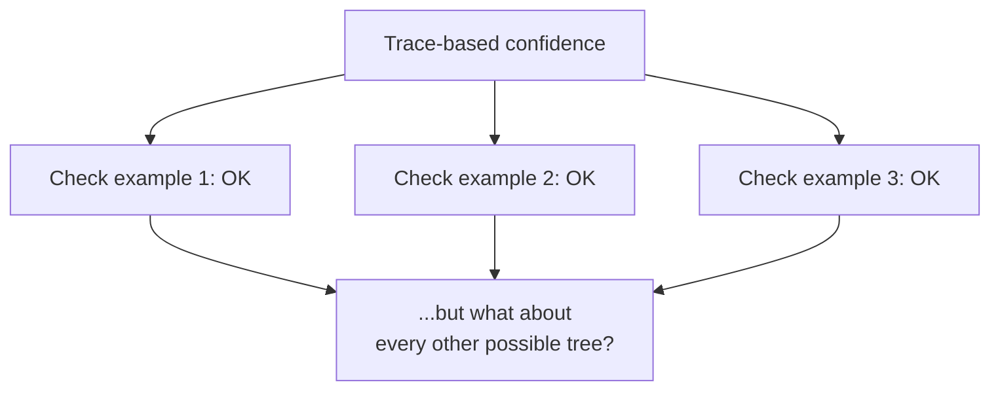

## Why tracing gets worse exactly as the problem gets more realistic

**If tracing through two or three examples worked, why isn't that
enough confidence to ship?** Because the number of possible inputs to
check grows explosively with depth and branching — a folder tree four
levels deep with a handful of items per folder already has more
distinct shapes than anyone could trace by hand, and a real
filesystem is far deeper and more varied than any hand-picked
example. Tracing only ever tells you about the specific cases you
traced.

Even a regular-looking tree grows quickly:

| Shape assumption               | Leaves to inspect by tracing |
| ------------------------------ | ---------------------------- |
| 2 children per folder, depth 3 | 8 leaves                     |
| 3 children per folder, depth 5 | 243 leaves                   |
| 4 children per folder, depth 6 | 4,096 leaves                 |

Real folders are not perfectly regular, but the lesson survives: each
extra level and each extra branch multiplies the number of concrete
paths a trace would have to cover. For the counting intuition, connect
this to `applied-math/combinatorics`.

## What an inductive argument actually checks instead

**If tracing can't cover every case, what does induction check that
somehow does?** Two things, neither of which requires enumerating
every possible input:

1. **Base case** — does the function give the correct answer for the
   simplest possible input (one with no recursive calls at all)?
2. **Inductive step** — _assuming_ the recursive call already gives
   the correct answer for any smaller input (this assumption is the
   **inductive hypothesis**), does the function correctly combine
   that result into the correct answer for the current, larger input?

If both hold, the function is correct for every input, no matter how
deep or how branching — not because every case was checked, but
because the argument shows correctness is preserved at every step
from the base case upward, however many steps that turns out to be
for any particular input.

That guarantee has hidden conditions:

| Condition                            | Why it matters                                          |
| ------------------------------------ | ------------------------------------------------------- |
| Inputs match the expected shape      | The proof is about folders/files, not corrupted objects |
| The structure is finite              | Every path must eventually end                          |
| There are no cycles                  | A folder cannot contain itself through a chain of links |
| Recursive calls are strictly smaller | Each call must move closer to a base case               |

Without those conditions, "base case + inductive step" is not ready to
guarantee every input yet; first you have to fix or reject the inputs.

## Why the inductive step is allowed to just assume the recursive call works

**Isn't "assume the recursive call already works" circular reasoning
— assuming the very thing being proven?** No — it's not circular
because the assumption is only ever made about a **strictly smaller**
input than the one currently being handled. A folder's total size
depends on calling `folderSize` on its _children_, which are smaller
(shallower, or containing less) than the folder itself. Because
there's no infinite descent — eventually every path bottoms out at
the base case — the assumption is always eventually backed by an
actual base case, not an infinite chain of assumptions.

**Does this mean you never have to think about what the recursive
call does internally?** Correct, and that's the actual power of the
technique: at the inductive step, you get to treat the recursive
call as a trusted black box that already does the right thing for
smaller inputs — you only have to reason about how the _current_
level combines those results. This is what makes induction scale to
arbitrary depth: the reasoning at each level is the same, fixed-size
argument, regardless of how deep the actual tree turns out to be.

| Method    | What it checks                     | What it cannot guarantee by itself              |
| --------- | ---------------------------------- | ----------------------------------------------- |
| Tracing   | One concrete input path            | All untraced shapes and edge cases              |
| Testing   | Many selected examples             | Every possible valid input                      |
| Induction | The base case and the general step | Inputs that break the proof's hidden conditions |

This is a cousin of `logic/problem-decomposition`: the large recursive
problem becomes "prove the smallest piece" plus "prove the way pieces
combine."

## Failure modes at this level

- **Treating a handful of traced examples as proof.** Passing tests
  on a few hand-picked inputs is evidence, not a correctness
  argument — it says nothing about inputs shaped differently from the
  ones tried.
- **Getting the inductive step right but skipping the base case.** A
  recursive function that correctly combines results from smaller
  inputs still fails entirely if the simplest input (an empty
  collection, a single leaf) isn't handled correctly.
- **Making the inductive hypothesis about the wrong thing.** The
  assumption has to be about a genuinely smaller sub-problem — if a
  recursive call can be made on an input that isn't actually smaller
  (a bug that causes infinite recursion), the whole argument's
  descent-to-a-base-case guarantee breaks.
