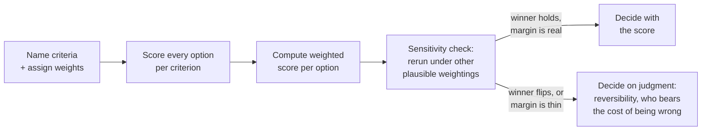

import LevelIntro from "../../../components/LevelIntro.astro";
import Checkpoint from "../../../components/Checkpoint.astro";

L1 showed the unlock: writing criteria and weights down explicitly
turned a shapeless three-week argument into a specific, resolvable
disagreement about one number. This level covers the mechanic that
turns that written list into an actual comparable score across
several candidate options — and the more important habit of not
trusting that score more than it deserves.

<LevelIntro
  items={[
    "The weighted-scoring matrix: options × criteria × weights → a comparable score",
    "Why the top-scoring option is a starting point for scrutiny, not the answer",
    "Sensitivity checking, and when the margin is too thin for the number to decide anything",
  ]}
/>

## The mechanic: a weighted-scoring matrix

**Once deploy velocity, operational risk, onboarding speed, and
maintainability are all written down as criteria, how do you actually
compare "keep the monolith" against "split into services now" using
all four at once, instead of arguing about them one at a time?**

A weighted-scoring matrix does three things, in order:

```text
1. List the options being compared (e.g. "stay monolith with
   modular boundaries" / "extract 2 services now" / "full
   microservices migration").
2. List the criteria and assign each one a weight — a number
   expressing how much it should count relative to the others.
   Weights are someone's honest judgment call, not a measurement;
   they should still sum to a fixed total (e.g. 1.0) so "how much
   this counts" is comparable across criteria.
3. Score every option against every criterion on a common scale
   (e.g. 1-10, worst to best for that criterion), then compute
   each option's weighted score: sum of (score x weight) across
   every criterion.
```

With real numbers, for the monolith-vs-split decision from L1 (scores
out of 10, weights summing to 1.0):

| Criterion (weight)               | Stay monolith, modular | Extract 2 services now |
| -------------------------------- | :--------------------: | :--------------------: |
| Operational risk (0.30)          |           8            |           5            |
| Team familiarity (0.25)          |           9            |           5            |
| Long-term maintainability (0.20) |           4            |           9            |
| Time-to-value (0.15)             |           9            |           4            |
| Cost (0.10)                      |           8            |           4            |
| **Weighted score**               |        **7.6**         |        **5.55**        |

Staying monolith wins under these weights, and by a real margin — not
a coin flip. L3 implements exactly this computation in code, with a
third option added, and runs it on the real numbers.

<Checkpoint question="Two engineers both agree the weighted-scoring matrix above is set up correctly, but one still doesn't trust the 7.6-vs-5.55 result. What's the one thing about the matrix that's true no matter how carefully the arithmetic was done?">

The weights and the 1-10 scores are still someone's honest estimate,
not a measurement — arithmetic done carefully on subjective inputs
still produces a subjective output, just one that now looks more
precise than it is. A weighted-scoring matrix doesn't remove judgment
from a decision; it makes the judgment calls explicit and inspectable
(which specific weight or score someone disagrees with) instead of
buried inside a vague "I just don't think we should split" — that's
the entire value of building the matrix, not proof the resulting
number is objectively correct.

</Checkpoint>

## Why the winning score is a starting point, not a verdict

**Marcus, from L1, thinks operational risk deserves more weight than
0.30 — maybe 0.40, with maintainability giving up the difference. Does
that possibility mean the matrix above was a waste of effort?**

No — it means the matrix did its job: it turned "I disagree" into "I
think this one weight should be higher," which is now something the
team can actually test. That's what **sensitivity analysis** is: rerun
the same scoring with a handful of other plausible weightings — not
just the first guess — and see whether the top-scoring option still
wins.

```text
1. Compute the weighted score under the first (baseline) weighting.
2. Re-run it under 2-4 other weightings a reasonable person on the
   team might actually argue for (not extreme, made-up ones).
3. Compare: does the same option win every time?
   - Yes, comfortably -> the recommendation is robust; the exact
     weights barely matter.
   - No, it flips under a plausible alternative weighting -> the
     "winner" was an artifact of one person's weight guesses, not
     a real signal. Say so, out loud.
4. Check the margin, even where it doesn't flip: a 2% edge in a
   rough 1-10 scoring exercise isn't a real signal either way.
   That's when something other than the score should decide.
```



When the winner does flip, or the margin is a rounding error, the
matrix has still done real work — it told you **which specific
disagreement is the one that matters**, and it told you the numbers
alone can't settle it. At that point the tie-breaker isn't "compute
harder" or "argue about the third decimal place of a weight." It's
asking a different kind of question: which option is easier to
reverse if it turns out wrong? Who has to live with the consequences
day-to-day if this goes badly? Which mistake would the team regret
more a year from now? Those questions decide close calls better than
squeezing more precision out of inputs that were never that precise
to begin with.

<Checkpoint question="A sensitivity check finds the recommendation holds under three plausible reweightings, all favoring the same option by a comfortable margin. Does that make the decision 'proven correct' the way a passing test proves code correct?">

No — it means the recommendation is robust to reasonable disagreement
about the weights specifically, which is a real and useful thing to
know, but it's not proof in the way a passing test is. The scores
themselves are still estimates (someone's honest 1-10 judgment call
per criterion), the list of criteria might be missing something
nobody thought to weigh at all, and "plausible reweightings" only
covers the range of weights someone actually tried. A robust result
under sensitivity checking is strong evidence for confidently
deciding and moving on — it's not a mathematical guarantee the way a
test suite passing is over the specific inputs it covers.

</Checkpoint>
