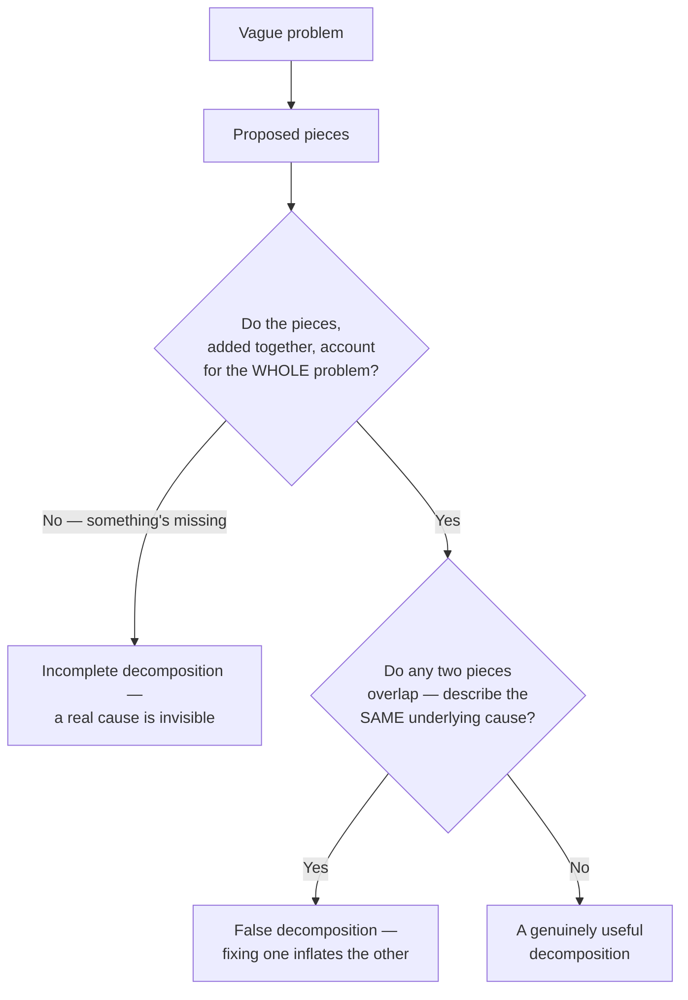

## The two properties a good decomposition needs

**Is any split into smaller pieces automatically a good decomposition?**
No — a useful decomposition needs two specific properties, both checkable:

**Exhaustive**: the pieces, summed, should account for the entire
original problem — checkout's 300 + 800 + 2,500 + 600 does add up to
4,200ms, with nothing left unaccounted for. If a decomposition leaves
part of the problem unexplained, there's a hidden cause hiding outside
the pieces you've named.

**Non-overlapping**: no two pieces should describe the same underlying
cause. If "server processing" were measured in a way that already
included the database query's time inside it, then "fixing" the database
query would make "server processing" look like it improved too — even
though nothing about server processing itself changed. This is a false
decomposition: it looks like measured, independent progress while
actually double-counting a single real cause.

## Independence: can this piece be worked on without the others?

**Beyond exhaustive and non-overlapping, is there a third property worth
checking?** Yes — whether a piece can genuinely be worked on in isolation.
The database query and the client rendering time are independent: an
engineer can optimize the query without touching rendering code at all,
and vice versa. Contrast that with a badly-drawn split like "reduce
server-side time" and "reduce end-to-end time" — the second one can't
actually be worked on without first understanding the first, because
end-to-end time is partly _made of_ server-side time. A decomposition
whose pieces secretly depend on each other isn't really four separate
problems — it's one problem wearing four labels.

## Decomposition reveals priority, not just structure

**Once a problem is broken into exhaustive, non-overlapping,
independent pieces, what's the next question?** Which piece actually
matters. Splitting 4,200ms into four numbers is only half the value —
the other half is that the split makes it visually obvious the database
query (59% of the total) dwarfs network time (7%). Before decomposition,
"optimize checkout" implicitly asked for effort spread across everything.
After decomposition, the priority is unambiguous.

| Piece             | Share of total | Worth attention this week?                        |
| ----------------- | -------------- | ------------------------------------------------- |
| Network           | 7%             | No — optimizing it further barely moves the total |
| Server processing | 19%            | Maybe, after the bigger piece is addressed        |
| Database query    | 59%            | Yes — this is most of the actual problem          |
| Client rendering  | 14%            | Maybe, after the bigger piece is addressed        |

## The generalizable lesson

**Does every vague problem decompose into measurable numbers this
cleanly?** Not always — "checkout is slow" happens to decompose into
timing, which is directly measurable. A vaguer problem ("our onboarding
is confusing") might decompose into pieces that need to be defined before
they can be measured at all (which specific step, for which specific
kind of user, causes confusion). The generalizable skill isn't
"measure everything" — it's the discipline of checking any proposed
split against the same two questions: does it cover the whole problem,
and do the pieces avoid describing the same cause twice.
