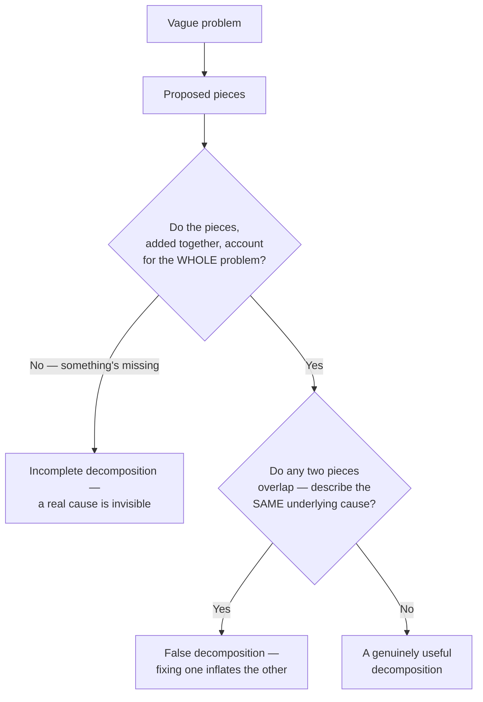

import LevelIntro from "../../../components/LevelIntro.astro";
import Checkpoint from "../../../components/Checkpoint.astro";

L1 turned "make checkout faster" into four measurable, named stages. L2
works out the actual rules that make a split like that trustworthy — not
every way of chopping a problem into pieces counts as a useful
decomposition, and this level gives you the two checkable properties that
tell the difference.

<LevelIntro
  items={[
    "The exhaustive and non-overlapping tests",
    "Independence — can a piece be worked on alone?",
    "Why decomposition also reveals priority",
  ]}
/>

## The two properties a good decomposition needs

**Is any split into smaller pieces automatically a good decomposition?**
No — a useful decomposition needs two specific properties, both checkable:

**Exhaustive**: the pieces, summed, should account for the entire
original problem — checkout's 300 + 800 + 2,500 + 600 does add up to
4,200ms, with nothing left unaccounted for. If a decomposition leaves
part of the problem unexplained, there's a hidden cause hiding outside
the pieces you've named.

**Non-overlapping**: no two pieces should describe the same underlying
cause. If "server processing" were measured in a way that already
included the database query's time inside it, then "fixing" the database
query would make "server processing" look like it improved too — even
though nothing about server processing itself changed. This is a false
decomposition: it looks like measured, independent progress while
actually double-counting a single real cause.

| Property            | Plain version       | Question to ask                                                        |
| ------------------- | ------------------- | ---------------------------------------------------------------------- |
| **Exhaustive**      | Complete            | Did we leave any important part of the original problem outside?       |
| **Non-overlapping** | Not counting twice  | Do two pieces describe the same cause under different names?           |
| **Independent**     | Workable separately | Can someone make progress on this piece without solving another first? |

For timing, money, distance, and quantities, "complete" can often be
checked by addition. For messier human problems, the check is causal:
do these pieces cover the main reasons the problem happens?

<Checkpoint question="Someone splits 'checkout is slow' into 'server processing' measured at 800ms and 'total backend time' measured at 3,300ms, alongside network (300ms) and rendering (600ms). Does this decomposition pass the exhaustive and non-overlapping tests?">

It fails non-overlapping. "Total backend time" (3,300ms) almost certainly
already includes "server processing" (800ms) and the database query
inside it — the two pieces aren't describing separate causes, one is a
superset of the other wearing a different label. Summing all four
"pieces" would double-count whatever the backend time already contains,
so the sum exceeding the true 4,200ms total is exactly the tell: it
signals overlap, not four independent contributors.

</Checkpoint>

## Independence: can this piece be worked on without the others?

**Beyond exhaustive and non-overlapping, is there a third property worth
checking?** Yes — whether a piece can genuinely be worked on in isolation.
The database query and the client rendering time are independent: an
engineer can optimize the query without touching rendering code at all,
and vice versa. Contrast that with a badly-drawn split like "reduce
server-side time" and "reduce end-to-end time" — the second one can't
actually be worked on without first understanding the first, because
end-to-end time is partly _made of_ server-side time. A decomposition
whose pieces secretly depend on each other isn't really four separate
problems — it's one problem wearing four labels.

Independent does not mean "these pieces can never affect each other."
It means the current piece is specific enough that a person can work on
it, measure it, or test a hypothesis about it without first solving all
the others.

## Decomposition reveals priority, not just structure

**Once a problem is broken into exhaustive, non-overlapping,
independent pieces, what's the next question?** Which piece actually
matters. Splitting 4,200ms into four numbers is only half the value —
the other half is that the split makes it visually obvious the database
query (59% of the total) dwarfs network time (7%). Before decomposition,
"optimize checkout" implicitly asked for effort spread across everything.
After decomposition, the priority is unambiguous.

| Piece             | Share of total | Worth attention this week?                        |
| ----------------- | -------------- | ------------------------------------------------- |
| Network           | 7%             | No — optimizing it further barely moves the total |
| Server processing | 19%            | Maybe, after the bigger piece is addressed        |
| Database query    | 59%            | Yes — this is most of the actual problem          |
| Client rendering  | 14%            | Maybe, after the bigger piece is addressed        |

<Checkpoint question="A decomposition of 'onboarding is confusing' produces three exhaustive, non-overlapping, independent pieces, each affecting roughly a third of new users equally. Does decomposition still do useful work here, even though there's no single dominant piece like the database query?">

Yes — decomposition's value isn't limited to cases with one dominant
piece. Even split evenly, it still converts one unworkable complaint into
three specific, assignable problems, each checkable on its own evidence.
What changes is only the prioritization step: instead of "start with the
59% piece," the next question becomes something else, like which piece
is cheapest to fix first or which affects the most valuable users — the
decomposition still did its job of making the problem actionable, it
just didn't hand you a free ranking the way an uneven split does.

</Checkpoint>

## The generalizable lesson

**Does every vague problem decompose into measurable numbers this
cleanly?** Not always — "checkout is slow" happens to decompose into
timing, which is directly measurable. A vaguer problem ("our onboarding
is confusing") might decompose into pieces that need to be defined before
they can be measured at all (which specific step, for which specific
kind of user, causes confusion). The generalizable skill isn't
"measure everything" — it's the discipline of checking any proposed
split against the same two questions: does it cover the whole problem,
and do the pieces avoid describing the same cause twice.

For "our onboarding is confusing," a useful first decomposition might
look like this instead of a timing table:

| Step               | User affected       | Suspected cause        | How to check it              |
| ------------------ | ------------------- | ---------------------- | ---------------------------- |
| Account creation   | First-time users    | Password rules unclear | Watch failed signup attempts |
| First dashboard    | Non-technical users | Labels use team jargon | Ask users to explain choices |
| First saved change | All users           | Success message hidden | Check support tickets        |

If the original request is vague because requirements are vague, link
this skill to `product-domain/requirements-gathering`: turn the ask
into observable behavior before choosing the implementation work.
