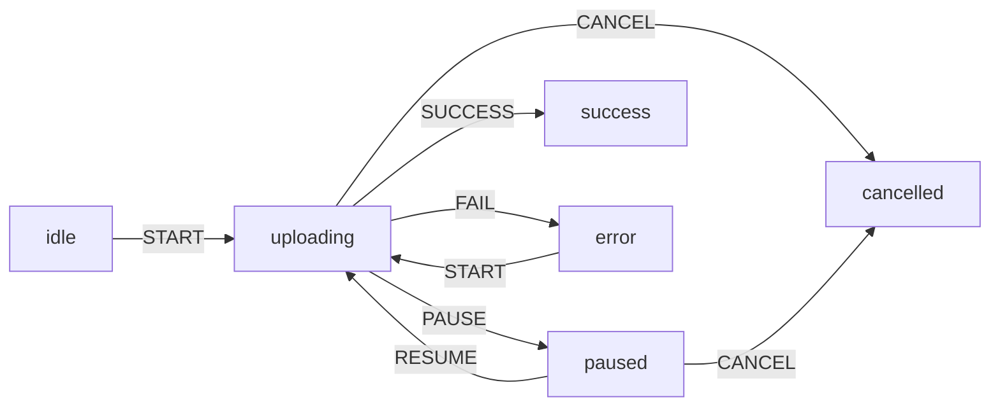

import LevelIntro from "../../../components/LevelIntro.astro";
import Checkpoint from "../../../components/Checkpoint.astro";

L1 named the bug — 4 independent booleans, 16 combinations, only 5
meaningful — without yet showing the actual counting or the fixed-state
alternative side by side. L2 works through both: the truth table that
proves how bad the boolean version really is, and the transition diagram
for the state-machine version of the same widget.

<LevelIntro
  items={[
    "Counting how many combinations N booleans actually allow",
    "Reading a state-transition diagram arrow by arrow",
    "Where this same problem shows up outside UI widgets",
  ]}
/>

## The truth table: how many combinations do 4 booleans actually allow?

**If an upload widget uses 4 independent booleans (`isUploading`,
`isPaused`, `isSuccess`, `isError`), how many distinct combinations of
`true`/`false` can those 4 booleans be in?** Every boolean doubles the
count of possible combinations — 4 independent booleans give
`2⁴ = 16` combinations total, whether or not each one makes sense:

| Number of independent booleans | Combinations |
| ------------------------------ | ------------ |
| 1                              | 2            |
| 2                              | 4            |
| 3                              | 8            |
| 4                              | 16           |

With only two booleans, you can see every combination:

| isUploading | isSuccess | Meaning                                |
| ----------- | --------- | -------------------------------------- |
| false       | false     | idle-ish                               |
| true        | false     | uploading                              |
| false       | true      | success                                |
| true        | true      | already suspicious: uploading and done |

| isUploading | isPaused | isSuccess | isError | Meaningful state?                                   |
| ----------- | -------- | --------- | ------- | --------------------------------------------------- |
| false       | false    | false     | false   | ✅ idle                                             |
| true        | false    | false     | false   | ✅ uploading                                        |
| false       | true     | false     | false   | ✅ paused                                           |
| false       | false    | true      | false   | ✅ success                                          |
| false       | false    | false     | true    | ✅ error                                            |
| true        | false    | true      | false   | 🚫 the actual bug — uploading AND succeeded at once |
| true        | true     | false     | true    | 🚫 uploading, paused, AND failed, simultaneously    |
| ...         | ...      | ...       | ...     | 🚫 9 more combinations, none of them meaningful     |

Only **5 of the 16** combinations correspond to a state the widget was
ever meant to be in. The other 11 aren't prevented by anything in the
code — they're just combinations nobody happened to write an event
handler that produces, until one did.

Those 5 are the states expressible with the four original flags:
`idle`, `uploading`, `paused`, `success`, and `error`. The diagram below
adds `cancelled` as a sixth intentional state, which is a feature: it is
named directly instead of being smuggled in through another independent
flag.

<Checkpoint question="If a fifth independent boolean were added to the upload widget (say, isRetrying), how many total combinations would the widget's state now technically allow, and would the number of meaningful ones necessarily grow to match?">

The total would double again, to `2⁵ = 32` combinations — every extra
independent boolean doubles the count regardless of what it means.
The meaningful count doesn't have to grow at all: adding `isRetrying`
might only make sense in one or two of the existing meaningful states,
so the gap between "combinations the code allows" and "combinations
that make sense" gets wider, not narrower, with every flag added. This
is the trend the state-machine version below is built specifically to
stop.

</Checkpoint>

## The state machine: the same widget, one variable instead of four

**If a single named state replaced all 4 booleans, how many of those
11 meaningless combinations would even be possible to represent?**
None — because there'd only be one variable, and its value would have
to be one of a fixed, named list:

Every arrow is a **transition**: a specific state, a specific event,
and the exact next state. There's no arrow for "PAUSE while in
`success`" — which means, in this model, that transition simply
doesn't exist. Not "is disallowed by a check somewhere" — doesn't
exist, the same way "green" isn't a valid answer to "heads or tails."

Read the diagram like this: each word node is a state the upload can be
in; each arrow is a permitted change; each label on an arrow is the
event that causes that change. No arrow means "this event is not allowed
from here."

## What a state machine actually buys you

| Property                                  | 4 independent booleans                                     | State machine (1 named state)                             |
| ----------------------------------------- | ---------------------------------------------------------- | --------------------------------------------------------- |
| Total representable combinations          | 16 (2⁴)                                                    | Exactly however many states are named (here, 6)           |
| Combinations that are actually meaningful | 5 out of 16 — the rest are accidents waiting to happen     | All of them, by construction — there's nothing else to be |
| What stops an invalid combination         | Nothing, unless every handler is written perfectly forever | The transition table itself — no rule, no transition      |
| What a new event handler has to get right | Every flag it doesn't touch, correctly, every time         | Just which state(s) it's valid to fire from               |

This is the core trade a state machine makes: instead of hoping every
future code change respects an unwritten rule about which flag
combinations are meaningful, the _shape of the data itself_ makes the
meaningless combinations impossible to construct.

<Checkpoint question="The diagram has no arrow labeled PAUSE leaving the success state. Concretely, what happens if code calls the equivalent of 'pause' while the state machine is in success — does it silently do nothing, silently switch to some other state, or something else?">

Something else: it's rejected, because there's no rule in the
transition table that maps `(success, PAUSE)` to any next state at all.
A well-built state machine implementation treats a missing entry as an
error to surface immediately (L3 implements this as a thrown exception)
rather than either ignoring the event or guessing a state. That's the
concrete payoff of "no arrow means the event isn't allowed" — it isn't
just a description of the diagram, it's a promise about what the running
code actually does when something outside the diagram is attempted.

</Checkpoint>

## When this generalizes beyond UI widgets

**Is this only a frontend concern?** No — anywhere a system has a
handful of meaningfully distinct phases and specific rules about which
phase can follow which, the same problem shows up: an order's
lifecycle (placed, paid, shipped, delivered, cancelled), a TCP
connection's handshake states, a CI pipeline's run status. Independent
boolean flags scale the same way in all of these — badly, and quietly,
until a genuinely impossible combination shows up in production.

Everyday examples work too: a traffic light is not red and green at the
same time; a food order moves from placed to preparing to delivered or
cancelled; a school application might be draft, submitted, reviewed,
accepted, or rejected.

To design one from scratch:

1. List the real states the system can be in.
2. List the events that can happen.
3. Draw only the arrows that should be legal.
4. Ask which events must be rejected from each state.

If `true`, `false`, and truth tables still feel slippery, revisit
`logic/boolean-logic` before the code-heavy L3.
