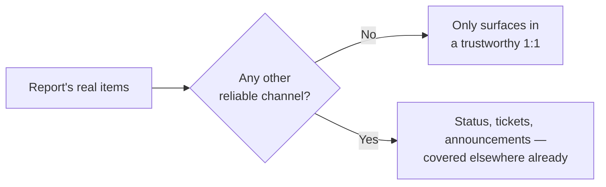

import Scenario from "../../../components/Scenario.astro";
import LevelIntro from "../../../components/LevelIntro.astro";

<Scenario>
  <Fragment slot="facts">
    

      

        0 of 3
        real concerns raised
      

      

        

      

    

    
On the report's mind today

    

      
💭 Unsure where their role is heading

      
😬 A teammate's review comments feel harsh

      
😐 Answering "fine" in a flatter tone than usual

    

    
On the manager's list

    

      
📅 Friday deadline check-in

      
🎫 Stale ticket statuses

      
🗓️ Sprint planning moving to Tuesdays

    

  </Fragment>

A manager opens their weekly 1:1 with a direct report:

> "Hey, how's the migration project going? Are we still on track for Friday? ... Oh, and can you clean up those stale ticket statuses. Also, sprint planning's moving to Tuesdays. Cool — anything on your end?"

> "Nope, think that's it."

**Before reading on: this report has three real things on their mind today — where their role is heading, a teammate's review comments feeling harsher than warranted, and a flatter tone than usual. How many of those three make it into the conversation above?**

</Scenario>

Zero. Not because nothing real happened, and not because the report didn't have anything to say — but because nothing in the structure of that conversation made space for it.

<LevelIntro
  items={[
    "What a 1:1 is for that no other channel covers",
    "The manager-led default failure mode",
    "The shape of a structure that actually works",
  ]}
/>

| What actually got covered             | What almost never got said                         |
| ------------------------------------- | -------------------------------------------------- |
| Friday deadline (manager asked)       | Where the role is heading (report never got asked) |
| Ticket statuses (manager flagged)     | Review-comment friction (report never got asked)   |
| Sprint day change (manager announced) | —                                                  |

- A 1:1 that only covers project status duplicates information already available elsewhere (standup, a tracker, a Slack channel) — its actual, distinctive value is the stuff that _doesn't_ surface anywhere else: how someone's really doing, what's blocking them that they haven't escalated, what they're thinking about their own growth, what feedback they're sitting on.
- **The default failure mode is the manager doing most of the talking** — running through their own list of updates and asks — which inverts the actual point: this is the report's time, not the manager's, and the manager's other channels (team meetings, written updates) already exist for pushing information the other direction.
- **A useful structure, roughly**: start with what's on the report's mind (not the manager's agenda) — recent wins/blockers, how they're actually doing, anything they want to raise — before getting to any manager-initiated topics, so the report's items don't get squeezed out by running out of time on the manager's list.
- **Listening for what's not said is as important as what is** — a report who says "everything's fine" in a flat tone, or who's markedly less engaged than usual, is giving real information even without stating it directly; noticing and gently following up ("you seem a bit off today, is everything okay?") is part of the skill, not overstepping.
- **Coaching questions** — asking "what have you considered?" or "what would you do?" before offering a direct answer — build the report's own problem-solving capacity over time, where immediately supplying the answer (faster in the moment) trains the report to bring every problem to the manager instead of building their own judgment. This connects directly to `people-management/ic-excellence-management`'s point about letting someone struggle productively rather than jumping in to solve it for them.
- **Consistency matters as much as content** — a 1:1 that gets rescheduled or cancelled repeatedly signals, whether intended or not, that it's low priority, which erodes exactly the trust needed for a report to bring up something real rather than saving it for a scheduled review months later.
- The practical skill: protecting the report's agenda time, listening actively (including to what isn't said), asking coaching questions before supplying answers, and treating consistency itself as part of what makes the meeting trustworthy enough to actually be used for what it's for.

