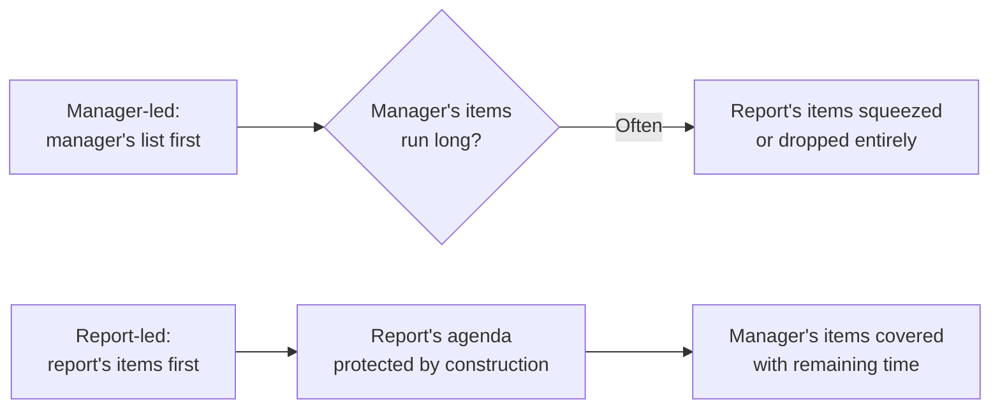
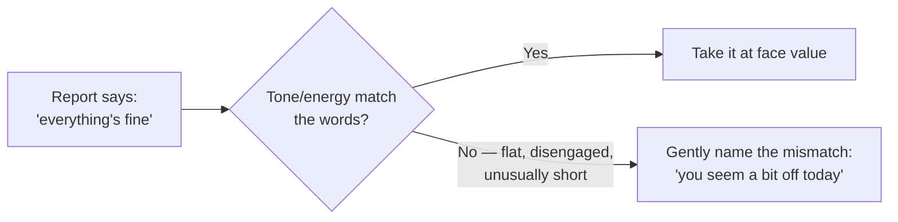

## Two different default structures



This isn't about the manager's topics being unimportant — it's that the manager already has other channels (team meetings, async updates, direct messages) to push their own items through, while the report's items — how they're actually doing, what they're hesitant to escalate, unstructured thoughts about their own growth — often have no other reliable outlet. Structurally protecting the report's time first is what keeps the 1:1 from quietly reverting to whichever agenda is more comfortable to lead with, which in practice tends to be the manager's.

## What a useful 1:1 actually covers, that other channels don't

| Already covered elsewhere (redundant in a 1:1) | Rarely covered anywhere else (the actual value)                        |
| ---------------------------------------------- | ---------------------------------------------------------------------- |
| Project status, what shipped this week         | How the person is actually doing, beyond "fine"                        |
| Ticket/task assignments                        | A blocker they haven't escalated, and why they haven't                 |
| Team-wide announcements                        | Feedback they're sitting on — about the manager, the team, a decision  |
| Deadlines, sprint planning                     | Where they want to grow, and whether current work is moving them there |

A 1:1 that only ever produces the left column has effectively become a redundant status meeting — which is not a moral failing, but a structural waste of the one regular, private channel that could be covering the right column instead.

## Listening for what isn't said



This isn't reading minds or manufacturing concern from nothing — it's noticing a real, observable mismatch (tone, energy, engagement level) between what's said and how it's said, and treating that mismatch as worth a gentle, low-pressure check rather than either ignoring it or assuming the worst. The report retains full control of how much to share; the manager's job is making the door visibly open, not forcing it.

## Coaching questions vs. immediately supplying the answer

```
Report: "I'm stuck on how to handle this API's inconsistent rate limiting."

Answer-first response: "Just add exponential backoff with jitter, here's the pattern..."

Coaching-first response: "What have you already tried, and what's making you
                          think those approaches aren't working?"
```

The answer-first response is faster in the moment and might even be correct — but it also means the _next_ similar problem goes straight back to the manager, because the report never had to develop their own approach to it. The coaching-first response takes longer in this specific conversation and directly builds the report's own problem-solving muscle for next time — the same trade-off `ic-excellence-management` describes for managers generally (letting someone struggle productively vs. solving it for them), applied specifically to the 1:1 setting where it happens most concretely and most often.
