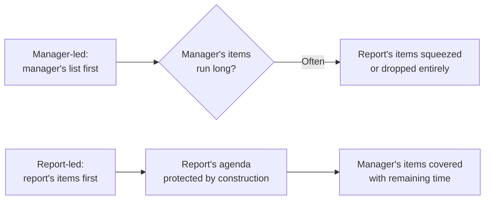
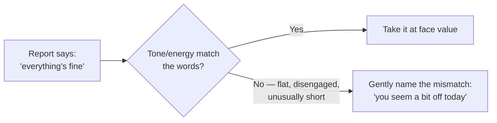

import Scenario from "../../../components/Scenario.astro";

<Scenario label="The tension">
  <Fragment slot="facts">
    <div class="not-prose">
      <div class="mb-1 flex items-baseline justify-between">
        <span class="text-lg font-bold text-slate-800 dark:text-slate-100">25 / 30</span>
        <span class="text-xs text-slate-400">minutes on the manager's list</span>
      </div>
      <div class="h-2 w-full overflow-hidden rounded-full bg-slate-200 dark:bg-slate-700">
        <div class="h-full rounded-full bg-amber-500 animate-fill-bar" style="--target-width: 83%"></div>
      </div>
    </div>

    <div class="not-prose mt-3 flex flex-col gap-1 text-sm text-slate-700 dark:text-slate-300">
      <div class="flex items-center gap-1.5"><span>⏱️</span> 5 minutes left for "anything on your end?"</div>
      <div class="flex items-center gap-1.5"><span>🎲</span> Whatever surfaces in that window gets rushed or dropped</div>
    </div>

  </Fragment>

A well-meaning manager runs a tight 30-minute 1:1: 25 minutes on their own list — project status, a few asks, a scheduling note — then, with five minutes left, "anything on your end?"

**If something real actually surfaces in that last five minutes — a hesitant concern the report has been sitting on for weeks — what usually happens to it?**

</Scenario>

Usually: it gets a rushed, surface-level response, or a "let's pick this up next time" that quietly never happens. Not because the manager doesn't care, but because nothing about a five-minute leftover window was built to hold something that took weeks to work up to saying.

## Two different default structures

**So what actually produces that five-minute squeeze — is it bad luck, or something structural?**



It's structural, not luck. This isn't about the manager's topics being unimportant — it's that the manager already has other channels (team meetings, async updates, direct messages) to push their own items through, while the report's items — how they're actually doing, what they're hesitant to escalate, unstructured thoughts about their own growth — often have no other reliable outlet. Structurally protecting the report's time first is what keeps the 1:1 from quietly reverting to whichever agenda is more comfortable to lead with, which in practice tends to be the manager's.

## What a useful 1:1 actually covers, that other channels don't

**Given that structural choice, which topics actually belong in the protected slot?**

| Already covered elsewhere (redundant in a 1:1) | Rarely covered anywhere else (the actual value)                        |
| ---------------------------------------------- | ---------------------------------------------------------------------- |
| Project status, what shipped this week         | How the person is actually doing, beyond "fine"                        |
| Ticket/task assignments                        | A blocker they haven't escalated, and why they haven't                 |
| Team-wide announcements                        | Feedback they're sitting on — about the manager, the team, a decision  |
| Deadlines, sprint planning                     | Where they want to grow, and whether current work is moving them there |

A 1:1 that only ever produces the left column has effectively become a redundant status meeting — which is not a moral failing, but a structural waste of the one regular, private channel that could be covering the right column instead.

## Listening for what isn't said

**A report answers "how are things?" with "everything's fine" — but the tone is flat, not their usual energy. Do those words settle the question?**



Not necessarily — the words and the delivery are two separate signals, and this isn't reading minds or manufacturing concern from nothing: it's noticing a real, observable mismatch (tone, energy, engagement level) between what's said and how it's said, and treating that mismatch as worth a gentle, low-pressure check rather than either ignoring it or assuming the worst. The report retains full control of how much to share; the manager's job is making the door visibly open, not forcing it.

## Coaching questions vs. immediately supplying the answer

**A report says they're stuck. Does helping mean answering fast, or something else?**

```
Report: "I'm stuck on how to handle this API's inconsistent rate limiting."

Answer-first response: "Just add exponential backoff with jitter, here's the pattern..."

Coaching-first response: "What have you already tried, and what's making you
                          think those approaches aren't working?"
```

The answer-first response is faster in the moment and might even be correct — but it also means the _next_ similar problem goes straight back to the manager, because the report never had to develop their own approach to it. The coaching-first response takes longer in this specific conversation and directly builds the report's own problem-solving muscle for next time — the same trade-off `ic-excellence-management` describes for managers generally (letting someone struggle productively vs. solving it for them), applied specifically to the 1:1 setting where it happens most concretely and most often.
