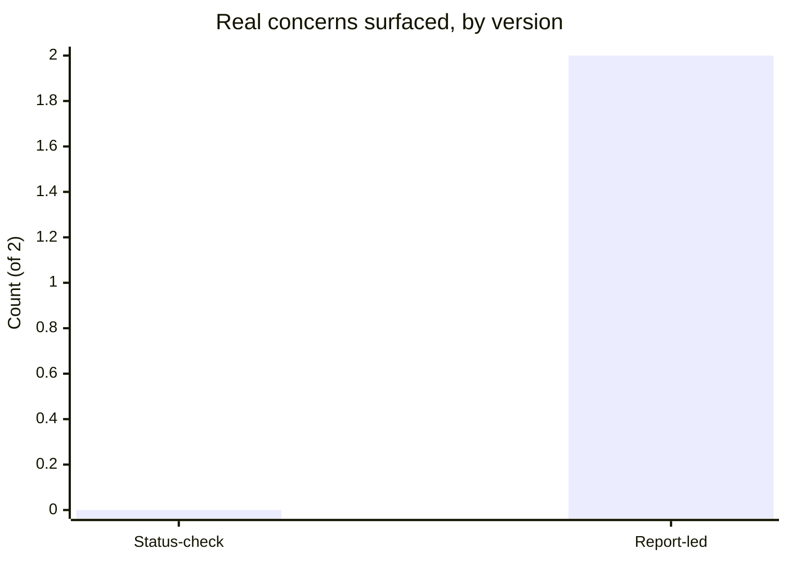

import Scenario from "../../../components/Scenario.astro";

<Scenario label="The scenario">
  <Fragment slot="facts">
    

      

        0 of 3
        real concerns raised
      

      

        

      

    

    
The report is carrying

    

      
💭 Unclear sense of where their role is heading

      
😬 A teammate's review comments feel harsher than warranted, unescalated

    

    
Structure being compared

    

      
📋 Version 1 — manager's list first, "anything on your end?" last

      
🙋 Version 2 — report's items first, six months later

    

  </Fragment>

A report has been quietly struggling with an unclear sense of where their role is heading, and has a real, unescalated concern about a teammate's code review comments feeling harsh. Watch how two different 1:1 structures handle the exact same underlying situation.

**Same report, same two real concerns, same manager, six months apart — the only thing that changes between the two versions below is agenda order. Does that alone predict how much actually surfaces?**

</Scenario>

## The status-check version

> **Manager:** "Hey, how's the migration project going? Are we still on track for the Friday deadline?"
>
> **Report:** "Yeah, should be fine. Almost done with the data layer piece."
>
> **Manager:** "Great. Oh, and I wanted to flag — can you make sure to update the ticket statuses, I noticed a few are stale. Also, heads up, we're moving the sprint planning to Tuesdays starting next week."
>
> **Report:** "Sure, got it."
>
> **Manager:** "Cool, anything on your end?"
>
> **Report:** "Nope, I think that's it."

Thirty seconds of silence-filling "anything on your end" at the very end, after the manager's own list, isn't a real invitation — it reads (correctly) as "wrapping up," not "I have protected time for whatever's actually on your mind." The report's real concerns (career direction, the code review friction) never surface, not because they weren't real, but because nothing in this conversation's structure made space for them.

## The report-led version, six months later, after adopting the structure from L2

> **Manager:** "Before we get into anything from my side — what's on your mind this week? Doesn't have to be work-related."
>
> **Report:** "Actually, yeah — I've been meaning to bring this up. I'm not totally sure where my role is heading. I feel like I'm doing similar work to a year ago and I'm not sure if that's a 'this is fine for now' thing or something I should be worried about."
>
> **Manager:** "That's a real thing to raise, thanks for bringing it up directly. What would 'heading somewhere' actually look like to you — more scope, a different kind of work, something else?"
>
> **Report:** "Probably more ownership over a whole area, not just executing tickets someone else scoped."
>
> **Manager:** "Okay — let's actually think through what that could look like concretely, maybe starting with [a specific upcoming project]. Anything else on your mind before I go into my list?"
>
> **Report:** "One more thing, actually — this is a little awkward, but some of [teammate]'s recent review comments have felt pretty harsh, more than the actual issues warrant. I haven't said anything to them directly."
>
> **Manager:** "I appreciate you telling me. Do you want me to just be aware of it for now, or would it help to think through how you might raise it with them directly first?"

Both real concerns — career direction and the review-tone friction — surface specifically because the structure asked _first_, with real room, before any manager-driven item competed for the remaining time. Neither concern was manufactured or unusually easy to raise; they were simply given an actual opening, twice, and the manager's coaching-question responses ("what would that look like," "do you want me aware or do you want to think through raising it yourself") kept ownership of both situations with the report rather than immediately taking over either one.

## What actually differs, side by side

**Both conversations are polite, both managers seem reasonably attentive — so what measurable thing is actually different?**

| &nbsp;                      | Status-check version                           | Report-led version                                |
| --------------------------- | ---------------------------------------------- | ------------------------------------------------- |
| **First question asked**    | "How's the migration going?" (manager's topic) | "What's on your mind this week?" (report's topic) |
| **Report's real concerns**  | 0 of 2 raised                                  | 2 of 2 raised                                     |
| **"Anything on your end?"** | Closing formality, after the list is done      | N/A — the report's turn came first, not last      |
| **Manager's own items**     | Fully covered                                  | Still fully covered, just afterward               |

Same report, same two concerns, same six-month relationship — the only variable that changed between the two conversations is which agenda went first. That's not proof agenda order is the _only_ thing that matters (the next section covers what else has to hold), but it is the single change that flips the outcome from 0 to 2 in this comparison.

## What changed between the two versions

The report is the same person, with the same real concerns, in both versions — nothing about their willingness to speak up changed. What changed is entirely structural: whose agenda came first, and whether "anything on your end" was a genuine protected opening or a closing formality. The six months between the two versions in this scenario isn't about the report needing to build trust gradually (though that's also often real) — the structural change alone, applied from the very first report-led 1:1, would very plausibly have surfaced both concerns immediately, not eventually.

## Failure modes

| Failure                                                                             | What it looks like                                                                                                                                            | The fix                                                                             |
| ----------------------------------------------------------------------------------- | ------------------------------------------------------------------------------------------------------------------------------------------------------------- | ----------------------------------------------------------------------------------- |
| Adopting the structure, not the mindset                                             | Manager reorders the agenda but visibly disengages once the report's items feel "resolved enough" — the report notices and calibrates future 1:1s accordingly | Stay genuinely present through the report's items, not just present-by-agenda-order |
| Over-applying coaching questions                                                    | Report asks "what's our actual policy on X" (a factual gap, not a problem-solving opportunity) and gets a coaching question back                              | Match the tool to the question — factual gaps need direct answers                   |
| Letting the meeting become inconsistent once it feels routine                       | Rescheduling or shortening 1:1s once no urgent item seems pending                                                                                             | Treat the recurring slot as the point, not just whatever's on it that week          |
| Assuming one well-structured 1:1 fixes years of an established status-check pattern | Report still gives guarded, minimal answers after a single reordered meeting                                                                                  | Earned trust takes repetition, even when the structural fix itself is immediate     |

**Before moving on: if the manager in the report-led version had visibly checked the time once the career-direction topic felt "wrapped up," would the review-tone concern likely have surfaced at all?** Probably not — the first failure mode above is exactly this: the agenda order alone doesn't do the work if the underlying attentiveness isn't genuine throughout, not just at the opening question.

## Beyond this example

The report-led 1:1 above is one case, not the whole territory — a few questions to test whether the structural point actually transferred, not just the specific dialogue above:

- What would change if the report's concern were something the manager couldn't fix or influence at all — say, a personal circumstance affecting their availability? Would the report-first structure still be the right move, or does "protecting their agenda time" start to mean something different when there's no action the manager can coach toward?
- What if the report were newer to the team, with less established trust than the report in this six-month scenario? Would you expect the very first report-led 1:1 to surface something this substantial, or does the "trust builds gradually" point from the failure modes predict a slower opening?
- If a report consistently uses their protected time only for status updates anyway, even when genuinely invited to raise anything — what does that suggest is still missing, given that the structure alone was supposed to be sufficient?
