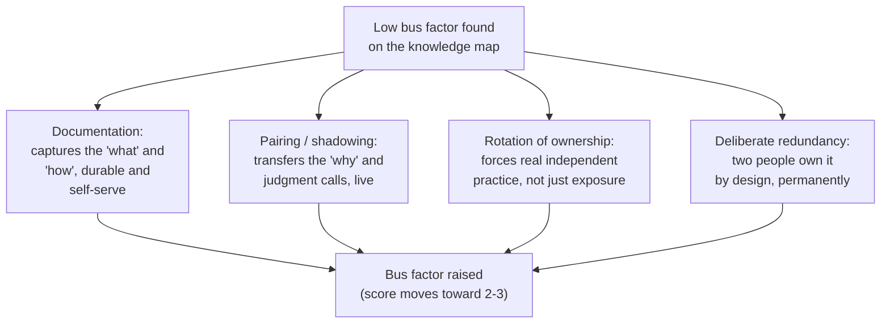

import LevelIntro from "../../../components/LevelIntro.astro";
import Checkpoint from "../../../components/Checkpoint.astro";

L1 named the risk: knowledge concentrated in one person is the same
danger whether it surfaces as a resignation or an emergency. L2 works
out how a manager actually finds where that risk lives on a real team,
before it's forced into the open, and what raises it once found.

<LevelIntro
  items={[
    "How to map who knows what, concretely",
    "The four practices that raise bus factor",
    "Why redundancy has a real cost, and how to bound it",
  ]}
/>

## Finding the risk: knowledge mapping

**A manager can't fix a concentration of knowledge they haven't
located — so how do you actually find it, rather than just having a
vague sense that "Priya knows a lot"?** The concrete tool is a
knowledge map: a simple grid of the team's critical systems,
processes, and responsibilities down one side, and every team member
across the top, scored by how independently each person could operate
each one.

| System / responsibility      | Priya | Dan | Wren | Sam |
| ---------------------------- | :---: | :-: | :--: | :-: |
| Billing reconciliation job   |   3   |  0  |  1   |  0  |
| On-call incident triage      |   3   |  2  |  3   |  2  |
| Deploy approval for payments |   3   |  1  |  0   |  0  |
| Onboarding new hires         |   2   |  3  |  1   |  1  |

Scoring: **0** = no exposure at all, **1** = has seen it but couldn't
run it unsupervised, **2** = could run it with some support, **3** =
fully independent. A row where only one person scores a 3, and
everyone else scores 0 or 1, **is** a bus factor of one — the map
doesn't predict the risk, it makes a risk that already existed
visible.

**Why build the map at all instead of just asking each person "could
you cover for a teammate"?** Because self-assessment is exactly where
concentration hides — Dan might genuinely believe he "kind of knows"
billing reconciliation because he's seen Priya work on it, but a 1 on
this map (seen it, couldn't run it unsupervised) is a very different
number from a 3, and the gap only becomes obvious once it's written
down next to hers instead of living as two separate impressions.

<Checkpoint question="Looking at the table above, which row has the lowest bus factor, and what does that number actually mean in practice?">

Deploy approval for payments has the lowest bus factor: only Priya
scores a 3, Dan scores a 1, and Wren and Sam score 0. That's a bus
factor of one for that specific responsibility — if Priya becomes
unavailable, payment deploys either stop entirely or someone has to
approve them without real independent competence, which is exactly the
scramble scenario from L1's Scenario, just for a different piece of
work than the billing job.

</Checkpoint>

## Raising it: four practices, not one silver bullet

**Once a low-bus-factor row is found, what actually moves a score from
0 or 1 up toward 2 or 3?** No single practice does the whole job —
each one closes a different gap.

- **Documentation** captures the parts of knowledge that are stable
  and explainable — the runbook, the architecture, the "if X breaks,
  check Y first." It's cheap to produce once written and doesn't
  depend on anyone's calendar, but it can't capture judgment calls
  that were never made explicit even to the person who makes them.
- **Pairing / shadowing** transfers exactly what documentation can't:
  the "why did you check that log first" reasoning that happens in
  someone's head during a live incident or a real piece of work. It's
  slower and requires both people's time at once, but it's the only
  practice that reliably moves someone from a 1 to a genuine 2.
- **Rotation of ownership** goes further than pairing — instead of
  watching, a second person actually owns the responsibility for a
  stretch (an on-call rotation, a sprint of on-call-adjacent work),
  which is what forces a 2 to become a real, tested 3 rather than a
  score that looks good on paper but has never been exercised under
  pressure.
- **Deliberate redundancy** is the standing decision that some
  responsibilities are never owned by fewer than two people, by
  design, indefinitely — not a one-time fix but an ongoing team norm
  for the handful of rows where the cost of a bus factor of one is
  genuinely unacceptable (payment approvals, security-critical
  systems).

**Why not just pick the cheapest one, documentation, and call it
done?** Because documentation alone caps out around a 2 — it transfers
the "what," not the judgment that only comes from actually doing the
work under real conditions. A team that only documents ends up with
people who could technically read the runbook but have never actually
run the job, which is a much better position than L1's Scenario but
still not a genuinely raised bus factor.

<Checkpoint question="A manager writes a thorough runbook for the billing reconciliation job, but nobody besides Priya has ever run it. Per L2, has the bus factor actually been raised?">

Only partially, and probably not to a real 2 or 3. Documentation moves
the knowledge from "exists only in Priya's head" to "exists on paper
too," which is genuinely useful and lowers the floor of how bad a
sudden departure would be. But it doesn't transfer the judgment calls
that show up only when the job actually breaks in a way the runbook
didn't anticipate — that requires pairing or rotation, where a second
person handles a real instance of the work. A documented-but-never-run
job is safer than L1's Scenario, but it isn't the same as a genuinely
raised bus factor.

</Checkpoint>

## The cost side: why not make everything redundant?

**If deliberate redundancy is the strongest fix, why doesn't every
team just apply it everywhere?** Because redundancy has a real,
ongoing cost — every responsibility staffed two-deep is time not spent
on other work, for every person involved, indefinitely. Applying it to
everything would mean a team permanently operating at roughly half
its nominal capacity, which trades one risk (concentration) for
another (not enough gets built). The practical answer is to bound
redundancy to the responsibilities where the cost of a bus factor of
one is actually severe — production-critical systems, anything
touching money or security, anything a single point of failure would
be genuinely expensive or dangerous to lose — and accept a lower bus
factor, backed by documentation and some pairing, on responsibilities
where the stakes don't justify the ongoing cost.

| Risk if concentrated                       | Redundancy cost is worth it?                                                   |
| ------------------------------------------ | ------------------------------------------------------------------------------ |
| Payment deploy approval                    | Yes — outage or fraud risk if the one person is unavailable during an incident |
| Security-critical access decisions         | Yes — same reasoning, plus compliance exposure                                 |
| A rarely-touched internal reporting script | Usually not — document it; the cost of a slow fix if it breaks is low          |
| Onboarding new hires                       | Partial — worth a second trained person, not necessarily full redundancy       |

## Failure modes at this level

- **Treating the knowledge map as a one-time exercise.** A map built
  once and never revisited goes stale the moment the team's systems or
  membership change — it needs to be a recurring check, not a
  one-off artifact.
- **Confusing "has seen it" with "could run it."** Scoring someone a 2
  or 3 because they were in the room once, rather than because they've
  actually operated the system with real accountability, defeats the
  whole point of the map — it hides risk instead of surfacing it.
- **Applying deliberate redundancy uniformly instead of by stakes.**
  Redundancy everywhere isn't a safer team, it's a slower one with the
  same amount of risk just redistributed less visibly — the bounding
  step (which rows actually justify the cost) is not optional.
