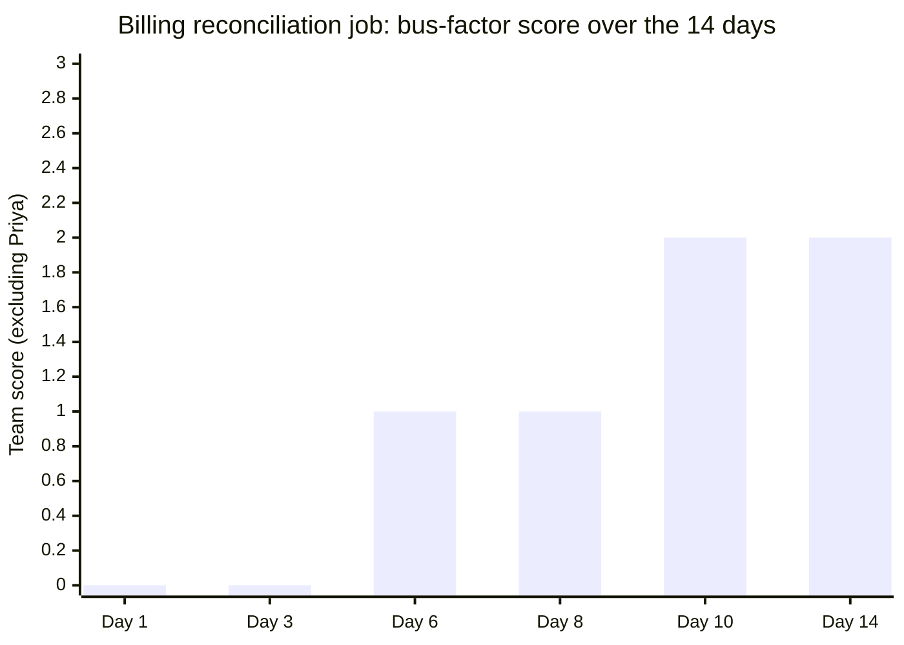

import LevelIntro from "../../../components/LevelIntro.astro";
import Checkpoint from "../../../components/Checkpoint.astro";

L2 established the knowledge map and the four practices that raise bus
factor. L3 walks the Scenario's actual team through Priya's fourteen
days of notice — what gets triaged first under a real deadline, what
the handoff plan looks like, and what changes on the other side so the
next departure isn't another fire drill.

<LevelIntro
  items={[
    "Triaging a real handoff against a fixed deadline",
    "What Priya's actual transfer plan looked like",
    "Turning a one-time scramble into a standing practice",
  ]}
/>

## Day 1: triage, not panic

**Priya's manager, Marcus, has fourteen days and a knowledge map that
was never built. Where does he actually start?** Not with the runbook.
The first move is building the knowledge map from L2 retroactively,
scoped only to what Priya touches — because fourteen days isn't enough
time to transfer everything at a 3, so the first real decision is
_what has to reach a 2 in two weeks, and what can settle for good
documentation and a lower score for now_.

| Responsibility                          | Current score (Dan / Wren / Sam) | Priya's departure risk                | Triage decision                                 |
| --------------------------------------- | -------------------------------- | ------------------------------------- | ----------------------------------------------- |
| Billing reconciliation job              | 0 / 1 / 0                        | Nightly job breaks, nobody can fix it | Highest priority — needs a real 2 by day 14     |
| Payment deploy approval                 | 1 / 0 / 0                        | Deploys stall or go out unreviewed    | High priority — needs a second approver trained |
| Vendor relationship (payments provider) | 2 / 1 / 1                        | Slower, but not urgent                | Documented, handed to Wren (already a 2)        |
| Quarterly reconciliation report         | 0 / 0 / 3                        | Sam already owns this fully           | No action needed                                |

**Why does the last row matter as much as the first three?** Because
triage isn't only about finding the gaps — it's also about confirming
where the team already has real redundancy, so Marcus doesn't spend
scarce hours re-verifying something that's actually fine. Wren already
independently handling the vendor relationship at a 2 means that row
gets a document handoff and nothing more; spending pairing time there
would come directly out of the two rows that genuinely need it.

<Checkpoint question="Marcus has fourteen days and four rows to worry about, but only enough real pairing time with Priya to seriously work through two of them. Per the table above, which two should he prioritize, and why not the vendor relationship?">

The billing reconciliation job and payment deploy approval — both
start at a 0 or 1 across the rest of the team and both have severe,
immediate consequences if Priya leaves before anyone can operate them
(a broken nightly job, or deploys stalling or going out unreviewed).
The vendor relationship, by contrast, already has Wren at a 2, meaning
someone can operate it with some support today — it needs a document
handoff, not scarce one-on-one time with Priya, because the real risk
there was already partially covered before the fourteen days even
started.

</Checkpoint>

## Days 2–10: the actual transfer plan

**What does "raising a score from 0 to 2 in about a week" concretely
look like, day to day, rather than as an abstract goal?** Marcus and
Priya build a short, specific plan for the two highest-priority rows,
combining the documentation and pairing practices from L2 rather than
picking just one.

1. **Day 2–3: Priya writes the real runbook**, not the three-sentence
   version — every failure mode she's actually hit in three years,
   what she checked, and why, not just "restart the job." This is the
   documentation half of L2's practices, and it happens first because
   it gives whoever pairs with her next something concrete to work
   from instead of starting cold.
2. **Day 4–6: Wren shadows the next live run of the reconciliation
   job**, including a real minor failure that happens to occur on day
   5 — a vendor API timeout Priya has seen before but that isn't in
   the runbook yet. Priya walks Wren through the exact judgment call
   (retry twice, then escalate rather than manually reconciling) live,
   and it gets added to the runbook that afternoon. This is the
   pairing half doing the thing documentation alone can't: transferring
   a judgment call that only shows up when something actually breaks.
3. **Day 7–8: Dan is added as a second payment-deploy approver**,
   reviewing two real deploys alongside Priya rather than a
   walkthrough of a past one — approval authority is only granted
   after those two real reviews, not on the first day, because
   authority without practiced judgment is the same trap as a runbook
   nobody has run.
4. **Day 9–10: Wren runs the reconciliation job solo, with Priya
   watching but not helping**, the rotation-of-ownership step from L2
   that actually tests whether the transfer worked, rather than
   assuming it did because the pairing session went fine.

**Why does the solo run on day 9–10 matter, if Wren already shadowed a
real failure on day 5?** Because shadowing tests whether Wren can
follow the reasoning when Priya supplies it — it doesn't test whether
Wren can produce that reasoning independently under the same pressure.
The gap between "understood it when shown" and "could do it
unprompted" is exactly the gap between L2's score of 2 and a genuine
3, and the only way to close it is an unassisted run before Priya is
actually gone to catch it.

## Day 14: what's left unresolved, and how Marcus handles it

**Not everything reaches a clean 3 by day 14 — what does Marcus do
about the gap that's still there?** He's explicit about it rather than
pretending the handoff is complete: the reconciliation job is at a
genuine 2 for Wren (independent with some support, not yet fully
proven under a real crisis), and Dan's deploy approval is a
practiced-but-thin 2 as well. Marcus tells both of them directly which
responsibilities are still fragile, sets an explicit 30-day check-in
to run another live test now that Priya is gone, and — critically —
tells his own manager the real state of the risk rather than reporting
the handoff as finished. **Why is that last step as much a part of the
handoff as the technical transfer itself?** Because an unspoken gap
that Marcus alone knows about is just a smaller, quieter version of
the exact problem this whole unit is about — knowledge concentrated in
one person, just now it's risk-awareness concentrated in the manager
instead of system knowledge concentrated in the departed engineer.

The chart's point is the ceiling, not just the climb: two weeks of
real, deliberate work raised the score from 0 to a solid 2 — it did
not, and could not, manufacture a fully proven 3 out of a system
someone else spent three years learning. That gap is real, and
pretending otherwise would be worse than naming it.

## What the team changes afterward

**Priya's departure is over. What does Marcus actually change on the
other side, so the next departure — planned or sudden — isn't another
two-week scramble?** Three concrete changes, not a vague resolution to
"document more":

- **The knowledge map from day 1 becomes a living document**, reviewed
  every quarter, not rebuilt from scratch under the next deadline.
  Rows scoring 0 or 1 for any critical responsibility get flagged in
  Marcus's own quarterly planning, before anyone gives notice.
- **The reconciliation job moves from Priya's old "bus factor of one"
  to a standing pairing rotation** — not full deliberate redundancy
  (L2's cost-bounding table would call this a "partial" row, not one
  that justifies permanent two-deep staffing), but a rule that at
  least one other person runs it live every month, so the score never
  quietly decays back toward 1 through disuse.
- **Payment deploy approval becomes genuinely redundant by design**,
  per L2's cost table — the stakes (fraud and outage risk) justify the
  ongoing cost of two trained approvers at all times, permanently, not
  just as a one-time reaction to this departure.

## Extend it: what if Priya hadn't given two weeks' notice?

**This whole worked example assumed fourteen days to react. What
actually changes in Marcus's options if Priya had been hospitalized
unexpectedly instead, with zero days of notice and zero chance to pair
before she was gone?** The triage table and the priority order don't
change — the billing job and deploy approval are still the two rows
that matter most. What disappears entirely is steps 2 through 4 of the
transfer plan: there's no live pairing, no walkthrough of the day-5
failure, no chance for Priya to hand over judgment calls she never
wrote down. Marcus would be working from whatever documentation
already existed (in this Scenario, the original three-sentence
runbook) plus whatever Dan and Wren could reconstruct from logs and
past incident notes — a much slower, riskier process that would likely
mean the reconciliation job actually breaks at least once before
anyone reaches even a 2. This is the concrete cost of the gap L1
named: the notice period didn't create the risk, it only bought time
to react to a risk that already existed — and a team whose bus factor
depends on always getting that notice hasn't actually fixed anything.

## Failure modes at this level

- **Treating fourteen days as enough time to reach a 3 everywhere.**
  Some rows will only reach a 2 in that window, and reporting the
  handoff as fully complete when it isn't sets the next person up to
  discover the gap during a real incident instead of a planned
  check-in.
- **Skipping the unassisted solo run because the pairing session
  looked smooth.** Shadowing and independent practice test different
  things; a manager who only checks the former is trusting a score
  that hasn't actually been earned.
- **Reacting only to the departure in front of you.** A handoff plan
  that fixes this one row and stops, without updating the standing
  knowledge map or changing which responsibilities get ongoing
  redundancy, guarantees the same scramble happens again for the next
  person who leaves.
