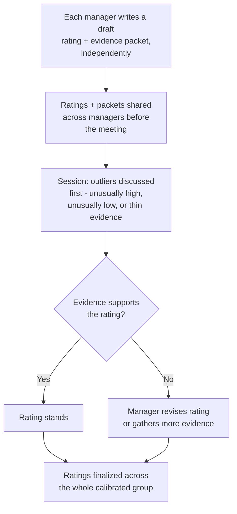

import LevelIntro from "../../../components/LevelIntro.astro";
import Checkpoint from "../../../components/Checkpoint.astro";

L1 named the three biases that distort a draft rating without the
manager noticing. L2 works out the actual mechanism calibration uses to
catch them, and why a single "did great work" bar breaks down once a
group has to compare people at different levels.

<LevelIntro
  items={[
    "How calibration turns invisible individual bias into visible inconsistency",
    "The independent-draft-then-evidence-first mechanism",
    "Why a single shared bar breaks down across levels",
  ]}
/>

## Why "just be objective" doesn't fix this

**If the problem is bias, why doesn't telling a manager to "just be
objective" solve it?** Because none of the three biases from L1 feel
like bias from the inside — a manager who rates March's launch higher
than February's quiet fix genuinely believes they're describing what
happened, because March is what they can recall in detail. Calibration
doesn't ask managers to try harder at being unbiased; it puts multiple
managers' ratings side by side against a shared rubric, so a distortion
that's invisible to one person becomes visible as an inconsistency
between people.

| Bias                        | What it looks like from inside the manager's head    | What calibration exposes it as                                   |
| --------------------------- | ---------------------------------------------------- | ---------------------------------------------------------------- |
| Recency bias                | "Here's what I remember about this person's year"    | A rating with no cited evidence from two of the four quarters    |
| Halo effect                 | "They're clearly excellent, look at this one result" | A rating on a dimension the manager never actually observed      |
| Leniency / central tendency | "Everyone on my team is doing fine"                  | One manager's ratings cluster tighter than every other manager's |

## The mechanism

**How does a room of managers actually turn five sets of biased drafts
into something more consistent?**

Two design choices do most of the work here. First, **drafts are
written independently, before the session** — a manager commits to a
rating and its evidence before hearing anyone else's opinions, so the
session surfaces genuine disagreement instead of everyone anchoring to
whoever spoke first. Second, **discussion starts from evidence, not
from the rating itself** — the question in the room isn't "do we agree
this person is a 4," it's "what specific, dated example supports a 4
instead of a 3," which is the mechanism that catches recency bias: a
packet with detailed March evidence and nothing from February is
visibly thin the moment someone asks for it.

<Checkpoint question="Two managers walk into a calibration session with drafts of 3 and 4 for two people who both did genuinely good work. Why does the session start by asking for evidence on the thinner packet, rather than starting by debating whether 3 or 4 is the 'right' number?">

Debating the number directly turns the conversation into a negotiation
between two people's gut impressions, with nothing to anchor it —
whoever argues more persuasively, or whoever has more seniority in the
room, tends to win regardless of what actually happened. Asking for the
specific, dated evidence behind the thinner rating instead turns the
same conversation into a fact-check: either the evidence is there and
the rating holds, or it isn't there and that absence is itself the
signal that something (most often recency bias) shaped the draft rather
than a fair read of the whole period. Starting from evidence is what
lets a room catch a distortion that the manager who wrote the draft
couldn't see in themselves.

</Checkpoint>

## Why "different roles and levels" makes this harder, not easier

**The Scenario compared two engineers in similar roles — what happens
when a calibration group has to compare a senior engineer to a junior
one?** The rubric can't be a single bar ("did great work") because
"great work" means something different at each level — a junior
engineer executing a well-scoped task independently and a senior
engineer identifying a problem nobody assigned them are both excellent,
on different axes. A calibration rubric has to specify **what's
actually being measured at each level** (scope of ownership, not just
raw output) so that a room comparing a junior and a senior isn't
implicitly asking "who did more," which senior engineers will always
win by default.

| Level  | What "meets expectations" actually measures                          |
| ------ | -------------------------------------------------------------------- |
| Junior | Executes well-scoped tasks reliably; asks for help at the right time |
| Mid    | Owns a feature end-to-end; scopes their own smaller tasks            |
| Senior | Identifies problems nobody assigned; unblocks others, not just self  |

<Checkpoint question="A calibration group is comparing a junior engineer's year to a senior engineer's year using one shared bar: 'did great work.' What goes wrong, specifically?">

A single shared bar implicitly measures raw output or visible impact,
and a senior engineer will almost always produce more of both simply
because of their scope and experience — so the comparison quietly
becomes "who did more" rather than "who met the bar for their own
role." That's unfair in both directions: it can make a junior
engineer's genuinely excellent, well-scoped work look thin next to a
senior's, and it can let a senior coast on scale rather than on the
things seniority is actually supposed to add, like unblocking others or
finding problems nobody assigned them. A per-level rubric fixes this by
naming what "meets expectations" measures at each level, so the group
is comparing each person against their own bar, not against each
other's raw output.

</Checkpoint>

## Failure modes at this level

- **Skipping the independent-draft step and discussing as a group from
  the start.** Without a private, evidence-backed draft first, the
  first manager to speak anchors everyone else's judgment, and the
  session catches less inconsistency than it would with drafts in
  hand.
- **Debating the rating number before the evidence.** "Is this a 3 or
  a 4" invites a negotiation; "what's the specific evidence" invites a
  fact-check — starting with the second question is what actually
  surfaces a thin, recency-biased packet.
- **Using one shared bar across every level instead of a per-level
  rubric.** A single "did great work" standard silently rewards
  scope and seniority rather than measuring whether someone met the
  bar for their own level.
