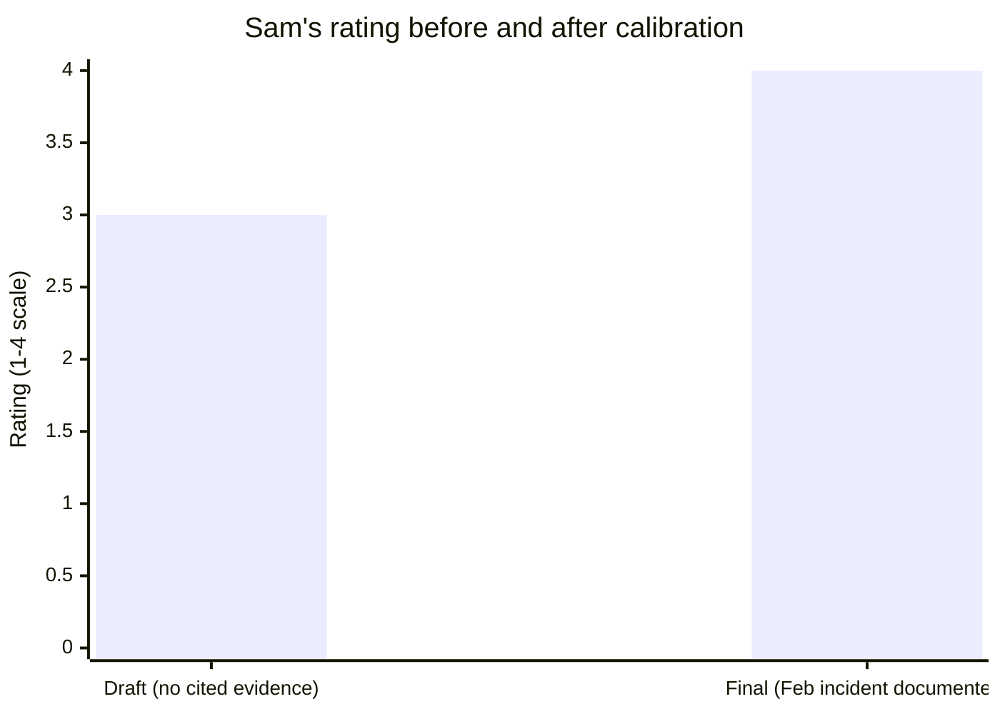

import LevelIntro from "../../../components/LevelIntro.astro";
import Checkpoint from "../../../components/Checkpoint.astro";

L2 worked out the mechanism — independent drafts, evidence before the
rating number, a per-level rubric. L3 runs that mechanism start to
finish on the two engineers from the opening Scenario, then pushes past
the single worked example into what happens when nobody catches the
gap.

<LevelIntro
  items={[
    "A full draft-to-final calibration walkthrough",
    "How a thin packet gets caught and revised in the room",
    "What breaks downstream if it isn't caught",
  ]}
/>

## Setting up the packets

**Before the room even meets, what does each manager bring in?** Two
managers, Priya and Dan, each manage one of the Scenario's engineers —
Priya manages Wren (the March launch), Dan manages Sam (the February
fix). Both write independent draft ratings and evidence packets before
the calibration session, using the same four-point scale (1 = below
expectations, 4 = significantly exceeds) and the same per-level rubric
from L2.

**Priya's draft — Wren, senior engineer, proposed rating: 4**

> Wren led the checkout redesign that shipped in March. It's already
> driving a measurable increase in completed purchases, and the
> engineering work behind it was clean and well-tested. Wren is
> clearly one of the strongest people on the team.

**Dan's draft — Sam, senior engineer, proposed rating: 3**

> Sam did solid, reliable work this year. Nothing stands out as
> exceptional, but nothing was a problem either. Meets expectations.

**Is either draft dishonest?** No — everything written is true. Wren's
launch really did happen and really is good work. But notice what's
missing from Dan's packet: no specific example, no date, no outcome —
just a summary impression. That absence is the thing calibration is
built to catch, and it's exactly the recency-bias pattern from L1: Dan
has plenty to say about Sam's year, but none of it is coming to mind
unprompted, because none of it happened recently.

<Checkpoint question="Dan's draft for Sam isn't false — everything in it is true, and Sam really did do solid work. So what, specifically, is the calibration session going to flag about it?">

Calibration isn't checking whether a draft is honest — it's checking
whether a draft is backed by specific, dated evidence, and Dan's isn't.
"Solid, reliable work, nothing stands out" is a true summary impression,
but it names no example, no date, and no outcome, which is exactly the
shape a recency-biased rating takes: not a false claim, but a thin one,
because the manager's memory of the full period has already faded down
to whatever happened most recently. The session's job is to ask "what's
the specific evidence" precisely because a sincere but thin packet
looks nothing like a lie from the outside — it only shows up once
someone asks for the example.

</Checkpoint>

## The session: outliers first

**The calibration group looks at both packets side by side. What do
they actually ask?** Not "is Wren a 4" — the group starts with the
thinnest packet: "Dan, what's the specific evidence behind Sam's 3?"

Dan pauses, then remembers: in February, Sam noticed that a routine
database migration script would have silently corrupted a subset of
customer records in production if it ran as scheduled — a problem
nobody had asked Sam to look for. Sam flagged it, wrote a corrected
migration, and tested it against a snapshot of production data before
it ran. No outage happened. No customer ever saw a symptom. Because
nothing broke, nobody outside the immediate team ever heard about it —
including, three months later, Dan's own memory when writing the
review.

The group then turns to Wren's packet, which reads as strong but is
worth the same fact-check: is the launch's business impact actually
measured yet, a few weeks post-launch, or is "already driving a
measurable increase" restating the goal rather than a result? Priya
checks and confirms early conversion data does support it — the
evidence holds up once asked for directly.

## What changes, and why

**Sam's fix and Wren's launch are different kinds of excellent — how
does the group decide they're comparable?** Using the per-level rubric
from L2 ("senior identifies problems nobody assigned, unblocks others,
not just self"): Sam's fix is a textbook example — nobody assigned the
investigation, and it prevented a production incident that would have
cost far more, in both engineering time and customer trust, than the
migration itself took to write. Wren's launch is also a strong example
of ownership. Measured against the same rubric standard rather than
against "how memorable was this," they're comparable — and the
group calibrates Sam's rating up to a 4 alongside Wren's, with Dan's
packet now including the specific, dated evidence.

**Dan's revised packet — Sam, senior engineer, final rating: 4**

> In February, Sam independently identified that a scheduled
> migration would corrupt a subset of production customer records,
> wrote and tested a corrected version, and prevented what would have
> been a significant incident — work nobody assigned and few people
> knew about. This is the kind of unassigned, high-leverage ownership
> the senior rubric describes, even though it produced no visible
> launch.

| Engineer | Draft rating | Evidence behind the draft                   | Final rating | What changed                                          |
| -------- | ------------ | ------------------------------------------- | ------------ | ----------------------------------------------------- |
| Wren     | 4            | Visible launch, impact confirmed on request | 4            | Nothing — evidence held up once fact-checked          |
| Sam      | 3            | General impression, no example              | 4            | Dan recalled and documented the specific Feb incident |

<Checkpoint question="Sam's fix (a quiet, prevented incident) and Wren's launch (a visible, measured win) look nothing alike on the surface. What lets the calibration group treat them as comparable rather than as apples and oranges?">

The group isn't comparing the two events directly — it's measuring
each one against the same fixed standard, the senior-level rubric from
L2 ("identifies problems nobody assigned, unblocks others, not just
self"). Sam's fix and Wren's launch both satisfy that standard, just
through different kinds of work, so grading them against the shared
rubric rather than against each other, or against how memorable each
event is, is what makes the comparison fair. Without that shared
standard, the group would default back to comparing visibility and
memorability, which is exactly the bias calibration exists to remove.

</Checkpoint>

## Extend it: what if the group hadn't caught this?

**What if Dan's draft of 3 had simply been accepted without discussion
— what actually breaks downstream, beyond "one review was slightly
off"?** If ratings feed into a fixed distribution (a common calibration
constraint — only so many "4"s allowed per team), Sam's undercounted
rating doesn't just understate one review; it can cost Sam a raise or
promotion slot that goes to someone else instead, and it teaches Sam,
over repeated cycles, that quiet, preventive work is worth less than
visible launches — which is exactly backward for what a team actually
needs from a senior engineer. Calibration's cost is one extra meeting;
its benefit is catching exactly this kind of error before it compounds
across a career, not just across one review cycle.

**A harder version of the same question:** what if Sam's fix and
Wren's launch had happened on _different_ teams, calibrated by
_different_ groups that never talk to each other? Cross-team
calibration (comparing final ratings across groups, not just within
one) is how larger orgs catch a second-order version of this same
problem — one whole team's calibration group could still be
collectively lenient or collectively harsh relative to another team's,
even after each team's internal session went perfectly.

## Failure modes at this level

- **Accepting a thin packet because the manager seems confident.**
  Dan's original draft was delivered with total sincerity — confidence
  isn't evidence, and a calibration session that doesn't ask "what's
  the specific example" for every packet, not just the surprising
  ones, will still let recency bias through on the packets nobody
  happened to question.
- **Treating calibration as a one-time fix instead of catching the
  next cycle's version of the same bias.** Dan now has Sam's February
  incident on record, but six months from now a _different_ quiet
  contribution will be just as invisible unless Dan changes the habit
  of writing evidence down when it happens, not just at review time.
- **Assuming a fixed rating distribution is itself fair.** Forcing a
  set number of "4"s per team can reintroduce exactly the unfairness
  calibration is trying to remove, if two genuinely excellent people
  end up on the same team competing for one slot — the distribution is
  a management tool for pay budgets, not a claim about how performance
  is actually distributed.
