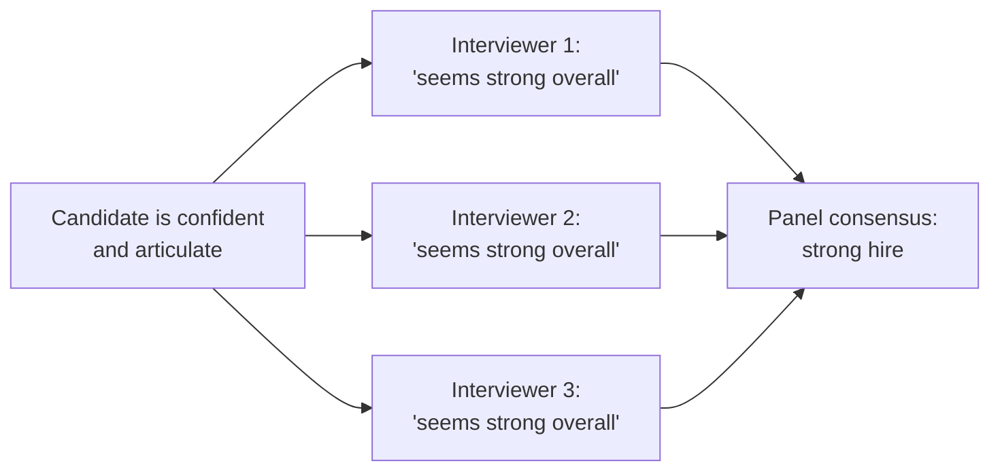

import LevelIntro from "../../../components/LevelIntro.astro";
import Checkpoint from "../../../components/Checkpoint.astro";

L1 named the halo effect and role definition as the two ideas behind
the Scenario's rushed hire. This level works through the mechanism —
why agreement among interviewers can be misleading, and what actually
makes a role definition usable.

<LevelIntro
  items={[
    "Why panel agreement isn't automatically independent evidence",
    "What a checkable role-definition signal looks like",
    "How signals get mapped onto individual interview slots",
  ]}
/>

## How one trait quietly biases the assessment of everything else

**If every interviewer independently thought the candidate was
strong, doesn't that agreement make the assessment more trustworthy?**
Not necessarily — if all five interviewers were reacting to the same
salient trait (how confident and articulate the candidate was) rather
than five independently-tested skills, their agreement isn't five
independent data points. It's one trait, counted five times:

Every arrow into "panel consensus" traces back to the same single
trait — none of the interviewers actually tested a distinct skill.
This is the **halo effect** in action: a strong, visible trait
(confidence) unconsciously colors the perceived strength of unrelated
traits (technical depth, judgment under pressure) that were never
actually observed.

**Does this mean confidence and charisma are bad signs in a
candidate?** No — the problem isn't that the candidate was confident,
it's that confidence became a proxy for everything else instead of
one specific, deliberately-tested signal among several independent
ones.

<Checkpoint question="Five interviewers all came away thinking a candidate was strong. Does that agreement by itself tell you five different skills were actually tested?">

Not necessarily. Agreement is only meaningful if each interviewer was
independently testing something different. If all five reactions
trace back to the same salient trait — how confident and articulate
the candidate came across — then the panel has produced one data
point, repeated five times, not five independent checks. The number
of interviewers who agreed says nothing about how much real coverage
the loop actually had; only what each of them was specifically
testing does.

</Checkpoint>

## What a role definition actually specifies

**If "a strong engineer" isn't specific enough to interview against,
what does a usable role definition look like?** A short list of the
specific things this particular role genuinely requires — framed as
checkable signals, not adjectives:

| Vague trait ("a strong engineer") | Concrete signal (checkable in an interview)                                                         |
| --------------------------------- | --------------------------------------------------------------------------------------------------- |
| "Good communicator"               | Can explain a technical trade-off to a non-technical stakeholder in under two minutes               |
| "Technically strong"              | Can independently diagnose a production incident from partial, ambiguous information                |
| "Good judgment"                   | Can identify which of three proposed fixes for a bug addresses the root cause, not just the symptom |

**Is this table saying every role needs all three of these
signals?** No — the point is that whatever signals a specific role
actually needs should be written down and specific, so the loop can
be designed to test exactly those things — not that this particular
list is universal. A different role would need a different, equally
specific list.

<Checkpoint question="A hiring manager writes down 'good judgment' as the one requirement for a role. Is that a usable role definition yet?">

No. "Good judgment" is exactly the kind of adjective that gave the
halo effect room to operate in the first place — it isn't checkable,
so no interviewer can design an exercise around it or score it
independently of their general impression of the candidate. A usable
role definition restates it as something a candidate can actually
demonstrate, such as identifying which of three proposed fixes for a
bug addresses the root cause rather than just the symptom. Until the
requirement is phrased as a concrete, observable signal like that,
there's nothing yet for a structured loop to test against.

</Checkpoint>

## Designing the loop around the signals, not the other way around

**Once the signals are defined, how does that change what each
interview slot actually does?** Each interview slot gets assigned to
test one specific signal from the role definition, and interviewers
score against that signal independently — before comparing notes with
each other, not after. This is what breaks the halo effect: if
Interviewer 2's job was specifically "test whether this candidate can
diagnose a production incident from partial information," their score
has to be based on evidence from that exercise, not a general "I
liked talking to them" impression carried over from earlier in the
day.

## Failure modes at this level

- **Running every interview as an open-ended conversation.** Without
  each slot targeting a distinct signal, every interviewer ends up
  measuring roughly the same thing — usually likability — and the
  loop provides far less real coverage than five interviews suggests.
- **Letting interviewers compare notes before scoring independently.**
  If the first interviewer's enthusiasm reaches the rest of the panel
  before they've formed their own assessment, it can anchor everyone
  else's scores regardless of what they actually observed.
- **Treating "everyone liked them" as equivalent to "we tested
  everything the role needs."** Agreement across the panel only means
  something if each interviewer was actually testing something
  different.
