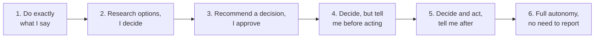
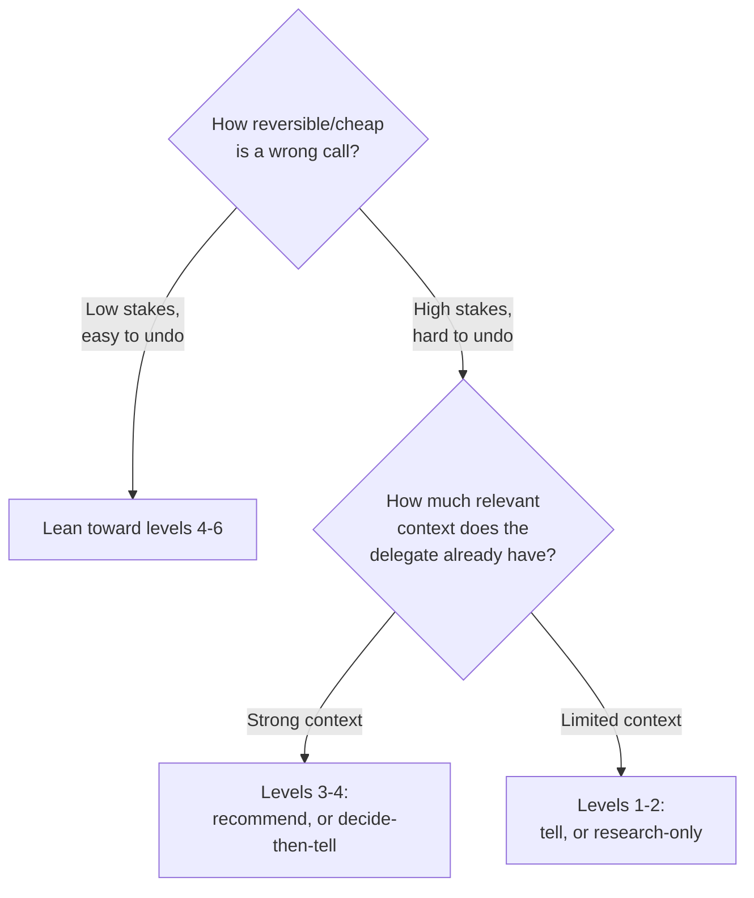

import LevelIntro from "../../../components/LevelIntro.astro";
import Checkpoint from "../../../components/Checkpoint.astro";

L1 showed how the CI-vendor incident happened: two people silently assumed
different points on a spectrum of delegated authority. L2 makes that
spectrum concrete and works out how to pick a point on it on purpose,
instead of by accident.

<LevelIntro
  items={[
    "The six-level delegation spectrum",
    "The two questions that pick a level",
    "Naming a specific 'trust but verify' check-in",
  ]}
/>

## The spectrum, made explicit

**If "take care of it" and "do exactly this" are two ends of a spectrum, what are the
useful stops in between?** A practical way to break it down:

The CI-vendor incident's mismatch was a gap of two full levels: the manager was operating
at **Level 3** ("recommend a decision, I approve"), the report was operating at **Level 5**
("decide and act, tell me after"). Neither level is wrong in the abstract — a two-level
gap on a reversible, low-stakes task might never cause a problem. On a one-year vendor
contract, it did.

<Checkpoint question="Two levels apart on the spectrum above caused a real incident on a one-year vendor contract. Would that same two-level gap (say, Level 3 vs. Level 5) necessarily cause a problem on a task like drafting a first version of an internal Slack announcement?">

Not necessarily. The spectrum itself doesn't determine risk on its own —
what turned the gap into an incident was the combination of a wide gap
_and_ a high-stakes, hard-to-reverse decision (a year-long contract with a
cancellation fee). A Slack draft is cheap to revise and easy to walk back,
so even a full Level 1-to-6 gap would mostly cost a round of edits, not a
real incident. The level gap is a risk factor, not a guaranteed failure —
it has to be read alongside how expensive a wrong call would actually be.

</Checkpoint>

## Choosing a level isn't a personality trait — it's two questions

**Given six levels to choose from, what should actually decide which one fits a specific
task?** Two questions, asked together, not a fixed policy applied to every delegation:

1. **How reversible is a wrong decision, and how expensive is undoing it?** A vendor
   contract with a cancellation fee and a year-long commitment sits very differently on
   the spectrum than a first draft of a Slack message, which costs nothing to revise.
2. **How much relevant context does the delegate already have for THIS specific
   decision?** A report who's evaluated CI vendors twice before at a previous job brings
   real context; a report doing it for the first time doesn't — and the same person can
   reasonably sit at different levels for different tasks, or even for the same task at
   different points in their tenure.

Notice the CI-vendor incident again: a one-year contract is genuinely high-stakes and hard
to reverse, and the report was doing this specific evaluation for the first time — both
factors point toward Level 2 or 3, not the Level 5 the report assumed by default.

## "Trust but verify" as a specific, named check-in point

**If naming a level out loud is the fix, what does that sentence actually sound like in
practice?** Not a vague promise to "check in sometimes" — a specific, concrete point:

> "Go ahead and research CI vendor options — loop me in once you've got it narrowed to two
> or three finalists, before you sign anything. I want to weigh in on the final call,
> but I don't need to be involved in the research itself."

This single sentence does three things at once: it states the level (Level 3, roughly —
research plus a recommendation, not full autonomy), it names the specific trigger for the
check-in (narrowed to finalists, before signing), and it explicitly frees the delegate from
needing approval on the parts that don't matter (which vendors to even consider). This is
what "trust but verify" looks like as an actual sentence, rather than an abstract
management principle — verification is scoped to one specific, high-leverage moment, not
spread across every step.

<Checkpoint question="The example check-in sentence above names 'narrowed to two or three finalists, before signing anything' as the trigger. Why is a specific trigger like that better than telling the report 'just keep me in the loop' as the check-in instruction?">

Because "keep me in the loop" doesn't say when, so it just relocates the
original ambiguity instead of resolving it — the report still has to guess
whether that means a daily update, a mention when they're halfway done, or
only when something goes wrong, and a different guess than the manager's
intent recreates the exact same mismatch from the incident. A specific
trigger tied to an actual decision point (narrowed to finalists, before
committing) removes the guesswork: there's exactly one moment it applies
to, and both people can recognize it when it arrives.

</Checkpoint>

## Why the level can (and should) change over time

The same task, delegated to the same person, doesn't have to stay at the same level
forever. A report who nails a Level 3 delegation (bringing a strong, well-reasoned
recommendation) earns a Level 4 or 5 next time on a similar task — the level is a living
assessment of demonstrated context for _this kind of decision_, not a fixed rating of the
person overall. Conversely, a mismatch like the incident above is information too: it
suggests the level needs to be set more explicitly next time, not that the report can
never be trusted with vendor decisions again.
