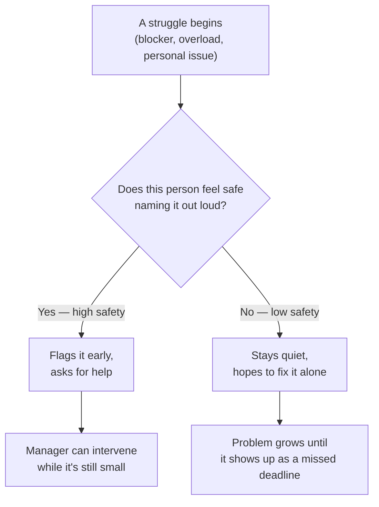

import LevelIntro from "../../../components/LevelIntro.astro";
import Checkpoint from "../../../components/Checkpoint.astro";

L1 named the difference between a lagging signal (the missed deadline
itself) and the quieter signals that come before it. L2 works through
what those specific signals actually look like, and why psychological
safety is the mechanism that decides whether a manager ever gets to see
them at all.

<LevelIntro
  items={[
    "The concrete behavioral signals that precede a crisis",
    "Why safety, not visibility, decides who reports early",
    "What a specific check-in does that a generic one doesn't",
  ]}
/>

## The signals that show up before a missed deadline

**If a missed deadline is the last thing to happen, what actually
comes first?** Almost never a dramatic announcement — usually a series
of small, easy-to-miss behavioral shifts, weeks before the deadline
itself is at risk:

| Signal                                             | What it often means                                                          |
| -------------------------------------------------- | ---------------------------------------------------------------------------- |
| Fewer updates in standup, or vaguer ones           | Something isn't going well and they aren't ready to say so directly          |
| Camera off more often in calls                     | Withdrawal, low energy, or avoiding being "seen" while struggling            |
| Fewer questions asked                              | Could mean confidence — or could mean they've stopped believing asking helps |
| Quality dipping quietly, before the deadline slips | The work is already suffering; the deadline just hasn't caught up yet        |
| Slower response times to messages                  | Disengagement, or being overwhelmed and avoiding the backlog                 |

None of these alone is proof of a crisis — a quiet week happens for
plenty of reasons. What matters is a _pattern_, sustained over more
than a few days, especially in someone whose baseline was previously
different.

<Checkpoint question="A report has one noticeably shorter standup update this week, nothing else out of the ordinary. Based on the table above, does this alone justify treating it as an early signal worth acting on?">

No, not on its own. The table above lists individual signals, but the
text right after it is explicit that none of them alone is proof of
anything — a single quiet week happens for all kinds of ordinary
reasons unrelated to a brewing problem. What makes a signal worth
acting on is a sustained pattern, either the same signal persisting
over more than a few days or several different signals showing up
together in someone whose baseline was previously different. One
shorter update, in isolation, is noise until it repeats or is joined
by something else.

</Checkpoint>

## Why psychological safety decides whether a manager ever sees any of this

**If these signals are visible, why do so many managers still find
out only when the deadline is missed?** Because visibility and
_reporting_ are different things — a manager can only act on a signal
they actually notice, and a struggling person's willingness to name
the struggle out loud depends on whether they expect that to help or
hurt them:

Psychological safety isn't a soft add-on to management — it's the
switch that determines which branch of this flowchart a struggling
person takes. The behavioral signals in the table above still exist in
the "stays quiet" branch, but nobody named them, so they only get
interpreted retroactively, after the deadline, when it's too late to
have mattered.

## Low-safety vs. high-safety teams: what actually differs

| What happens                                     | Low psychological safety                                     | High psychological safety                                                   |
| ------------------------------------------------ | ------------------------------------------------------------ | --------------------------------------------------------------------------- |
| A blocker shows up mid-task                      | Handled alone, silently, often too late to ask for real help | Flagged within days, while there's still time to adjust                     |
| A mistake is made                                | Hidden or minimized, out of fear of the reaction             | Disclosed directly, because the cost of hiding it is understood to be worse |
| A manager asks "how's it going?"                 | Answered with a reflexive "fine" regardless of the truth     | Answered honestly, because honesty hasn't previously been punished          |
| The first the manager hears about a real problem | The missed deadline itself                                   | Days or weeks earlier, directly from the person involved                    |

The right-hand column isn't a personality trait some teams happen to
have — it's built, deliberately, through how a manager actually
responds the first few times someone takes the risk of saying "I'm
struggling."

<Checkpoint question="Two managers both get told by a report, for the first time, 'I'm behind and I don't think I'll make the deadline.' Manager X responds with visible frustration about the timeline. Manager Y responds by asking what would help. Based on the table above, what's the longer-term difference between these two reactions, beyond just this one deadline?">

The difference isn't really about this one deadline at all — it's
about whether this report, or anyone who hears how it went, ever
volunteers that kind of disclosure again. Manager X's frustration
teaches the report that naming a struggle gets met with a negative
reaction, which pushes future struggles into the "stays quiet" branch
of the pattern described above: the next blocker gets hidden and
handled alone, often too late to actually help with. Manager Y's
response teaches the opposite — that disclosure led to support, not
punishment — which is exactly the mechanism that keeps a team's
psychological safety high enough that people keep choosing to flag
problems early instead of hoping to fix them alone.

</Checkpoint>

## What this means for checking in

**If psychological safety is what determines whether signals get
reported, what's a manager actually supposed to do with that?**
Checking in regularly, and specifically, is the practical lever: a
generic "everything okay?" invites a reflexive "yeah, fine," but a
specific, observational check-in — naming an actual change that was
noticed — signals that the manager is actually paying attention, which
is itself part of what builds the safety to answer honestly. L3 walks
through exactly what that conversation sounds like, and what it
doesn't.
