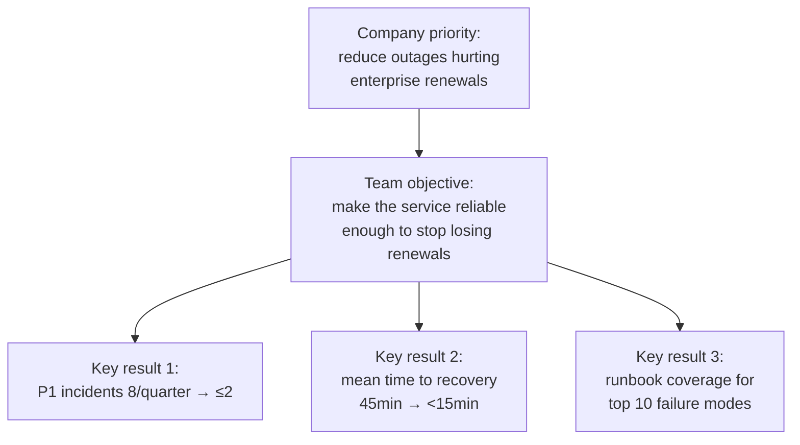

import LevelIntro from "../../../components/LevelIntro.astro";
import Checkpoint from "../../../components/Checkpoint.astro";

L1 named the two things "improve code quality" was missing — a measurable
key result and a traceable link to a real company need. L2 works out what
a goal looks like when it actually has both, and how to tell whether a
team currently has what a given key result would require.

<LevelIntro
  items={[
    "The two-question test for any goal",
    "Objective vs. key result, side by side",
    "Naming a skill gap before it becomes a delivery risk",
  ]}
/>

## Why "improve code quality" isn't actually a goal you can be accountable to

**"Improve code quality" is specific enough to work on — so what's
actually wrong with it as a goal?** Two separate things: it has no
measurable key result (how would anyone know if it succeeded?), and it
was never derived from a level above the team — nobody asked "what
does the organization need from this team this quarter?" before
picking it. A goal can fail either test independently, but "improve
code quality" fails both at once, which is what made the quarter's
effort invisible to leadership even though real work happened.

("P1" here is short for "priority-1" — the highest-severity tier for an
incident, the kind that actually threatens a customer renewal, as
opposed to a minor bug.)

**Does every team goal need to trace all the way up to a company
priority like this?** Yes, in spirit — even goals about internal
tooling or team health should be traceable to _something_ the
organization needs (developer velocity, retention, reduced risk), not
just something that felt worth doing. The chain doesn't have to be
one hop; it just has to exist and be explainable.

<Checkpoint question="A team sets the goal 'reduce P1 incidents from 8/quarter to ≤2, tied to the company's uptime-driven renewal priority.' Does this goal pass the two tests that 'improve code quality' failed?">

Yes, on both counts. It has a real key result — a count that either
lands at 2 or fewer by quarter end or doesn't, with no room to argue
about whether it happened. And it traces upward: it exists because the
company's stated priority is reducing outages that threaten a specific
renewal, not because the team picked something that sounded worthwhile
in isolation. That second part is the one "improve code quality" never
had — a number alone isn't enough if the number doesn't connect to
what the organization actually needed that quarter.

</Checkpoint>

## Objectives versus key results

**What's the actual difference between an objective and a key
result?** An objective is qualitative and motivating — "make the
service reliable enough to stop losing renewals" says _why this
matters_ in a way a number alone doesn't. A key result is quantitative
and falsifiable — "P1 incidents 8/quarter → ≤2" either happened or it
didn't, with no room for the ambiguity "improve code quality" had.

|         | Objective                                                | Key result                  |
| ------- | -------------------------------------------------------- | --------------------------- |
| Nature  | Qualitative, motivating                                  | Quantitative, measurable    |
| Answers | "Why does this matter?"                                  | "Did it actually happen?"   |
| Example | Make the service reliable enough to stop losing renewals | P1 incidents 8/quarter → ≤2 |

An objective without key results is a slogan. Key results without an
objective are a spreadsheet nobody's inspired by. Both are needed
together.

## Skill gap analysis: does the team actually have what the goal requires?

**Suppose the key results are set — is the goal-setting work done?**
Not quite — the next question is whether the team currently has the
skills and tools to hit those key results, or whether the plan needs
to include building them first. If nobody on the team has ever
written an incident runbook, "runbook coverage for the top 10 failure
modes" implicitly requires learning how to write a good one before it
can be delivered — a real goal plan names that gap explicitly instead
of assuming effort alone closes it.

<Checkpoint question="A team sets 'write runbooks for the top 10 failure modes' as a key result, but nobody on the team has ever written one before. What does a skill gap analysis add here that the key result alone doesn't capture?">

The key result as written only says what should exist by the end of
the quarter — it says nothing about whether the team currently knows
how to produce it well. A skill gap analysis surfaces that gap
explicitly: writing ten documents is easy to do badly, and a runbook
nobody trusts during an actual 2am incident hasn't really delivered
the key result even if it technically exists. Naming the gap up front
means the plan can account for it directly — pairing the first attempt
with someone experienced, reviewing it against what makes a runbook
usable under pressure — rather than discovering at quarter end that
the box got checked but the underlying need didn't get met.

</Checkpoint>

## The generalizable lesson

**Is this specific to engineering teams and outages?** No — the same
two failure modes (no measurable key result, no traceable link to a
real organizational need) can happen to a goal in any function: a
support team, a design team, a sales team. Whenever a goal is being
set, the same two questions apply: what number will tell us this
happened, and what does this actually connect to one level up? A goal
that can't answer both is a good intention, not yet a goal.
