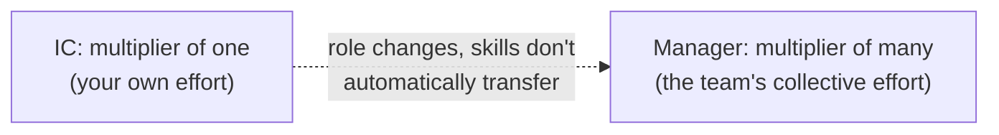

import Scenario from "../../../components/Scenario.astro";
import LevelIntro from "../../../components/LevelIntro.astro";

<Scenario>
  <Fragment slot="facts">
    

      

        15/month
        Maya's personal PRs merged — up from 12
      

      

        

      

      

        2 of 4
        reports unclear on this week's priority
      

      

        

      

    

    

      
🚀 Promoted 3 months ago to manage the same team she used to code on

      
🐢 Team's release cadence has halved since the promotion

      
😕 Maya: "I'm doing more than ever — how is this going wrong?"

    

  </Fragment>

Maya was the strongest backend engineer on a four-person team. Three months
after being promoted to manage that same team, she has personally shipped
more code than anyone else on the team, and can recite the exact status of
every hard bug in flight. Meanwhile, two of her four reports privately say
they don't know what to prioritize this week, and the team's release cadence
has slowed by half.

| Metric (Maya's team)         | Before promotion | 3 months into managing |
| ---------------------------- | ---------------- | ---------------------- |
| Maya's PRs merged personally | 12/month         | 15/month               |
| Reports unclear on priority  | —                | 2 of 4                 |
| Team release cadence         | baseline         | halved                 |

**Before reading on: Maya's own output went up, not down, since the promotion. So what, exactly, is going wrong?**

</Scenario>

The trap Maya fell into is the single most common one in this transition, and it isn't about effort or talent.

<LevelIntro
  items={[
    "Why IC skills don't automatically transfer to management",
    "The manager's real unit of output",
    "The retreat-to-IC-work failure mode",
  ]}
/>

- The core trap: the skills that get someone _promoted_ into management (being an excellent individual contributor — writing great code, solving hard technical problems yourself) are largely **not** the skills the management job actually requires day to day. Excellence at the work and excellence at enabling _others'_ work are different competencies that happen to share a career ladder.
- An IC's unit of output is their own work. A manager's unit of output is **the output of the people they manage** — a manager who is personally still the top individual contributor on the team, while their reports are unclear on priorities or blocked and unsupported, is failing at the actual job, regardless of their personal technical output. That's exactly Maya's situation: her PR count is a distraction from the metric that actually matters now.
- This produces a **specific, common failure mode**: a new manager, uncertain in the unfamiliar job, retreats to what they know how to do well — writing code, personally solving the hardest technical problems — which feels productive and _is_ productive, but isn't the job anymore, and often actively starves the team of the coaching, unblocking, and prioritization only the manager is positioned to provide.
- The shift is often described as moving from a **multiplier of one** (your own effort) to a **multiplier of many** (a team's collective effort) — a manager who makes four people 10% more effective has produced more real value than personally shipping a few extra PRs, even though the second is directly visible on a dashboard and the first isn't.

- This is not a claim that management is "harder" or "better" than being an IC — they're different jobs requiring different skills, and being excellent at one doesn't transfer automatically, in either direction. A team's best engineer is not automatically its best manager, and treating the promotion as an automatic reward for technical excellence (rather than a genuine role change) sets both the new manager and their team up for a rough transition.
- The practical shift this unit is about: learning to measure your own success by team output and team growth, not personal output — and building the specific new-to-you skills (delegation, coaching, unblocking, prioritization across other people's work) that this actually requires, rather than assuming technical excellence will carry over.

Maya isn't failing because she's untalented — she's optimizing the wrong equation. L2 makes that equation explicit.
