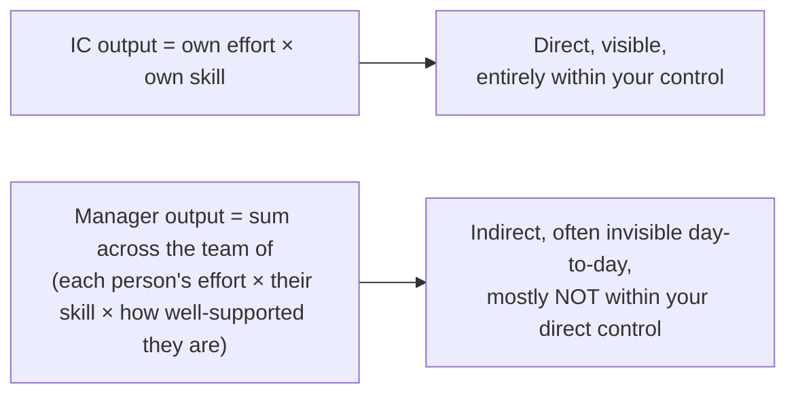

## Two different output equations

The manager equation has a term the IC equation doesn't: "how well-supported they are" — unclear priorities, missing context, being blocked on a decision only the manager can make, or lacking coaching on a skill gap all directly multiply down every team member's effective output, and closing those gaps is now the actual job, even though it produces no code and no direct, personally-attributable output of its own.

## Why the retreat-to-IC-work trap is so common

Picture a new manager's actual to-do list on a given day: unblock person A's ambiguous requirement, have a hard feedback conversation with person B, figure out why person C seems disengaged, decide priority between two competing asks from other teams — every one of them unfamiliar and genuinely uncomfortable. Sitting right next to that list is a familiar alternative: "just write this tricky bit of code myself, I know exactly how." Under the discomfort of the unclear tasks, the pull toward the familiar one is strong — not because it's the wrong instinct in general, but because it's genuinely productive and feels like real progress, which is exactly what makes it so easy to default to, even though it isn't what only the manager can do today.

Every one of the "unclear tasks" is something _only_ the manager is positioned to do (the org gave them the context, the authority, or the relationship to do it) — while the familiar task, however well done, is something a senior IC on the team could likely have done too. Retreating to the familiar task doesn't just fail to help the team; it actively withholds capacity the team structurally can't get from anywhere else.

## The skill set genuinely doesn't transfer 1:1

| IC skill (what got them promoted)           | Manager skill (what the job actually needs)                                                              | Why it's not the same muscle                                                                    |
| ------------------------------------------- | -------------------------------------------------------------------------------------------------------- | ----------------------------------------------------------------------------------------------- |
| Solving a hard technical problem personally | Recognizing when to let someone else struggle productively with a problem instead of solving it for them | The instinct to jump in and fix it directly now works against building the other person's skill |
| Writing clear code                          | Writing clear, actionable feedback about someone else's code and choices                                 | Requires framing that lands without demotivating — a different communication skill entirely     |
| Prioritizing your own backlog               | Prioritizing across several people's conflicting, partially-visible work                                 | Requires visibility and judgment the IC role never demanded                                     |
| Being right                                 | Being willing to be publicly wrong in a way that makes it safe for reports to disagree and take risks    | Directly in tension with the IC habit of demonstrating competence by having the right answer    |

None of these manager-column skills are things a strong IC automatically already has — they're a genuinely separate skill set that has to be deliberately built, the same way the IC skills were, not something competence in the left column guarantees.

## Measuring success by the right output

The practical consequence of the "multiplier of many" framing: a manager's self-assessment question shouldn't be "what did I personally produce this week" — it should be "is my team more capable, more unblocked, and more clear on priorities than they were a month ago, and is that measurably true even in areas I didn't personally touch." The second question is harder to answer and slower to show results, which is exactly why it's easy to substitute the first, more familiar, faster-feedback question instead.
