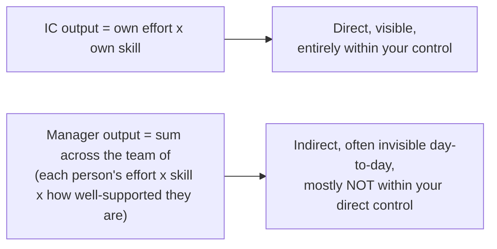
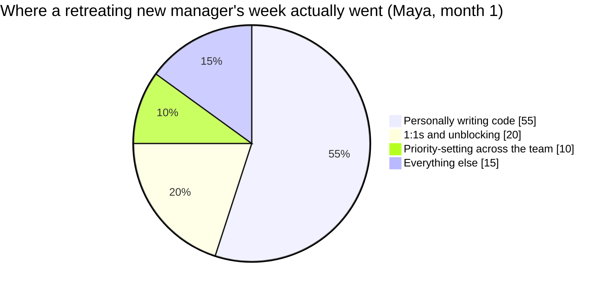

import LevelIntro from "../../../components/LevelIntro.astro";
import Checkpoint from "../../../components/Checkpoint.astro";

L1 named the trap Maya fell into without yet writing out the actual math
behind it. L2 makes the two output equations explicit, and shows why the
retreat back to familiar IC work is such a common — and costly — response
to the discomfort of the new one.

<LevelIntro
  items={[
    "The IC output equation vs. the manager output equation",
    "Why the retreat-to-IC-work trap is so common",
    "The specific skills that don't transfer 1:1",
  ]}
/>

## Two different output equations

Maya, from L1, is measuring herself against the same equation she used as an IC — but the job underneath her changed. What does the new equation actually look like, and where does it leave room for a gap her old one never had?

The manager equation has a term the IC equation doesn't: "how well-supported they are" — unclear priorities, missing context, being blocked on a decision only the manager can make, or lacking coaching on a skill gap all directly multiply down every team member's effective output, and closing those gaps is now the actual job, even though it produces no code and no direct, personally-attributable output of its own. Maya's two unclear reports are exactly that missing term showing up as a cost.

<Checkpoint question="Maya's PR count went up after her promotion. Using the manager output equation above, explain why that number alone can't tell you whether she's doing the job well.">

Because the manager equation isn't about Maya's own effort and skill at
all — it's the sum, across the whole team, of each person's effort and
skill multiplied by how well-supported they are. Maya's PR count only
measures her own term in the old IC equation, which no longer describes
her job. A high personal number can coexist with two reports being
unclear on priorities, which is a direct hit to the "how well-supported
they are" term for those two people — exactly what's happening to Maya's
team. The two numbers are answering different questions, and only one of
them is actually her scoreboard now.

</Checkpoint>

## Why the retreat-to-IC-work trap is so common

If the new equation is genuinely better for the team, why does almost every new manager still drift back toward the old one? Picture a new manager's actual to-do list on a given day: unblock person A's ambiguous requirement, have a hard feedback conversation with person B, figure out why person C seems disengaged, decide priority between two competing asks from other teams — every one of them unfamiliar and genuinely uncomfortable. Sitting right next to that list is a familiar alternative: "just write this tricky bit of code myself, I know exactly how." Under the discomfort of the unclear tasks, the pull toward the familiar one is strong — not because it's the wrong instinct in general, but because it's genuinely productive and feels like real progress, which is exactly what makes it so easy to default to, even though it isn't what only the manager can do today.

Every one of the "unclear tasks" is something _only_ the manager is positioned to do (the org gave them the context, the authority, or the relationship to do it) — while the familiar task, however well done, is something a senior IC on the team could likely have done too. Retreating to the familiar task doesn't just fail to help the team; it actively withholds capacity the team structurally can't get from anywhere else.

## The skill set genuinely doesn't transfer 1:1

Maya is clearly skilled — nobody disputes that. So if skill isn't the missing piece, what specifically is she short on?

| IC skill (what got them promoted)           | Manager skill (what the job actually needs)                                                              | Why it's not the same muscle                                                                    |
| ------------------------------------------- | -------------------------------------------------------------------------------------------------------- | ----------------------------------------------------------------------------------------------- |
| Solving a hard technical problem personally | Recognizing when to let someone else struggle productively with a problem instead of solving it for them | The instinct to jump in and fix it directly now works against building the other person's skill |
| Writing clear code                          | Writing clear, actionable feedback about someone else's code and choices                                 | Requires framing that lands without demotivating — a different communication skill entirely     |
| Prioritizing your own backlog               | Prioritizing across several people's conflicting, partially-visible work                                 | Requires visibility and judgment the IC role never demanded                                     |
| Being right                                 | Being willing to be publicly wrong in a way that makes it safe for reports to disagree and take risks    | Directly in tension with the IC habit of demonstrating competence by having the right answer    |

None of these manager-column skills are things a strong IC automatically already has — they're a genuinely separate skill set that has to be deliberately built, the same way the IC skills were, not something competence in the left column guarantees.

<Checkpoint question="A strong IC gets promoted and, in their first week, personally rewrites a struggling junior engineer's pull request instead of leaving comments and letting the junior fix it themselves. Which row of the skill table above does this match, and what does it cost the team even though the PR is now technically better?">

It matches the first row: solving the problem personally instead of
recognizing when to let someone struggle productively with it. The
instinct that made them a strong IC — noticing what's wrong and fixing it
directly — is now working against the actual goal, because the junior
engineer never has to build the skill of finding that kind of bug
themselves. The PR is better today, but the team's capability didn't
grow, and the same category of mistake is likely to resurface next time,
since the underlying gap in the junior engineer's skill was never
actually closed.

</Checkpoint>

## Measuring success by the right output

If Maya's PR count is the wrong scoreboard, what question should she actually be asking herself at the end of a week?

The practical consequence of the "multiplier of many" framing: a manager's self-assessment question shouldn't be "what did I personally produce this week" — it should be "is my team more capable, more unblocked, and more clear on priorities than they were a month ago, and is that measurably true even in areas I didn't personally touch." The second question is harder to answer and slower to show results, which is exactly why it's easy to substitute the first, more familiar, faster-feedback question instead — the same substitution Maya has been making without noticing.

L3 walks the same starting team through a full month handled both ways, so the gap between the two scoreboards stops being abstract.
