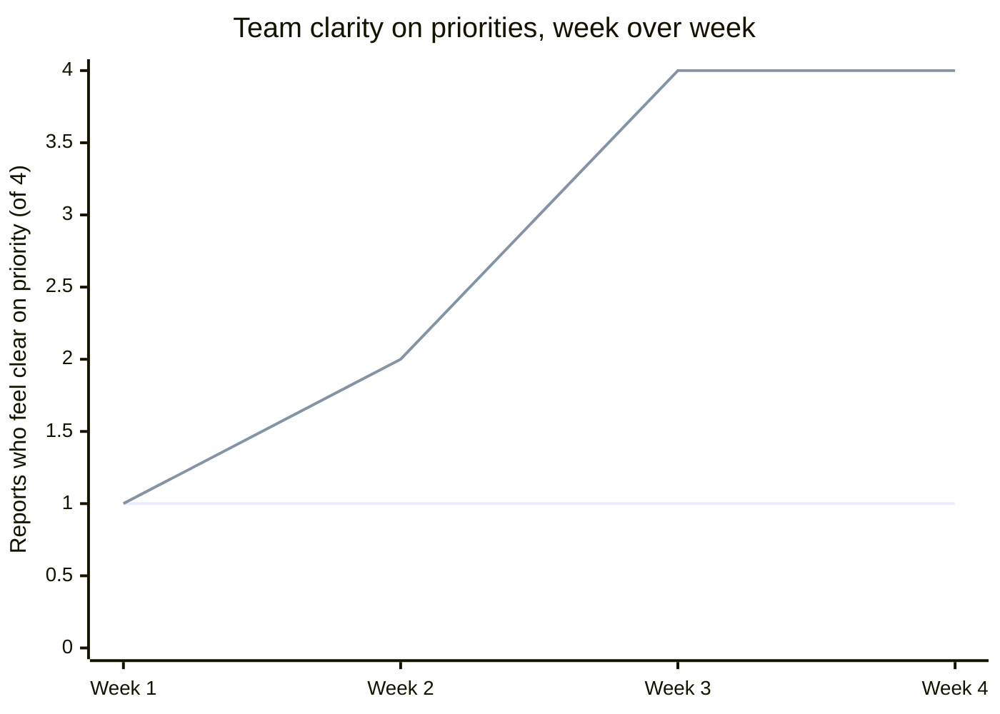

import Scenario from "../../../components/Scenario.astro";
import LevelIntro from "../../../components/LevelIntro.astro";
import Checkpoint from "../../../components/Checkpoint.astro";

<Scenario label="The scenario">
  <Fragment slot="facts">
    

      
👤 Manager: an excellent senior engineer, just promoted

      
👥 Team: the same 4 people they used to be a peer on

      
❓ An ambiguous new project, no clear owner yet

      
🧑‍💻 One junior engineer, stuck on the same problem repeatedly

      
📋 A backlog with no agreed-on priority order

    

    
Two paths, identical starting point

    

      
🅰️ Path A: retreat to familiar IC work

      
🅱️ Path B: do the actual management job

    

  </Fragment>

An excellent senior engineer is promoted to manage the four-person team they
used to be a peer on. Watch the same starting situation — a team with an
ambiguous new project, one struggling junior engineer, and a backlog of
unclear priority — produce very different four-week outcomes depending on
where the new manager's time actually goes.

**Before reading on: both managers below are equally skilled and equally hardworking, facing the identical starting facts above. If neither one is lazy or incompetent, what could possibly produce two different outcomes?**

</Scenario>

Watch how the _same starting facts_ produce genuinely different four-week outcomes, depending on which problems the manager treats as theirs to solve directly.

<LevelIntro
  items={[
    "The same starting team, handled two different ways",
    "Week-by-week outcomes of retreat vs. real management",
    "Failure modes in the IC-to-manager transition",
  ]}
/>

## Path A: retreating to IC work

**Week 1:** Uncertain how to run a kickoff for the ambiguous new project, the manager instead spends the week personally writing the technical design doc for it — genuinely excellent work, done fast, because it's exactly the kind of thing they were promoted for being good at.

**Week 2:** The struggling junior engineer is still stuck on the same problem they were stuck on before the promotion. The manager notices, but jumping in to personally debug and explain feels slower than just fixing it themselves in twenty minutes — so they do that instead of sitting with the engineer to build the underlying skill.

**Week 3:** The backlog priority is still unclear to the rest of the team, because clarifying it requires several political conversations with other teams that feel unfamiliar and uncomfortable compared to just picking up more of the technical backlog personally, which the manager does instead.

**Week 4 outcome:** The design doc is excellent. The junior engineer has been "unblocked" three separate times on similar issues without the underlying gap ever closing, and privately feels like they're not really trusted to figure things out. The rest of the team is still working from unclear priorities, quietly making their own guesses about what matters most — guesses that don't all agree with each other. The manager has personally produced a lot of good individual work, and the team, as a unit, is not measurably more capable or more clear than it was a month ago.

## Path B: doing the actual job

**Week 1:** The manager runs a kickoff meeting specifically to surface and resolve the new project's ambiguity as a team discussion, contributing technical judgment but deliberately not writing the design doc alone — a senior engineer on the team writes it, with the manager reviewing and coaching instead of authoring.

**Week 2:** Noticing the junior engineer stuck, the manager sits with them, asks questions rather than supplying the answer, and helps them find the fix themselves — slower this week, but the same category of problem doesn't recur the following week, because the underlying gap actually closed.

**Week 3:** The manager has the uncomfortable political conversations with other teams needed to actually resolve the priority ambiguity, then communicates a clear, ranked priority list to the team — work the manager is uniquely positioned to do, since nobody else on the team has the standing or context for those conversations.

**Week 4 outcome:** No design doc with the manager's name on it, and the manager personally wrote less code this month than almost anyone on the team. But the team is measurably different: the junior engineer independently solved two similar problems that would previously have needed help, the senior engineer who wrote the design doc grew from the experience, and everyone is working from the same clear priority list instead of four different guesses. Team output, and the team's capability going forward, both increased — none of it shows up as the manager's personal output, because it isn't supposed to.

<Checkpoint question="A colleague looking only at Path B's manager's personal output for the month (design docs written, code shipped) would likely conclude they had a quiet, low-output month. Why is that read wrong, and what would you look at instead to see what actually happened?">

It's wrong because it's still applying the IC scoreboard — personal
output — to a job whose actual output is the team's, not the manager's
own. Judged that way, Path B genuinely looks weaker than Path A, since
Path A's manager has a design doc and a full month of shipped code to
point to. What you'd need to look at instead is the team, not the
manager: whether the junior engineer can now solve that class of problem
alone, whether the senior engineer who wrote the doc grew from doing it,
and whether the team is working from one shared priority list instead of
four separate guesses. All three of those are real gains that happened
because the manager's time went to enabling them rather than to producing
visible personal output — the gain is just attributed to the team instead
of to the manager, which is exactly the shift L1 and L2 describe.

</Checkpoint>

## What actually differed, week by week

| Week | Path A's time went to                              | Path B's time went to                                         | What that bought (or cost) the team                              |
| ---- | -------------------------------------------------- | ------------------------------------------------------------- | ---------------------------------------------------------------- |
| 1    | Personally writing the design doc                  | Running a kickoff; coaching another engineer to write it      | Path B: a report grew; the doc still shipped, just not solo      |
| 2    | Fixing the junior engineer's bug directly (20 min) | Sitting with the junior engineer to find it themselves        | Path A: same bug class recurs later; Path B: gap closes for good |
| 3    | More personal backlog work                         | Uncomfortable but necessary cross-team priority conversations | Path A: team still guessing; Path B: one shared, ranked list     |
| 4    | Personal output high, team clarity flat            | Personal output low, team capability and clarity both up      | The trade Path A never noticed making                            |

Path A and Path B started with an identical team, an identical skill level in the manager, and an identical set of problems. The manager in Path A wasn't lazy or incompetent — every individual thing they did was done well. What differed is which problems they treated as theirs to solve directly versus theirs to enable someone else to solve — exactly the shift L1 and L2 describe, and it's invisible in any single week's activity log, only visible in the trajectory over the month.

## Failure modes

| Failure                                                                                         | What it looks like                                                                                                                                                                     | Why it fails                                                                                                                                          |
| ----------------------------------------------------------------------------------------------- | -------------------------------------------------------------------------------------------------------------------------------------------------------------------------------------- | ----------------------------------------------------------------------------------------------------------------------------------------------------- |
| Judging the new manager's week-by-week output by IC standards.                                  | Path B's manager "produced" less visible individual work every single week than Path A's — a shallow read of either week in isolation would score Path A higher                        | This is exactly why this transition is hard to self-correct without deliberately reframing what's being measured                                      |
| Over-correcting into never doing hands-on technical work again.                                 | The goal isn't zero personal technical contribution forever — a manager who's completely lost touch with the technical work can lose the credibility and judgment the role still needs | The shift is in _default_ behavior under ambiguity (delegate and coach first) and in what fills the majority of the time, not an absolute prohibition |
| Assuming the IC-retreat pattern is a one-time first-month mistake, not a recurring pull.        | The comfort of familiar, fast-feedback IC work doesn't go away after month one — every future moment of uncertainty in the management role creates the same pull back toward it        | This is why it's a standing discipline to maintain, not a phase that's simply grown out of                                                            |
| Promoting someone into management as a reward with no acknowledgment that it's a different job. | Path A's manager wasn't set up to fail by lack of talent — they were set up to fail by an implicit framing that promotion is recognition for IC excellence                             | No one had explicitly taught them the Path-B skills before handing them the role                                                                      |

<Checkpoint question="A manager who followed Path B for a full year decides they're now 'past' the retreat-to-IC-work risk and stops watching for it. According to the failure modes above, is that a safe conclusion?">

No. One of the failure modes above is treating the IC-retreat pattern as a
one-time first-month mistake rather than a recurring pull — the comfort
of familiar, fast-feedback IC work doesn't disappear once someone has
proven they can resist it for a while. Every new moment of ambiguity in
the management role (a new team, a harder political conflict, an
unfamiliar kind of underperformance) recreates the same pull toward the
familiar alternative, regardless of how long ago the person last gave in
to it. Treating it as solved rather than as a standing discipline is
exactly the assumption that lets the pattern resurface unnoticed.

</Checkpoint>

## Beyond this example

  🧑‍💻 This four-person team, four-week case
  &rarr;
  
    🧑‍💼 Whatever "unclear task vs. familiar work" trade-off is sitting on your
    own plate this week
  

This team and this month are one case, not the whole territory — a few questions to test whether the model actually transferred, not just this specific scenario:

- What would change about Path B's Week 3 if the priority conflict were with a peer manager who outranks this one politically, not just an unfamiliar conversation? Does "have the uncomfortable conversation" still hold as the right move, or does the failure mode about "attempting scope without earned trust" (from `career-craft/leveling-expectations`) start to apply here too?
- Picture the same four weeks, but the junior engineer in Path B still hasn't closed the gap by Week 4 despite the coaching approach — the "ask questions, don't supply the answer" method just isn't landing for this particular person. What would Path B's manager need to notice, and by when, to avoid quietly sliding into a fifth week of the same non-working approach?
- Think of one real task on your own plate right now that's genuinely "only you can do it" (context, authority, or relationship-dependent) versus one that's familiar and comfortable but someone else could plausibly do. Which one got more of your time this week, and does that match which one only you could do?
