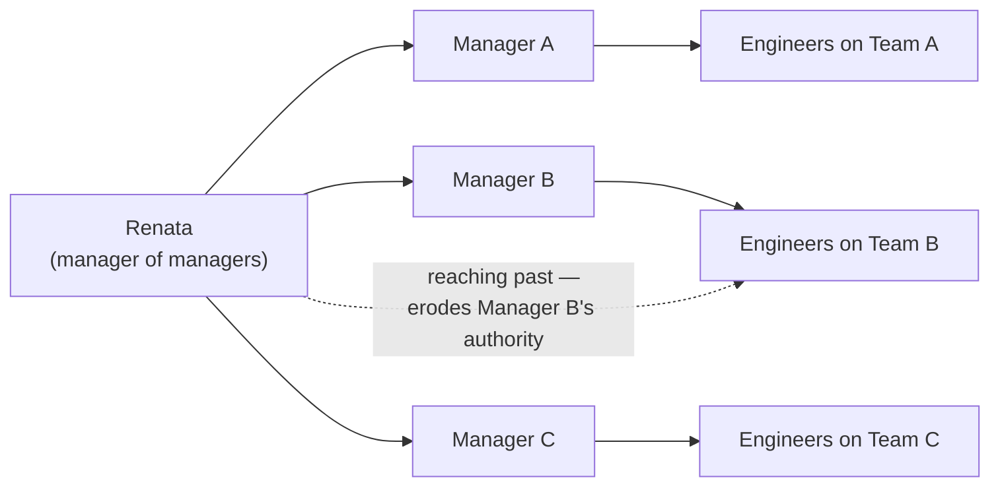

import LevelIntro from "../../../components/LevelIntro.astro";
import Checkpoint from "../../../components/Checkpoint.astro";

L1 named the core shift: Renata's job is no longer to manage engineers,
it's to manage the managers who manage engineers, and every decision she
makes now reaches an engineer only after passing through someone else's
interpretation. L2 works out what that actually changes about how she
spends her time, how she coaches a struggling manager without taking over
their job, and how culture gets set across teams she doesn't touch
directly.

<LevelIntro
  items={[
    "Why managing through a layer changes the job, not just the scale",
    "Coaching a manager vs. fixing their team's problem for them",
    "Setting culture on purpose, before it fragments by default",
  ]}
/>

## Why managing through a layer changes the job, not just the scale

**If Renata is still responsible for the outcomes of twenty-four
engineers, why can't she just manage them the same way, only for more
people?** Because her actual point of control has moved. She used to
have a direct line to every outcome: see a blocked engineer, unblock
them. Now every outcome she's responsible for is produced by someone
else's decisions — a manager's coaching, a manager's prioritization, a
manager's calibration call. Trying to manage the old way at the new
scale doesn't just fail to scale; it actively breaks the new job,
because every time she reaches past a manager to get a direct result,
she's substituting her judgment for theirs in front of their own team.

Every solid arrow is a relationship Renata can invest in directly and
repeatedly. The dotted arrow is available to her too — she technically
can talk to any engineer — but every time she uses it instead of the
solid line through that engineer's manager, she weakens the line she
actually depends on for everything else that manager does.

<Checkpoint question="Renata notices Team B is missing its sprint commitments two sprints in a row. What's the difference between her stepping in to run Team B's next sprint planning herself, versus asking Team B's manager to walk her through how they're currently running it?">

Running the sprint planning herself solves this sprint's problem directly,
the same way she would have as an IC manager — but it teaches Team B's
manager nothing, and it signals to Team B that their own manager doesn't
really run the team when it matters. Asking the manager to walk her
through their current process keeps the manager as the one actually
running their team while giving Renata the information she needs to
diagnose what's actually going wrong — maybe the manager is
overcommitting the team, maybe they're not accounting for interrupt work,
maybe the estimates are fine and something else is eating the sprint.
Whatever it is, the fix has to come out of that conversation and land as
something the manager does differently, not something Renata does
instead of them — otherwise the exact same problem returns the next time
Renata isn't watching closely.

</Checkpoint>

## Coaching a manager vs. fixing their team's problem for them

**If Renata sees exactly what a struggling manager should do
differently, why not just tell them, or do it herself?** Because a
manager who's handed the answer instead of coached to find it doesn't
actually get better at the underlying skill — and Renata cannot
personally diagnose and solve every team's problem at this scale
anyway; there are three teams today and, if she keeps growing, there
will eventually be many more. Her only real leverage is making each
manager more capable, not being a faster fixer than they are.

| Situation                                             | Fixing it directly                                                | Coaching the manager                                                                                                        |
| ----------------------------------------------------- | ----------------------------------------------------------------- | --------------------------------------------------------------------------------------------------------------------------- |
| A report on Team B isn't hitting expectations         | Renata talks to the report herself, sets expectations, follows up | Renata asks Team B's manager what they've already said to the report, and helps them plan the next conversation             |
| Two engineers on the same team are in conflict        | Renata mediates it personally                                     | Renata asks the manager how they're planning to handle it, and coaches them through the mediation approach from `mediation` |
| A manager's 1:1s have turned into pure status updates | Renata sits in and models a better 1:1                            | Renata asks what the manager is currently trying to get out of 1:1s, and works through the gap with them directly           |

Fixing it directly produces a faster resolution to that one instance —
and is sometimes genuinely the right call in a true emergency — but
repeated as a default, it produces a manager who has learned that
escalating gets it handled, not a manager who has gotten better at
handling it.

<Checkpoint question="A manager on Renata's team says, in a 1:1, 'Honestly, it would just be faster if you told me what to do here.' Is agreeing to that request the same kind of move as Renata jumping into an engineer's Slack thread back in L1's opening scenario?">

Yes, structurally — both substitute Renata's direct judgment for the
manager's own, in a moment where the manager was supposed to be building
that judgment. It's faster in the same narrow sense the Slack-thread
rescue was faster: the immediate problem gets solved sooner. But "just
tell me what to do" is exactly the request Renata's coaching is supposed
to build the manager past, not defer to — every time she answers it
directly instead of working the problem through with them, she trades a
few minutes of time now for a manager who comes back with the same kind
of request next time, instead of one who's gotten more capable of
answering it themselves.

</Checkpoint>

## Setting culture on purpose, before it fragments by default

**If Renata never personally attends most of Team A, B, or C's
retros, code reviews, or calibration sessions, how does she have any
influence on what those actually look like?** Not by attending them —
by deliberately setting a small number of explicit standards that
every manager under her is expected to run consistently, and then
checking outcomes rather than process. Without that deliberate step,
each manager defaults to whatever they personally learned before —
which means three managers can quietly produce three different
definitions of "meets expectations," three different incident-review
cultures, and three different senses of what get noticed and rewarded
— and nobody above Renata will see the fragmentation until it shows up
as inconsistent promotions or a team that feels unfair compared to
its neighbor.

Concretely, this means Renata has to decide, and communicate
explicitly, things like: what a calibration conversation has to
cover regardless of which manager runs it, what "blameless" actually
means in a postmortem in practice, and what she personally reviews
across all three teams (not to approve every decision, but to catch
drift early). This is the same discipline as any standard-setting: say
it once, explicitly, the same way to everyone who needs to apply it —
not something each manager should have to reverse-engineer from
watching what Renata happens to reward.

## Failure modes at this level

- **Managing the old way at the new altitude.** Reaching past a
  manager to fix something directly might solve today's instance, but
  it teaches the manager nothing and erodes their standing with their
  own team every time it happens.
- **Confusing coaching with abdication.** Coaching a struggling
  manager through a problem isn't the same as leaving them to sink or
  swim alone — Renata still needs to know what's happening on each
  team and step in when something is genuinely urgent; the discipline
  is in _how_ she steps in, not whether she pays attention at all.
- **Assuming culture sets itself if you hire good managers.** Good
  managers still default to whatever they each learned previously
  unless someone above them names the shared standard explicitly —
  "hire well and get out of the way" produces fragmentation, not
  consistency, once there's more than one manager involved.
