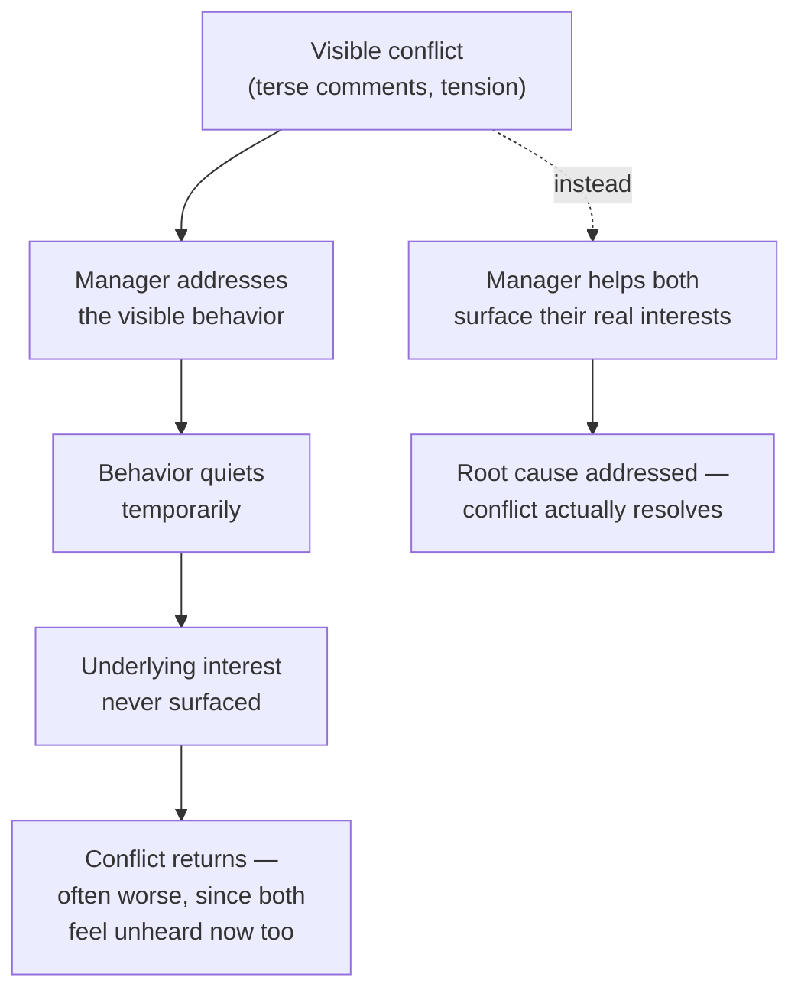

import LevelIntro from "../../../components/LevelIntro.astro";
import Checkpoint from "../../../components/Checkpoint.astro";

L1 named the difference between a position and an interest, and the idea
that neutrality is a discipline the mediator practices. L2 works out why
surface fixes fail structurally, what actually separates a position from
an interest in practice, and what neutrality costs a manager who's used to
handing down a verdict.

<LevelIntro
  items={[
    "Why surface-level fixes to conflict recur",
    "Positions vs. interests, worked through an example",
    "The two behaviors neutrality actually requires",
  ]}
/>

## Why the same fix keeps failing

**If "be more respectful" didn't work, why would a stricter version
of the same fix — a formal policy, a stern warning — fail too?**
Because both are still aimed at the position, not the interest.
Every recurring conflict follows a similar shape:

Telling two people to "be nicer" treats the comment tone as the
problem. But tone is usually where an unaddressed interest becomes
visible, not the interest itself — fixing the visible layer without
touching what's underneath just delays the next visible flare-up.

## Positions vs. interests, worked through the opening scenario

**What's the difference between what Priya and Devon would each say
if you asked "what's wrong," versus what's actually driving the
conflict?**

| Person | Position (what they'd say)                                            | Likely interest underneath                                                                                                                           |
| ------ | --------------------------------------------------------------------- | ---------------------------------------------------------------------------------------------------------------------------------------------------- |
| Priya  | "Devon nitpicks every PR with unnecessary style comments."            | Feels her design judgment isn't trusted, and every comment reads as a challenge to her competence rather than a genuine question.                    |
| Devon  | "Priya pushes back on review feedback instead of just addressing it." | Feels his review comments (many about real, if minor, issues) are dismissed rather than engaged with, making him feel like his input doesn't matter. |

Notice the positions look like a personality clash — "nitpicky" vs.
"defensive" — while the interests underneath are almost mirror images
of each other: **both people feel their competence isn't being
respected by the other.** That symmetry is invisible at the position
level and only shows up once each person's actual interest is
surfaced separately.

<Checkpoint question="A teammate tells you their coworker 'always talks over them in meetings.' That's their position. What question would help you find the interest underneath it, and why is asking that question different from just agreeing the coworker is being rude?">

Ask something like "what does it mean to you when that happens" or "what
does it feel like in the moment." That question is different from
agreeing the coworker is rude because it doesn't accept the position as
the finished story — it treats "talks over me" as the visible layer and
goes looking for what's underneath it, the same way Priya's "he nitpicks"
turned out to mean "he doesn't think I know what I'm doing" once someone
asked what it would mean if that were true. Agreeing with the position
instead would lock the conversation at the surface level and make it
harder for the real interest to surface later, because the manager has
already taken a side before hearing the other person at all.

</Checkpoint>

## Why neutrality has to be a discipline, not a default

**If a manager already has an instinct about who's "more right," why
does staying neutral matter?** Because the moment a mediator signals
even mild agreement with one side, the other side stops trusting the
process — they now see the conversation as two-against-one rather
than a genuine effort to find the real issue. Neutrality doesn't mean
pretending both people are equally right about every specific claim;
it means the mediator's role is structural (making space for both
interests to surface) rather than judicial (deciding whose position
wins). Two behaviors most directly test this discipline:

- **Not proposing the solution first.** A mediator who jumps to "here's
  what you should both do" has replaced two people's negotiation with
  their own — even a good solution imposed this way tends not to
  stick, because neither person did the work of understanding the
  other's actual interest.
- **Not repeating one side's framing back as if it were settled fact.**
  If a manager says "Priya, I hear you're frustrated with Devon's
  nitpicking" in front of Devon, that sentence has already taken
  Priya's _position_ — "nitpicking" — and treated it as agreed
  description of Devon's behavior, which Devon has every reason to
  reject before the real conversation even starts.

<Checkpoint question="A manager, trying to be helpful, tells one person in a conflict 'honestly, I think you're right about this' before talking to the other person at all. What does that do to the mediation before it even starts?">

It ends the mediation's neutrality before the process has really begun.
Once the manager has told one person they agree, that person has no
reason to keep exploring their own interest honestly — they already have
the validation they wanted — and the other person, once they find out (and
they usually do), will treat every later step of the process as biased
rather than structural, since the manager has already picked a side in
substance even if they later try to stay neutral in form. The damage isn't
that the opinion might be wrong; it's that voicing it at all converts the
manager from someone structuring a conversation into a judge who's already
ruled, which is exactly the posture neutrality is meant to avoid.

</Checkpoint>

## Failure modes at this level

- **Treating the first fix's failure as proof the conflict is
  unfixable.** A recurring conflict after a surface fix isn't
  evidence of a personality clash that can't be resolved — it's
  usually evidence the wrong layer was addressed.
- **Confusing staying neutral with staying passive.** Neutrality is
  active — structuring conversations, asking questions that surface
  interests, keeping the conversation from staying stuck at the
  position level. It isn't just staying out of the way.
- **Assuming a mirror-image interest pattern (like Priya and Devon's)
  is universal.** Not every conflict has symmetric underlying
  interests — sometimes one person's interest is legitimate and the
  other's position really is the core problem. The mediation process
  is what reveals which case you're in; it shouldn't be assumed in
  advance.
