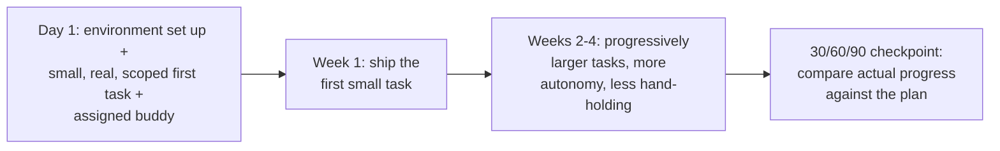

## Two failure modes, one root cause

**The Scenario's new hire got too much information, not too little.
Is that a different problem from leaving someone with no guidance at
all?** Not really — both hand someone a pile of unstructured
information (a 40-page wiki, or "the whole codebase, go explore") and
expect them to figure out on their own which parts matter right now.
Neither one anchors any of that information to something the new hire
is actually doing.

| Approach                         | What actually happens                                                                          | Why it fails                                                                                                    |
| -------------------------------- | ---------------------------------------------------------------------------------------------- | --------------------------------------------------------------------------------------------------------------- |
| Full information dump (Scenario) | New hire reads everything up front, before touching any real work                              | None of it is anchored to a task, so little of it sticks — by the time it's needed, it's been forgotten         |
| "Look around, ask questions"     | New hire is given no starting point and has to discover on their own what to explore first     | With no scoped first task, there's no way to tell what matters yet — exploration has no direction               |
| Ramp plan                        | New hire gets a small, real, scoped task almost immediately, with just enough context to do it | Context arrives exactly when it's needed for the task at hand, so it's immediately put to use instead of stored |

**Would just giving the new hire less to read have fixed the
Scenario?** Not by itself — a shorter document handed over with the
same "read it, then we'll talk" structure still isn't anchored to
anything the new hire is doing. The problem isn't the length of the
wiki; it's that reading came before doing.

## What a ramp plan actually sequences

**If dumping information doesn't work, what does "just enough,
just in time" look like in practice?**

A ramp plan front-loads a small task instead of front-loading
information — the new hire learns the parts of the system the task
actually touches, then the next task pulls in slightly more context,
and so on. Each step is a deliberate trade: enough structure that the
new hire isn't guessing what to do, but not so much that they're
absorbing material with no immediate use for it.

## The buddy, and why it's not the manager

**Why does a ramp plan usually name a specific buddy, rather than
just "ask your manager anything"?** A manager check-in is typically
scheduled and infrequent — exactly the cadence that produced the
Scenario's two-week gap. A buddy is someone a new hire can interrupt
for a two-minute question without the overhead of booking time, which
matters most in exactly the early days when the volume of small
"what does this mean" questions is highest.

## Failure modes at this level

- **Treating "more documentation" as the fix for a bad onboarding
  experience.** The Scenario's new hire read everything they were
  given — the volume wasn't the failure, the lack of a task to anchor
  it to was.
- **Leaving a new hire with no starting point at all, mistaking that
  for autonomy.** "Look around and ask questions" isn't a lighter
  version of a ramp plan — it's the same lack of structure from the
  other direction.
- **Relying only on a scheduled manager check-in for questions.**
  Small, frequent questions need a low-overhead answer path; saving
  them all for a two-week check-in is what let the Scenario's gap
  grow unnoticed.
