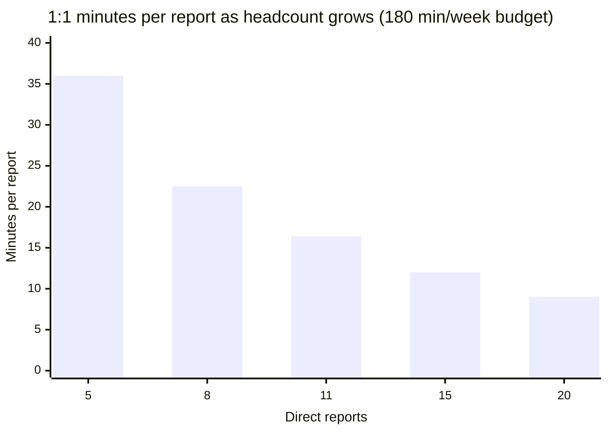
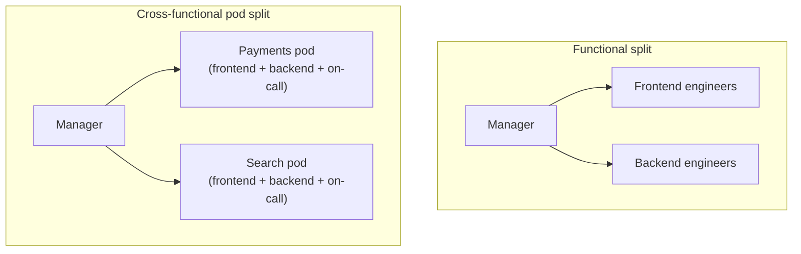

import LevelIntro from "../../../components/LevelIntro.astro";
import Checkpoint from "../../../components/Checkpoint.astro";

L1 showed the symptom: Priya's 1:1 time per report dropped from 36
minutes to 16 as her team grew from 5 to 11, and decisions that used to
take a day now take a week. L2 works out why that happens mechanically,
what signals actually justify splitting a team (as opposed to just
hiring faster), and what shape the resulting teams should take.

<LevelIntro
  items={[
    "Why span of control has a real ceiling, not just a soft preference",
    "The signals that say 'split now,' beyond raw headcount",
    "Functional vs. cross-functional pods, and Conway's Law",
  ]}
/>

## Why does span of control have a real ceiling?

**Priya didn't get worse at her job — so why did every report's 1:1
time shrink?** Because her weekly time budget for 1:1s is fixed
(3 hours — 180 minutes), and that fixed pool has to divide across
however many people report to her. The relationship is simple
division, not a soft management-style preference:

At 5 reports, everyone gets 36 minutes — enough to talk about a stuck
problem, a career question, and still have room. At 11, that's down to
16 minutes — barely enough to status-check, let alone coach. Nothing
about Priya changed; the arithmetic did. This is what "span of control"
actually measures: not a manager's raw capacity for effort, but how
thin a fixed amount of individual attention gets spread as reports are
added.

**Does this mean any manager with more than 6–8 reports is doing it
wrong?** Not automatically — some roles (a team of senior ICs who need
little day-to-day coaching, for instance) can sustain a wider span.
But the ceiling is real for hands-on technical management, where 1:1
time, code review, and unblocking decisions are all competing for the
same fixed hours. Ignoring it doesn't remove the constraint — it just
means the shortfall shows up somewhere less visible, like decision
latency instead of a missed 1:1.

<Checkpoint question="Priya's team is at 11 reports and 1:1 time has dropped to 16 minutes. If she simply freezes hiring at 11 without changing the team's structure, does the underlying problem go away?">

No. The problem isn't that the team is still growing — it's that 11
already exceeds the span of control her fixed 1:1 budget can support
well. Freezing headcount stops the ratio from getting worse, but it
doesn't undo the squeeze that already happened: 16 minutes stays 16
minutes. The fix has to change the structure (who reports to whom, who
makes which decisions) — not just the growth rate.

</Checkpoint>

## What signals actually say "split," beyond the headcount number?

**If span of control were the only signal, would a strict "split at 8
reports" rule always be right?** Not quite — headcount is the easiest
signal to see, but it's rarely the only one, and a team can hit real
trouble before or after a specific number depending on what else is
true about it.

| Signal                           | What it looks like in practice                                                                                        |
| -------------------------------- | --------------------------------------------------------------------------------------------------------------------- |
| Span-of-control ceiling breached | 1:1 time and code-review turnaround both degrade even though the manager isn't slacking                               |
| Genuinely divergent workstreams  | Two areas (e.g. payments and search) have different stakeholders, roadmaps, and failure modes, but share one reviewer |
| Decision bottleneck              | Nearly every non-trivial decision routes through one person, regardless of who's closest to the problem               |
| Diffuse or absent ownership      | An incident happens and no single person can say, with confidence, "this is mine to fix"                              |
| Onboarding drag                  | New hires take longer to ramp because there's too much surface area for one manager to hand off context on            |

A team can show two or three of these strongly while sitting right at
the "typical" span-of-control number — that's still a real signal to
split. Conversely, a team of 9 with one coherent workstream and a lead
who handles routine decisions independently may not need to split at
all. The number is a useful proxy, not the actual test.

## Functional teams vs. cross-functional pods

**Once a team decides to split, does it matter how the boundary is
drawn?** Yes — the boundary itself determines what gets easier and what
gets harder afterward, not just how big each half is.

|          | Functional (by discipline)                                      | Cross-functional pod (by outcome)                               |
| -------- | --------------------------------------------------------------- | --------------------------------------------------------------- |
| Strength | Deep skill mentorship; consistent standards within a discipline | End-to-end ownership; fast decisions within the pod's own scope |
| Weakness | Shipping one feature needs cross-team coordination and handoffs | Thinner bench per discipline; standards can drift between pods  |
| Best fit | Early-stage teams, or work with heavy discipline-specific depth | Teams with clearly separable product areas or customer outcomes |

Neither shape is universally correct — a platform team (providing a
capability, like an internal deploy pipeline, that other teams consume)
is a third option worth naming separately, since its "customer" is
other engineers rather than an end user. The right choice depends on
whether the team's actual work divides more naturally by skill or by
outcome.

## Conway's Law: the org chart becomes the architecture

**Does splitting Priya's team into a payments pod and a search pod
just change who reports to whom, or does it change the software too?**
It changes the software too, whether anyone intends that or not.
Conway's Law observes that systems end up structured to mirror the
communication structure of the organizations that build them — two
pods with separate ownership and separate on-call tend to produce two
more separately deployable services over time, because coordinating
across the pod boundary gets slightly harder than coordinating within
it, and that friction shapes where interfaces end up.

<Checkpoint question="If Priya splits her team into a payments pod and a search pod, but leaves the underlying codebase as one shared, tightly coupled module both pods edit daily, has she actually gotten the benefit of the split?">

Only partly, and probably not for long. The org chart now shows two
teams with separate ownership, but Conway's Law cuts both ways — a
codebase that doesn't reflect the new boundary will keep generating the
same cross-team coordination the split was meant to reduce, since both
pods still have to negotiate every change to the shared module. The
org-level split and the system-level boundary need to move together;
splitting one without the other leaves the coordination cost in place,
just relabeled.

</Checkpoint>

## The generalizable lesson

Span of control, divergent workstreams, and decision bottlenecks apply
to any people-facing structure, not just engineering — a sales team, a
support team, or a design team all run into the same arithmetic once
one manager's fixed attention has to stretch across too many reports or
too many genuinely different problems at once. L3 works through the
actual mechanics of when and how to act on these signals, using
Priya's team as it keeps growing past this point.
