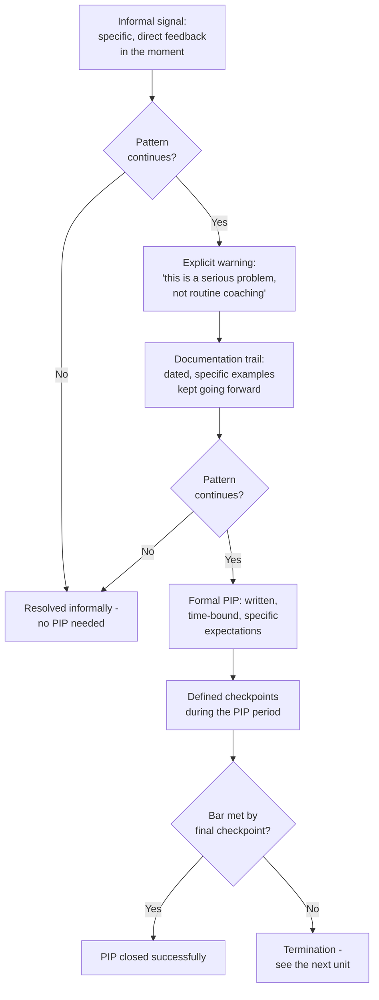

import LevelIntro from "../../../components/LevelIntro.astro";
import Checkpoint from "../../../components/Checkpoint.astro";

L1 named the no-surprises principle and the documentation trail as the
two things a fair PIP depends on, without yet showing how they fit
together in order. L2 works through the full sequence a fair process
follows — from the first informal signal to the final checkpoint — and
exactly where the Scenario's manager fell off that sequence.

<LevelIntro
  items={[
    "The full sequence from informal signal to final checkpoint",
    "Why documentation has to predate the formal PIP",
    "What makes a PIP goal specific enough to be fair",
  ]}
/>

## Why the Scenario's report has a point

**The manager genuinely believed the performance problem was real and
had even mentioned it once — so why is "nobody told me" a fair
complaint?** Because a single vague, gentle mention doesn't function as
a warning. "Let's try to hit deadlines more consistently" is exactly
the kind of thing a manager says as routine coaching, not as "this
could cost you your job." The report isn't wrong about what they
heard — they're describing an honest gap between what was said and
what was meant.

## The full sequence

**If a PIP shouldn't be the first time someone hears the problem is
serious, what has to happen before it?**

The Scenario's manager has step A (an informal signal happened) but
skipped step D entirely — the mention in the 1:1 was never explicitly
framed as "this is serious," so the report reasonably filed it under
routine coaching, not a warning. Everything downstream — the
documentation trail, the eventual PIP — depends on step D actually
having happened and having been _understood_ as a warning, not just
said.

<Checkpoint question="A manager gave a vague heads-up in a 1:1 back at step A, and the pattern has continued since. According to the sequence above, is the manager now ready to start the documentation trail, or is something else still missing first?">

Something else is still missing: the explicit-warning step. The
sequence doesn't move straight from an informal signal to
documentation — it requires the report to actually hear, in plain
terms, that this has crossed from routine coaching into a serious
problem that puts their role at risk. Starting the documentation trail
before that conversation happens just produces a well-dated record of
a process the report was never told was underway, which doesn't
satisfy the no-surprises principle any better than skipping the record
entirely. The manager has to go back and deliver the explicit warning
first, and only then start building the trail forward from that point.

</Checkpoint>

## Why documentation has to start before the PIP, not with it

**If a manager starts documenting the moment they decide to open a
PIP, what's still missing?** Context. A PIP with only two weeks of
evidence behind it, gathered right as the PIP starts, reads as either
sudden or retaliatory — even if the underlying pattern is genuinely
months old. A documentation trail that starts at the explicit-warning
step and continues for weeks or months before the PIP is what makes
the eventual PIP look like the natural next step in an established
pattern, rather than something that appeared out of nowhere.

| What's documented                                                | Why it matters at PIP time                                                  |
| ---------------------------------------------------------------- | --------------------------------------------------------------------------- |
| Dated, specific examples ("missed the Mar 3 deadline by 4 days") | Turns "I felt like performance was slipping" into a factual record          |
| The explicit-warning conversation itself                         | Proves the no-surprises principle was actually satisfied, not just intended |
| Any mitigating context the report raised                         | Shows the process considered the report's side, not just the manager's      |

## Why expectations have to be specific, not just "be better"

**What actually makes a PIP's goals fair to evaluate at the final
checkpoint?** The goals have to be stated so concretely that meeting
them is a factual question, not a judgment call — otherwise the final
checkpoint just repeats the Scenario's exact problem at a smaller
scale: the manager and the report disagreeing about whether "better"
happened.

| Vague goal (avoid)                 | Specific, observable goal (use instead)                                                                    |
| ---------------------------------- | ---------------------------------------------------------------------------------------------------------- |
| "Be more thorough in code review"  | "Leave at least one substantive comment on 90% of assigned PRs, verified weekly"                           |
| "Communicate better with the team" | "Post a written status update in the team channel every Friday, for 6 consecutive weeks"                   |
| "Improve overall performance"      | "Ship the two agreed features by their stated dates, with no more than one missed intermediate checkpoint" |

<Checkpoint question="A PIP states the goal 'communicate better with the team.' At the final checkpoint, the manager says this wasn't met and the report disagrees. Whose fault is that disagreement, given what specificity is supposed to prevent?">

It's the manager's fault, not a genuine disagreement about the
report's performance. A goal like "communicate better" was never
stated as a factual, checkable condition, so there's no shared fact
for either side to point to — the final checkpoint just becomes a
second round of the same subjective judgment call that made the
Scenario's situation unfair in the first place. The whole reason
specificity matters is that it moves the question from "do we agree
this got better" to "did the status update get posted every Friday for
six weeks" — a question with one correct answer regardless of who's
asking. A vague goal doesn't just risk being unfair to the report; it
also leaves the manager without a defensible answer if the outcome is
ever challenged.

</Checkpoint>

## Failure modes at this level

- **Treating a vague mention as if it satisfied the no-surprises
  principle.** The Scenario's manager technically said something, but
  it wasn't framed as a warning — satisfying the principle requires
  the report to have actually understood the stakes, not just heard
  words that could be read that way in hindsight.
- **Starting the documentation trail only once the PIP itself begins.**
  This is what makes an otherwise-justified PIP look sudden or
  retaliatory — the record needs to predate the formal plan by weeks
  or months, not start with it.
- **Writing PIP goals a manager can move the goalposts on.** A vague
  goal doesn't just risk unfairness to the report — it also leaves the
  manager with no clean, defensible answer at the final checkpoint if
  the outcome is challenged.
