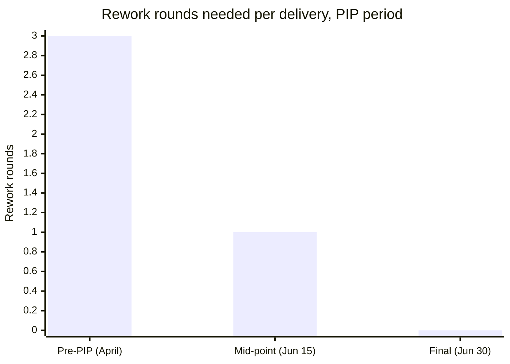

## Repairing the missing step

**The Scenario's manager already skipped the explicit-warning step —
does that mean it's too late to run a fair process?** No, but it means
the manager has to go back and do it properly before a PIP can start.
The manager schedules a dedicated conversation — not a 1:1 aside — and
says, plainly:

> "I want to talk directly about something I should have raised more
> clearly before now. Over the last two quarters, deadlines have been
> missed on the March and May releases, and the April dashboard
> project needed a full rework after delivery. I haven't been clear
> enough that this is a serious problem, not routine feedback — and I
> need to be clear now: if this pattern continues, it puts your role
> here at risk. I want to help you turn it around, and the next step
> is a formal, written plan with specific goals and checkpoints."

**Why does this conversation happen before any written document
exists?** Because the written PIP is meant to formalize something
already understood, not deliver the news for the first time. Having
the direct conversation first — and confirming out loud that the
report understands the stakes — is what actually satisfies the
no-surprises principle the earlier written mentions failed to.

## The documentation trail, made concrete

After this conversation, the manager starts (and backfills what can be
honestly reconstructed of) a dated record:

| Date   | Example                                                     |
| ------ | ----------------------------------------------------------- |
| Jan 14 | March release date discussed; report agreed to the timeline |
| Mar 7  | Release missed by 4 days; report cited unclear requirements |
| Apr 2  | Requirements were clarified in writing before work started  |
| Apr 29 | Dashboard delivered; QA found it needed a full rework       |
| May 20 | Second release missed by 6 days                             |
| May 22 | Direct conversation above; explicit warning given           |

**Does the report's Mar 7 explanation — unclear requirements — matter
here?** Yes, and the trail includes it rather than hiding it: the
manager responded by clarifying requirements in writing before the
next cycle (Apr 2), which removes that explanation for the later
misses. A documentation trail that only records failures, with no
record of the manager's own corrective steps, doesn't actually
demonstrate the process was fair — it just demonstrates the failures.

## The written PIP

> **Performance Improvement Plan — [Report], effective June 1, 30-day
> period**
>
> **Areas of concern:** Missed release deadlines (March, May) and
> delivered work requiring full rework (April), continuing after
> requirements clarity was addressed on April 2.
>
> **Expectations for this period:**
>
> 1. Ship the June 15 release on or before its stated date.
> 2. No delivered work item requires more than one round of QA
>    rework before acceptance.
> 3. Flag any at-risk timeline at least 3 business days before the
>    deadline, in writing, rather than at the deadline itself.
>
> **Checkpoints:** Weekly 1:1 status review; a formal mid-point
> check-in on June 15; a final review on June 30.
>
> **Support provided:** Manager will pre-review requirements
> documents before work starts; pairing available on request.
>
> **Outcome:** Meeting all three expectations through June 30 closes
> this PIP successfully. Not meeting them may result in termination.

**Do the three expectations pass L2's specificity test?** Yes — each
one has a factual yes/no answer at the checkpoint (did the release
ship on time; how many rework rounds; was the risk flagged 3 days out
or not), which is exactly what keeps the final checkpoint from
repeating the Scenario's original disagreement.

## Two outcomes at the final checkpoint

**What does June 30 actually look like in each direction?**

**Outcome A — met:** The June 15 release ships on its date, the
mid-point item needs one round of QA feedback (within the stated
limit), and by June 30 a second delivery needs none. The manager
closes the PIP in writing, citing the specific met expectations, and
the two discuss what ongoing support (not surveillance) looks like
going forward.

**Outcome B — not met:** The June 15 release slips by 3 days, with no
advance flag filed. The manager's June 15 checkpoint note states this
plainly, citing expectation 3 specifically, and reiterates that the
plan's timeline hasn't changed. By June 30, if the pattern hasn't
turned around, the manager proceeds to termination — the next unit
covers running that conversation itself.

## Extend it: what if the report disputes the documentation itself?

**What if, instead of accepting the March 7 record, the report insists
requirements really were unclear even after April 2 — how does a
manager handle a genuine, not just defensive, factual dispute?** The
documentation trail's value here is that it's dated and specific
enough to check: did the April 2 clarification actually cover the
May release's requirements, or only the April one? If the report is
right and a real gap exists, the fair move is to correct the record
and adjust the PIP's expectations accordingly — a documentation trail
that's used to steamroll a genuine correction stops functioning as a
fairness tool and starts functioning as a weapon, which undermines the
entire point of keeping one.

## Failure modes at this level

- **Writing PIP expectations that were never mentioned as a concern
  before.** If "communicate better with the team" appears in the PIP
  but was never part of the earlier documentation trail, it violates
  the no-surprises principle even inside an otherwise well-run
  process.
- **Treating the mid-point checkpoint as informal, with no written
  record.** The May 15 checkpoint note above is what makes Outcome B
  defensible later — an undocumented "it's not going well" conversation
  at the mid-point leaves the same ambiguity a PIP exists to remove.
- **Closing a PIP successfully but going straight back to zero
  documentation afterward.** A pattern that reappears three months
  later, with no record kept since the PIP closed, forces the next
  manager (or the same one) to restart the entire process from step
  A instead of building on what's already known.
