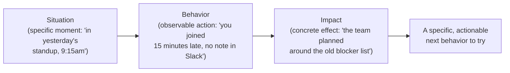

## Why "be more proactive" gives the receiver nothing to act on

**If the manager's actual complaint is real — the report really did miss
something important — why doesn't naming the trait directly work?**
Because "be more proactive" is the manager's _conclusion_ about the
report, not the specific thing the report can go do differently on
Monday. The report is left to guess which of dozens of possible behaviors
would count as "proactive enough," and — because it's framed as a
statement about who they are rather than what they did — it reads more
like a verdict than a fixable data point.

Each step narrows from "what happened" to "what it caused" to "what could
be different" — trait-based feedback skips straight to a verdict without
ever passing through the specific situation or behavior at all.

## SBI versus trait-based feedback, side by side

**What actually changes when the same complaint is rewritten through the
SBI structure?**

|                                         | Trait-based                                             | SBI                                                                         |
| --------------------------------------- | ------------------------------------------------------- | --------------------------------------------------------------------------- |
| What's named                            | A conclusion about the person ("not proactive")         | A specific, observable action ("joined 15 minutes late, no blocker update") |
| Can the receiver verify it happened?    | Hard to dispute or confirm — it's an impression         | Yes — it's a specific, checkable fact                                       |
| Does it suggest what to do differently? | No — "be more proactive" doesn't specify an action      | Implicitly yes — the fix is the inverse of the described behavior           |
| How does it typically land?             | As a character judgment, often triggering defensiveness | As a fact plus its consequence — easier to hear without feeling attacked    |

## Timing: why "three weeks later" already lost the conversation

**If the SBI structure is used correctly but delivered three weeks after
the event, does it still work as well?** Not as well — by three weeks
out, neither person can reliably reconstruct the specific situation
anymore, which means the "S" in SBI degrades back toward a vague
generalization ("you're often late to standup") instead of the one
concrete instance that made the impact undeniable. Feedback delivered
within a day or two of the event can cite the exact situation while it's
still verifiable and fresh to both people; feedback saved for a scheduled
review has to either name specifics from memory (unreliable) or fall back
to a pattern-level trait statement (exactly the failure mode SBI was
supposed to avoid).

## Difficult conversations: SBI at higher stakes, same structure

**Does this change when the behavior in question is a repeated pattern
with real consequences, not a single instance?** The structure doesn't
change — but a pattern needs more than one Situation to establish it's
not a one-off, and the Impact needs to be stated plainly even when it's
uncomfortable (a missed deadline that cost the team a client's trust, not
just "it wasn't great"). What changes at higher stakes is preparation:
naming 2-3 specific situations in advance (not vague "you always..."),
being explicit about the impact without softening it into vagueness, and
still ending on what a different behavior going forward would look like
— the goal remains change, not a verdict delivered and left to sit.

## The generalizable lesson

**Is SBI really just a feedback template, or is it doing something more
general?** The underlying move — replace a conclusion about someone with
the specific, checkable evidence that led to it, plus the concrete effect
that evidence had — generalizes past feedback conversations: it's the
same shift from "this code is bad" to "this function doesn't handle an
empty array, and that caused the crash in yesterday's incident." Anywhere
a judgment needs to change behavior rather than just be registered, naming
the specific evidence and its effect does more work than naming the
conclusion.
