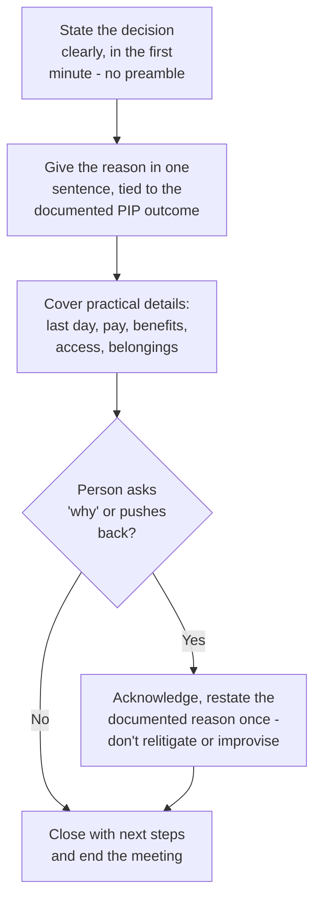

## Why the two instincts point at different problems

**If clarity helps both dignity and legal soundness, why does it feel
like a trade-off in the moment?** Because the two failure modes it's
guarding against look opposite on the surface. Over-explaining tends
to happen when a manager is trying to be kind — walking through every
reason, relitigating the PIP, apologizing repeatedly — which can
introduce inconsistent or off-the-cuff justifications that don't match
the documented record, creating legal exposure. Under-explaining tends
to happen when a manager is trying to be "safe" — reading a script
flatly, refusing to answer any question — which can feel cold and
sudden even after a properly run PIP, undermining dignity. Both
failure modes come from treating the meeting as the place to _make_
the case, rather than the place to _deliver_ a decision already made
and already documented.

| Instinct                 | What it tries to protect | What actually goes wrong                                                   |
| ------------------------ | ------------------------ | -------------------------------------------------------------------------- |
| Over-explain             | The person's dignity     | Introduces new, undocumented justifications that can contradict the record |
| Under-explain            | Legal safety             | Feels sudden and cold, even when the underlying process was fair           |
| Short, factual, prepared | Both at once             | Neither — because it doesn't improvise either the reasons or the tone      |

## The actual structure

**What does a conversation that avoids both failure modes actually
look like, mechanically?**

**Why does the decision get stated first, before any explanation at
all?** Delaying it — leading with "so, we've been talking about
performance..." — stretches out the moment the person realizes what's
happening, which is worse for dignity, not better. Stating it plainly
in the first minute is what actually respects the person: it doesn't
make them sit through a preamble to guess the ending.

## Why the reason has to trace back to the PIP, not be re-argued

**The manager knows dozens of reasons, big and small, that performance
wasn't where it needed to be — why give only one sentence?** Because
every reason given in this room becomes part of the record, and the
record that actually matters is the one already built during the PIP
(the previous unit's documentation trail and written expectations).
Introducing a new reason here — even a true one — that wasn't part of
that documented process is exactly the over-explaining failure mode:
it creates a mismatch between "what was documented" and "what was
said," which is what legal exposure actually looks like in practice.
One sentence, tied directly to the PIP's stated expectations, is both
sufficient and safer than a fuller account improvised in the moment.

## Failure modes at this level

- **Treating the meeting as a debate to be won.** If the person
  disagrees, the answer is "I understand this is difficult, and the
  decision is final" — not a longer argument for why the decision is
  correct, which reopens exactly the discussion the PIP process was
  designed to have already concluded.
- **Leading with logistics instead of the decision.** Starting with
  "let's talk about your laptop and your last paycheck" before
  stating the actual decision delays the moment of clarity the person
  is owed and reads as avoidance.
- **Preparing the reason but not the practical details.** A manager
  who has rehearsed exactly what to say about performance but hasn't
  confirmed the last day, benefits timeline, or return-of-equipment
  process ends up improvising the part of the conversation that's
  actually easiest to prepare fully in advance.
