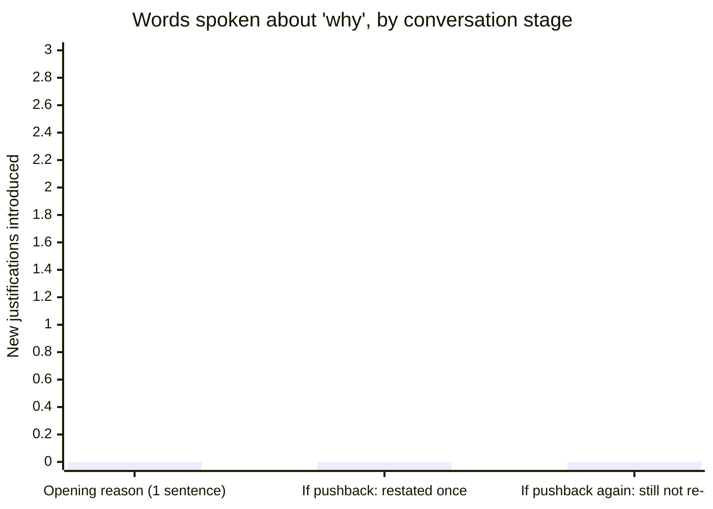

## Before the meeting: what has to be ready

**What does the manager actually need to prepare in the ten minutes
before the meeting, beyond the opening line?** Three things, all
practical: confirmation of the last working day, exactly what happens
to pay and benefits (and by when the person will get written details —
this is not something to improvise on the spot), and the logistics of
equipment return and system access. A second person — typically from
HR — is also present, both to witness the conversation and to handle
questions the manager isn't the right person to answer.

| Detail                    | What the manager needs before walking in                            |
| ------------------------- | ------------------------------------------------------------------- |
| Last working day          | Confirmed exact date, stated plainly, not "we'll figure that out"   |
| Pay and benefits          | What's owed, and when written details will follow (do not estimate) |
| Access and equipment      | When system access ends; how/when to return equipment               |
| Second person in the room | HR or equivalent, confirmed and present before the meeting starts   |

## The meeting itself

**What do the first sixty seconds actually sound like?**

> **Manager:** "Thanks for making time. I want to get right to it — this
> isn't going to be an easy conversation. We're ending your employment
> here, effective today."

**Why no preamble at all, not even a single softening sentence?** Per
L2, delaying the moment of clarity is worse for the person, not
kinder — every second before the actual sentence is a second the
person spends bracing without knowing what for.

> **Manager:** "As we discussed at the end of the improvement plan, the
> expectations we agreed on — shipping on the stated dates and flagging
> risk in advance — weren't met by the June 30 checkpoint. That's the
> basis for this decision."

**Why is this the entire explanation — no list of every frustration
from the last two quarters?** This one sentence ties directly to the
PIP's three written expectations from the previous unit — nothing new,
nothing improvised, nothing that isn't already in the documented
record. It satisfies the same no-surprises principle the PIP itself
was built on: the person already knew, from the June 30 checkpoint
note, that expectation 3 hadn't been met.

> **Manager:** "Today is your last working day. [HR name] is here and
> will walk through pay, benefits, and next steps right after this.
> Your system access will end at 6pm today, and we'll arrange a time
> tomorrow for you to collect your personal items."

This is where the prepared logistics from the table above get
delivered — plainly, with specifics, not "we'll sort out the details
later."

## When the person pushes back

**The report responds: "This isn't fair — you never really gave me a
real chance." How does the manager handle this, live, without
relitigating or caving?**

> **Report:** "This isn't fair. You never really gave me a real
> chance."
>
> **Manager:** "I hear that this feels sudden and unfair, and I know
> this is hard to hear. The plan we agreed to in May set out specific,
> written expectations, and the June 30 checkpoint is what this
> decision is based on. I know that's not what you wanted to hear, and
> I'm not going to relitigate it here — but I want to make sure you
> have what you need for what comes next."

**Why doesn't the manager offer a longer defense of the PIP's
fairness in this moment?** Per L2's failure modes, a longer defense
turns the meeting into a debate the manager tries to win, which is
exactly what the meeting isn't for — the PIP process (previous unit)
was where fairness was established; this meeting is where its outcome
is delivered. Restating the documented basis once, briefly, without
escalating, is the version that's both respectful and safe.

The chart's point is the flat line itself: the number of _new_
justifications introduced stays at zero through the entire
conversation, including under pushback — which is the concrete,
checkable version of "don't relitigate."

## Extend it: what if the news is worse than a single termination?

**This unit's example is one person, one meeting. What changes if the
manager has to deliver this same news to five people at once, in a
layoff rather than a performance-based termination?** The core
structure — state the decision first, one clear reason, cover
practicals, don't relitigate — still holds, but the reason itself
changes shape: it's no longer individual documented cause, it's a
business-driven decision ("this role is being eliminated as part of a
reduction in force"), and the practical details expand to include
severance terms and the order and timing of individual conversations,
often coordinated closely with HR and legal in advance in a way a
single-person termination usually isn't. The dignity principles don't
change; what has to be prepared in advance gets considerably larger.

## Failure modes at this level

- **Improvising the pay/benefits/equipment details on the spot because
  they weren't confirmed beforehand.** These are the most
  preparable parts of the whole meeting — winging them in the moment
  reads as disorganized in exactly the part of the conversation that
  should feel most solid.
- **Escalating tone to match the person's pushback.** Restating the
  documented reason once, calmly, is the entire playbook — matching
  frustration with frustration turns a hard-but-clean meeting into a
  genuinely adversarial one.
- **Holding the meeting without a second person present.** Beyond the
  practical value of a witness, having HR in the room is part of what
  keeps the manager from either over-explaining under pressure or
  needing to answer questions (benefits specifics, legal details)
  they aren't the right person to answer.
