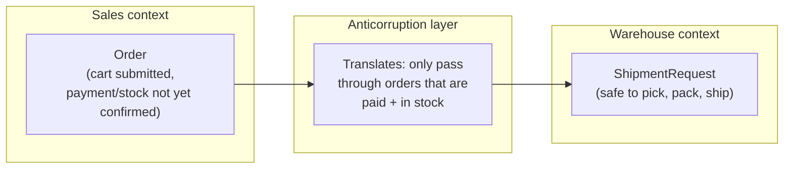

## Why agreeing on the word isn't enough

**If Sales and Warehouse both say "Order means a customer bought
something," why isn't that agreement enough to wire their systems
together directly?** Because "Order" in Sales' world carries a different
set of _guarantees_ than "Order" in Warehouse's world — Sales' Order
exists the instant a cart is submitted, with no promise that payment will
clear or that stock is available. Warehouse's Order needs to mean
something that's actually safe to pick, pack, and ship. Both teams would
give the same one-sentence definition if asked — the mismatch isn't in
the definition, it's in what's silently assumed to be true whenever the
word is used.

## The context map

**Why put a translation step in between, instead of just fixing Sales'
`Order` to already mean "safe to ship"?** Because Sales genuinely needs
an object that exists before payment clears — for the cart page, for
abandoned-cart follow-ups, for inventory holds. Forcing Sales' model to
carry Warehouse's guarantee would break Sales' own use cases. The
anticorruption layer lets each context's model stay true to what that
context actually needs, and does the work of reconciling the two only
once, at the boundary — not by pushing one team's requirements onto the
other's internal model.

## Upstream, downstream, and who adapts to whom

**When two contexts are related, who has to change when the other one
changes?** This is a relationship, not a symmetric partnership — one
side is usually **upstream** (its model evolves on its own schedule) and
the other is **downstream** (it has to adapt when the upstream model
changes). In the Sales/Warehouse case, Sales is upstream: Warehouse's
anticorruption layer is what absorbs changes to Sales' `Order` shape
without Warehouse's own internal model having to change every time.

| Pattern              | What it means                                                                                 | When it shows up                                                                                  |
| -------------------- | --------------------------------------------------------------------------------------------- | ------------------------------------------------------------------------------------------------- |
| Anticorruption layer | Downstream context translates the upstream model at the boundary, keeping its own model clean | Upstream model has guarantees the downstream context can't rely on directly (this unit's example) |
| Conformist           | Downstream context just adopts the upstream model as-is, no translation                       | Downstream has little or no influence over the upstream team (e.g. a third-party API)             |
| Shared kernel        | Both contexts deliberately share a small, jointly-owned piece of the model                    | The two teams are willing to coordinate tightly on that shared piece and change it together       |

## What a context map is actually for

**Is a context map just an architecture diagram with extra jargon?**
It's specifically about where meaning changes, not just where a network
call crosses a service boundary — two services can share one bounded
context (same meanings throughout), and a single service can quietly
straddle two bounded contexts if a word's guarantees change partway
through it. The map's job is to make each context's boundary and its
upstream/downstream relationships explicit, so a downstream team knows
exactly where it needs a translation layer and where it can trust the
model as-is.

## The generalizable lesson

**Does every integration between two systems need an anticorruption
layer?** No — only where the two contexts' models carry genuinely
different guarantees. Introducing a translation layer has a real cost (a
worked example gets built and maintained), so the actual skill is
recognizing which relationships are safe to wire directly (both contexts
already share the same guarantees) and which ones need a deliberate
boundary — the same judgment call as deciding when a shared word masks
two different concepts, one level up: this time at the level of whole
systems talking to each other, not just a database column.
