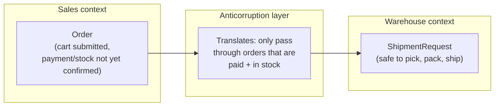

import LevelIntro from "../../../components/LevelIntro.astro";
import Checkpoint from "../../../components/Checkpoint.astro";

L1 named the Sales/Warehouse bug and introduced the vocabulary —
bounded context, context map, anticorruption layer — without yet showing
how the pieces fit together or what actually goes at the boundary. L2
works through why the mismatch happens even when both teams agree on the
word, and what a translation step at the boundary is actually for.

<LevelIntro
  items={[
    "Why matching definitions can still hide different guarantees",
    "How a context map represents the boundary and the fix",
    "Upstream/downstream, and the three integration patterns",
  ]}
/>

## Why agreeing on the word isn't enough

**If Sales and Warehouse both say "Order means a customer bought
something," why isn't that agreement enough to wire their systems
together directly?** Because "Order" in Sales' world carries a different
set of _guarantees_ than "Order" in Warehouse's world — Sales' Order
exists the instant a cart is submitted, with no promise that payment will
clear or that stock is available. Warehouse's Order needs to mean
something that's actually safe to pick, pack, and ship. Both teams would
give the same one-sentence definition if asked — the mismatch isn't in
the definition, it's in what's silently assumed to be true whenever the
word is used.

<Checkpoint question="Sales and Warehouse both define 'Order' the same way in a meeting. Does that agreement guarantee their systems can be wired together safely?">

No. A shared dictionary definition only covers what the word means in
conversation — it says nothing about what's silently guaranteed to be
true whenever that word shows up in each team's actual system. Sales'
Order and Warehouse's Order can both honestly be "a customer bought
something" while carrying completely different assumptions about
whether payment has cleared or stock is available. The mismatch lives in
those unstated guarantees, not in the definition, which is exactly why
a conversation that only checks the definition won't catch it.

</Checkpoint>

## The context map

In this diagram, **context** means "the place where a word has one
specific meaning." It may be a team, a service, or just a part of a
system. `ShipmentRequest` means Warehouse's own instruction to prepare a
package; it is not the same thing as Sales' `Order`.

**Why put a translation step in between, instead of just fixing Sales'
`Order` to already mean "safe to ship"?** Because Sales genuinely needs
an object that exists before payment clears — for the cart page, for
abandoned-cart follow-ups, for inventory holds. Forcing Sales' model to
carry Warehouse's guarantee would break Sales' own use cases. The
anticorruption layer lets each context's model stay true to what that
context actually needs, and does the work of reconciling the two only
once, at the boundary — not by pushing one team's requirements onto the
other's internal model.

## Upstream, downstream, and who adapts to whom

**When two contexts are related, who has to change when the other one
changes?** This is a relationship, not a symmetric partnership — one
side is usually **upstream** (its model evolves on its own schedule) and
the other is **downstream** (it has to adapt when the upstream model
changes). In the Sales/Warehouse case, Sales is upstream: Warehouse's
anticorruption layer is what absorbs changes to Sales' `Order` shape
without Warehouse's own internal model having to change every time.

| Pattern              | What it means                                                                                 | When it shows up                                                                                  |
| -------------------- | --------------------------------------------------------------------------------------------- | ------------------------------------------------------------------------------------------------- |
| Anticorruption layer | Downstream context translates the upstream model at the boundary, keeping its own model clean | Upstream model has guarantees the downstream context can't rely on directly (this unit's example) |
| Conformist           | Downstream context just adopts the upstream model as-is, no translation                       | Downstream has little or no influence over the upstream team (e.g. a third-party API)             |
| Shared kernel        | Both contexts deliberately share a small, jointly-owned piece of the model                    | The two teams are willing to coordinate tightly on that shared piece and change it together       |

A shared kernel works best when it stays small: for example, both teams
might jointly protect a tiny `PaymentConfirmed` event. It becomes risky
when the shared piece grows into a large object that neither team can
change freely without slowing the other one down.

<Checkpoint question="In the Sales/Warehouse relationship, which context is upstream, and what does that mean for who has to absorb the other's changes?">

Sales is upstream and Warehouse is downstream. Sales' `Order` model
evolves on its own schedule, driven by what Sales itself needs — new
statuses, new fields, changed timing — without owing Warehouse advance
notice. Warehouse, as the downstream context, is the one that has to
adapt, and it does that through its anticorruption layer rather than by
asking Sales to slow down or change how it models orders. That's the
whole point of putting the translation on the downstream side: it's the
side with less leverage over the other's model, so it's the side that
absorbs the cost of staying compatible.

</Checkpoint>

## What a context map is actually for

**Is a context map just an architecture diagram with extra jargon?**
It's specifically about where meaning changes, not just where a network
call crosses a service boundary. A service is one running part of a
software system, such as the part that handles checkout or shipping. Two
services can share one bounded context (same meanings throughout), and a single service can quietly
straddle two bounded contexts if a word's guarantees change partway
through it. The map's job is to make each context's boundary and its
upstream/downstream relationships explicit, so a downstream team knows
exactly where it needs a translation layer and where it can trust the
model as-is.

## The generalizable lesson

**Does every integration between two systems need an anticorruption
layer?** No — only where the two contexts' models carry genuinely
different guarantees. Introducing a translation layer has a real cost (a
worked example gets built and maintained), so the actual skill is
recognizing which relationships are safe to wire directly (both contexts
already share the same guarantees) and which ones need a deliberate
boundary — the same judgment call as deciding when a shared word masks
two different concepts, one level up: this time at the level of whole
systems talking to each other, not just a database column.
