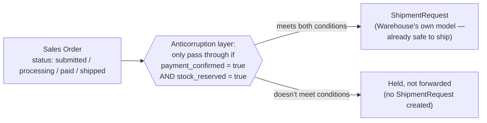

import Scenario from "../../../components/Scenario.astro";
import LevelIntro from "../../../components/LevelIntro.astro";
import Checkpoint from "../../../components/Checkpoint.astro";

<Scenario label="What actually happened, and what fixed it">
  <Fragment slot="facts">
    

      
🐛 <strong>The bug</strong> — Warehouse shipped orders whose payment later failed

      
🔍 <strong>Root cause</strong> — Warehouse trusted Sales' Order object directly, with no translation

      
🛠️ <strong>The fix</strong> — an anticorruption layer that only forwards paid, in-stock orders

    

  </Fragment>

**Before reading the fix, predict: what's the smallest change that would
have prevented the bug, without asking Sales to redefine what an
`Order` means for their own purposes?**

</Scenario>

<LevelIntro
  items={[
    "The Sales/Warehouse bug, traced to its root cause",
    "Building an anticorruption layer that actually holds",
    "When conformist beats anticorruption, and the failure modes",
  ]}
/>

## What actually happened

Sales' system creates an `Order` record the instant a shopping cart is
submitted — before the payment processor confirms the charge, and before
inventory is checked. This is deliberate: Sales needs that record to
exist early, for the cart page, for "you left something in your cart"
emails, and for reporting on submitted-but-not-yet-paid carts.

A **payment processor** is the outside or internal system that confirms
whether the card or payment actually succeeded. **Inventory** means the
stock available to sell. A record is just stored data about one thing,
like one submitted cart.

Warehouse's integration was built to listen for new `Order` records and
immediately queue them for picking and packing. It read Sales' `status`
field, saw values like `"submitted"`, `"processing"`, `"paid"`, and
`"shipped"` — and, reasonably, assumed anything past `"submitted"` was
safe to act on. What nobody had verified was that Sales sometimes moved
an order to `"processing"` _before_ the payment provider's confirmation
came back, as a UI optimization to show the customer "we're on it"
sooner. A small percentage of `"processing"` orders had their payment
fail afterward — and by then, Warehouse had already shipped them.

"Listen" here means Warehouse's system automatically reacts whenever
Sales creates or publishes a new order record. **UI** means user
interface: what the customer sees on the screen.

## Why "read Sales' status field carefully" wouldn't have been enough

**Wouldn't fixing this just mean Warehouse should have understood Sales'
status field better?** That's the conformist-pattern instinct, and it's
fragile here: even if Warehouse's team carefully mapped every current
status value to a shipping decision, that mapping breaks the moment
Sales adds a new status, reorders when a status transition happens, or
changes what `"processing"` means internally — none of which Sales owes
Warehouse advance notice about, because `"processing"` was never a
promise made _to_ Warehouse. Warehouse was depending on the specific
shape of a model that belongs to, and evolves for, a different context.

<Checkpoint question="Suppose Warehouse's team had carefully documented every current value of Sales' status field and built shipping logic around that exact mapping. Would that have permanently fixed the bug?">

No — it would have fixed today's version of the bug while leaving the
underlying cause untouched. The mapping only holds for as long as
Sales' status values, their order, and their meaning stay exactly as
they are right now. Sales owes Warehouse no notice before adding a new
status, reordering a transition, or quietly changing what
`"processing"` means internally, because none of that was ever a
promise made _to_ Warehouse — it's Sales' own internal model, evolving
for Sales' own reasons. A hand-mapped status list is a snapshot of
someone else's model, not a contract, so it breaks again the next time
that model moves.

</Checkpoint>

## The fix: an anticorruption layer

Warehouse introduced a translation step between Sales' `Order` stream and
its own internal model:

In plain words, the layer asks two yes/no questions before Warehouse acts:
"Has the payment really succeeded?" and "Is the item really reserved?"
Those true/false checks are what the boolean conditions represent.

Instead of trying to keep Warehouse's understanding of Sales' status
values perfectly in sync, the anticorruption layer checks two specific,
narrow conditions — an explicit payment confirmation and a stock
reservation — and only then constructs Warehouse's own `ShipmentRequest`
object. Warehouse's internal model never has to know that
`"processing"` exists, what it means, or when Sales might change it.

## What changed, concretely

|                                                | Before the fix                                                   | After the fix                                                                        |
| ---------------------------------------------- | ---------------------------------------------------------------- | ------------------------------------------------------------------------------------ |
| What Warehouse trusted                         | Sales' `status` string, interpreted by Warehouse's own guesswork | Two explicit boolean conditions checked at the boundary                              |
| What breaks if Sales changes internal statuses | Warehouse's shipping decision, silently                          | Nothing — the anticorruption layer's contract is unrelated to Sales' internal states |
| Who owns the meaning of "safe to ship"         | Nobody, explicitly — assumed from Sales' field                   | Warehouse, via its own `ShipmentRequest` model                                       |

Here, **contract** does not mean a legal document. It means an explicit
promise between systems about what a piece of data can be trusted to
mean.

## Extend it: what if Warehouse had no leverage with Sales at all?

**Everything above assumed Warehouse's team could design and maintain its
own anticorruption layer. What changes if Sales were a third-party
system Warehouse's company doesn't control at all — say, a marketplace
platform that dictates the order format, take it or leave it?** This is
the **conformist** pattern instead of an anticorruption layer: when a
downstream context has no realistic influence over the upstream model
and no practical way to insulate itself from it (because building and
maintaining a full translation layer costs more than the integration is
worth), the pragmatic choice is to adopt the upstream model largely
as-is and accept that upstream changes will occasionally break things
downstream. The judgment call is about leverage and cost, not about
which pattern is "more correct" — an anticorruption layer that costs more
to build and maintain than the bugs it prevents isn't obviously the
better choice.

**Leverage** means practical influence. If Warehouse can ask Sales to
expose clearer data, it has leverage. If Sales is an outside platform
that says "use our format or leave," Warehouse has little leverage.

<Checkpoint question="A downstream team is deciding whether to build an anticorruption layer against a marketplace platform's order format, or just adopt that format as-is. What should actually decide it — which pattern is 'more correct,' or something else?">

Something else: leverage and cost, not correctness. An anticorruption
layer is only worth building when the downstream team has enough
influence to make the upstream model's evolution predictable, or enough
at stake to justify absorbing translation cost on its own — neither
pattern is inherently the "right" one in the abstract. Against a
marketplace platform that dictates its format and won't negotiate,
building and maintaining a full translation layer can easily cost more
than the occasional breakage it would prevent, which makes the
conformist choice the pragmatic one here, not a lesser one. The same
reasoning runs the other way when the downstream team does have real
influence, or when the upstream model's guarantees genuinely can't be
trusted as-is — that's when the anticorruption layer earns its cost.

</Checkpoint>

## Failure modes

| Failure mode                                                                                    | What it gets wrong                                                                                            |
| ----------------------------------------------------------------------------------------------- | ------------------------------------------------------------------------------------------------------------- |
| Wiring one context's model directly into another with no translation                            | Every future change to the upstream model becomes a silent risk to the downstream system                      |
| Assuming "we agree on the word" means "we agree on the guarantees"                              | The dictionary definition can match while the assumptions baked into each context's use of it diverge         |
| Building an anticorruption layer where there's no real leverage to negotiate the upstream model | Sinks effort into a translation layer that can't actually prevent upstream changes from breaking things       |
| Treating a context map as just a service diagram                                                | Misses that the real boundary is wherever a word's meaning changes, not wherever a network call happens to be |
| Skipping a translation layer because "it's more code"                                           | Trades a one-time, explicit cost for a recurring, silent one every time the upstream model shifts             |
