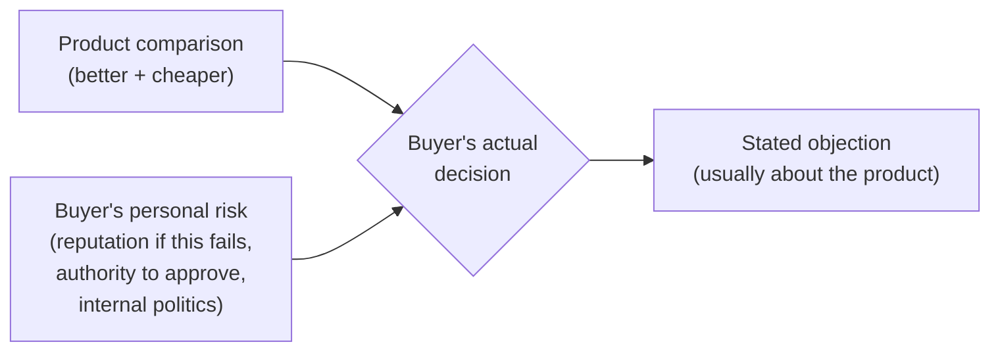

## Why buyers rarely say the real reason out loud

**If a buyer's actual objection is "I'm worried about being blamed
if this goes wrong," why would they say "we need to think about it"
instead?** Because the real reason is usually personal or political
in a way that feels unsafe or awkward to admit to a vendor (or
sometimes even to themselves) — "we need to think about it" costs
nothing to say and avoids the conversation entirely:

| Stated objection                         | Common real objection underneath                                                                                              |
| ---------------------------------------- | ----------------------------------------------------------------------------------------------------------------------------- |
| "We need to think about it."             | Risk aversion — the buyer isn't confident enough to stake their own credibility on the decision yet.                          |
| "It's not the right time."               | The buyer doesn't have (or isn't sure they have) the authority to approve this alone.                                         |
| "We're happy with what we have."         | Status quo bias — the current approach's flaws are familiar and survivable; a new approach's flaws are unknown.               |
| "It's a bit expensive for us right now." | The price itself isn't the issue — the buyer doesn't yet have a way to justify the cost internally to whoever they report to. |

**Is this table saying every stated objection is a cover story?**
No — sometimes "it's expensive" really does just mean the budget
isn't there. The table is a set of common patterns, not a rule that
applies every time; the point is knowing what to listen for, not
assuming deception in every stall.

## What actually drives most B2B purchase hesitation

**Why would a buyer hesitate on a product that's clearly better and
cheaper than what they have?** Because "better and cheaper" is a
comparison about the _product_ — but the buyer isn't just evaluating
the product, they're evaluating their own risk in recommending it:

The stated objection almost always references the product ("it's
expensive," "not the right time") because that's the comfortable,
professional-sounding thing to say — but the actual decision weighs
the buyer's personal exposure just as heavily, often more, and that
part rarely gets said out loud unprompted.

## Surfacing the real objection without accusing anyone

**If you suspect the stated objection isn't the whole story, what do
you actually ask — "is that the real reason"?** No — that framing
puts the buyer on the defensive and assumes they were being
dishonest. A better question asks forward, not backward: **"What
would need to be true for this to be an easy yes?"** This doesn't
accuse anyone of hiding anything — it invites the buyer to name what's
actually missing, whether that's more internal buy-in, a lower-risk
rollout plan, or something about their own authority to decide.

**Why does this specific framing work better than just asking "why
not"?** "Why not" asks the buyer to justify a decision they've
already made, which invites defending the stated objection more
firmly. "What would need to be true" asks about the future, not the
past — it's a planning question, not a justification demand, so it's
much easier for a buyer to answer honestly.

## Failure modes at this level

- **Assuming every stalled deal has a hidden real objection.**
  Sometimes the stated objection genuinely is the whole story —
  treating every "we'll think about it" as a puzzle to solve can
  come across as pushy or presumptuous.
- **Directly accusing the buyer of not being honest.** Asking "is
  that the real reason?" puts the relationship at risk for the sake
  of information that a better-framed question could get without any
  confrontation at all.
- **Finding the real objection and then ignoring it anyway.**
  Surfacing that the buyer's real concern is internal risk, then
  responding only with more product features, doesn't address what
  was actually uncovered.
