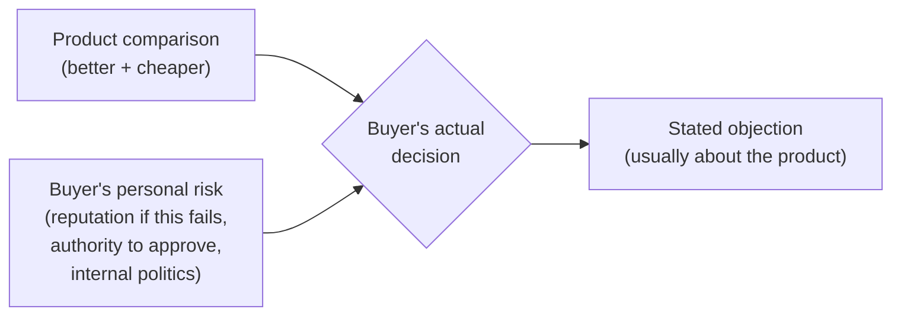

import LevelIntro from "../../../components/LevelIntro.astro";
import Checkpoint from "../../../components/Checkpoint.astro";

L1 named the gap between a stated objection and the real one sitting
underneath it. This level works through why that gap exists so
reliably, and builds a concrete question a seller can actually ask to
close it.

<LevelIntro
  items={[
    "Common stated-objection-to-real-objection patterns",
    "Why B2B hesitation is about the buyer's risk, not just the product",
    "A forward-looking question that surfaces the real concern",
  ]}
/>

## Why buyers rarely say the real reason out loud

**If a buyer's actual objection is "I'm worried about being blamed
if this goes wrong," why would they say "we need to think about it"
instead?** Because the real reason is usually personal or political
in a way that feels unsafe or awkward to admit to a vendor (or
sometimes even to themselves) — "we need to think about it" costs
nothing to say and avoids the conversation entirely:

| Stated objection                         | Common real objection underneath                                                                                              |
| ---------------------------------------- | ----------------------------------------------------------------------------------------------------------------------------- |
| "We need to think about it."             | Risk aversion — the buyer isn't confident enough to stake their own credibility on the decision yet.                          |
| "It's not the right time."               | The buyer doesn't have (or isn't sure they have) the authority to approve this alone.                                         |
| "We're happy with what we have."         | Status quo bias — the current approach's flaws are familiar and survivable; a new approach's flaws are unknown.               |
| "It's a bit expensive for us right now." | The price itself isn't the issue — the buyer doesn't yet have a way to justify the cost internally to whoever they report to. |

Read the table as possible clues, not as a mind-reading machine. A
buyer may be telling the whole truth, or they may be naming the
easiest professional reason while a harder concern sits underneath.
The skill is to ask in a way that lets the real concern surface
without making the buyer feel accused.

**Is this table saying every stated objection is a cover story?**
No — sometimes "it's expensive" really does just mean the budget
isn't there. The table is a set of common patterns, not a rule that
applies every time; the point is knowing what to listen for, not
assuming deception in every stall.

<Checkpoint question="A buyer says 'we're happy with what we have,' even though the vendor's product is clearly better on paper. Naming the pattern from the table above, what's a likely real objection underneath that specific stated one?">

Status quo bias is the likely pattern: the buyer's current setup has
flaws they already know how to live with, while the new option's
flaws — even if probably smaller — are unknown and therefore feel
riskier to be responsible for. "We're happy with what we have" is an
easier thing to say out loud than "I'd rather live with a known
problem than be blamed for an unknown one," even though the second
sentence is closer to what's actually driving the decision.

</Checkpoint>

## What actually drives most B2B purchase hesitation

**Why would a buyer hesitate on a product that's clearly better and
cheaper than what they have?** Because "better and cheaper" is a
comparison about the _product_ — but the buyer isn't just evaluating
the product, they're evaluating their own risk in recommending it:

B2B means business-to-business: one company selling to another
company. That usually means the buyer is not spending only their own
money; they may need approval, they may need to explain the decision
to a boss, and they may risk their reputation if the new choice fails.
To "stake their credibility" simply means to put their reputation on
the line.

The stated objection almost always references the product ("it's
expensive," "not the right time") because that's the comfortable,
professional-sounding thing to say — but the actual decision weighs
the buyer's personal exposure just as heavily, often more, and that
part rarely gets said out loud unprompted.

In text form: the buyer is not just asking "is this product better?"
They are also asking "can I safely recommend this, get it approved,
and survive the consequences if it goes badly?"

## Surfacing the real objection without accusing anyone

**If you suspect the stated objection isn't the whole story, what do
you actually ask — "is that the real reason"?** No — that framing
puts the buyer on the defensive and assumes they were being
dishonest. A better question asks forward, not backward: **"What
would need to be true for this to be an easy yes?"** This doesn't
accuse anyone of hiding anything — it invites the buyer to name what's
actually missing, whether that's more internal buy-in, a lower-risk
rollout plan, or something about their own authority to decide.

**Why does this specific framing work better than just asking "why
not"?** "Why not" asks the buyer to justify a decision they've
already made, which invites defending the stated objection more
firmly. "What would need to be true" asks about the future, not the
past — it's a planning question, not a justification demand, so it's
much easier for a buyer to answer honestly.

<Checkpoint question="Why would asking 'is the price really the problem, or is something else going on?' tend to backfire compared to asking 'what would need to be true for this to be an easy yes?'">

The "is something else going on" framing still asks the buyer to
confirm or deny a suspicion about their own honesty, even phrased
gently — it puts them in the position of either admitting they
weren't fully forthcoming or defending the stated objection more
firmly to avoid that admission. "What would need to be true" never
asks the buyer to look backward at what they already said; it asks
them to look forward at what's missing, which is a planning question
rather than a confession, so there's nothing uncomfortable to defend
against.

</Checkpoint>

## Failure modes at this level

- **Assuming every stalled deal has a hidden real objection.**
  Sometimes the stated objection genuinely is the whole story —
  treating every "we'll think about it" as a puzzle to solve can
  come across as pushy or presumptuous.
- **Directly accusing the buyer of not being honest.** Asking "is
  that the real reason?" puts the relationship at risk for the sake
  of information that a better-framed question could get without any
  confrontation at all.
- **Finding the real objection and then ignoring it anyway.**
  Surfacing that the buyer's real concern is internal risk, then
  responding only with more product features, doesn't address what
  was actually uncovered.
