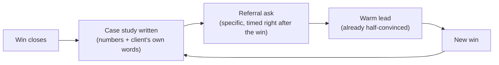

import LevelIntro from "../../../components/LevelIntro.astro";
import Checkpoint from "../../../components/Checkpoint.astro";

L1 showed the outcome gap between documenting a win and letting it
disappear. This level breaks down what actually makes a case study
persuasive rather than decorative, and the specific timing and framing
that gets a referral ask a real name instead of silence.

<LevelIntro
  items={[
    "What makes a case study land instead of reading as marketing filler",
    "Referral-ask timing and framing that actually gets a yes",
    "How one win's case study and referral loop back into the next deal",
  ]}
/>

## What makes a case study actually persuasive?

A prospect reading a case study is running one implicit test: is this a
real thing that happened to a real person, or is it copy written to
sound like one? Three ingredients decide which side of that test a
case study lands on.

| Element            | Weak version                                                    | Strong version                                                                                                              |
| ------------------ | --------------------------------------------------------------- | --------------------------------------------------------------------------------------------------------------------------- |
| Numbers            | "significantly reduced errors"                                  | "cut double-booking incidents from 4 a quarter to 0"                                                                        |
| Voice              | "Our clients love how easy it is" (unattributed marketing copy) | "Two dispatchers editing the same spreadsheet was the actual problem" — Marcus R., Operations Manager (a real, named quote) |
| Structure          | A success story with no stated starting point                   | Problem (in numbers) → what changed → result (in numbers), all traceable to one real client                                 |
| Credibility signal | Anonymous, generic ("a logistics company")                      | Named client and role, specific enough that a similar prospect recognizes their own situation                               |

A vague version isn't dishonest — it's just unfalsifiable, and a
prospect's skepticism treats unfalsifiable claims as marketing by
default. A specific number attached to a named person is much harder to
discount, because it's the kind of detail that's easy to check and hard
to make up.

<Checkpoint question="Why does a specific number like 'cut double-booking incidents from 4 a quarter to 0' persuade a new prospect more than 'significantly reduced errors,' even though both describe the same underlying result?">

The specific number is checkable and the vague one isn't. "Significantly
reduced errors" could describe almost any outcome, including a
disappointing one dressed up in confident language — a skeptical reader
has no way to tell the difference, so their default is to discount it
the way they'd discount any other marketing claim. "From 4 a quarter to
0" is a concrete, falsifiable fact attached to a specific person's name
and role. It reads as something that actually happened rather than
something written to sound persuasive, and that distinction is exactly
what a prospect is unconsciously screening for when they read a case
study at all.

</Checkpoint>

## Referral-ask mechanics: timing and framing

Getting a case study right earns the right to ask for something bigger:
an introduction to someone with the same problem. Two variables decide
whether that ask lands.

- **Timing.** The ask happens right after the win is realized, while
  the specific pain and the specific relief are both still close at
  hand for the client. A referral ask folded into a renewal call months
  later is asking the client to retrieve a feeling that's no longer
  vivid — it becomes a favor with no story attached, instead of a
  natural next sentence after a real result.
- **Framing.** "Does anyone come to mind with this exact same problem —
  even just one or two names?" hands the client a narrow, answerable
  question. "Let me know if you hear of anyone" hands the client an
  open-ended research task they have to do on their own time, with no
  concrete trigger to remember it by — which is why it usually produces
  silence, not because the client didn't want to help.

<Checkpoint question="Suppose a rep closes a deal similar in size to Marcus's, but waits until the annual renewal call four months later to ask for a referral. What's lost, even if the client says yes anyway?">

What's lost isn't the yes itself — it's the specificity behind it. Right
after the win, the client can point to a precise, still-vivid problem
("the double-booking thing") and immediately picture a colleague who
has the exact same one. Four months later, at renewal, the details have
blurred into general satisfaction — the client can still say "sure,
I'll think of someone," but it's now a vague goodwill gesture instead of
a sharp match between a remembered problem and a remembered person. The
referral is more likely to be generic, delayed, or simply forgotten,
because the moment that made the connection obvious has already passed.

</Checkpoint>

## Why does this compound rather than just add one deal?

Each case study a rep writes becomes raw material for every sale that
follows it, not just a record of the one that's already closed: a real
objection that got overcome, with the exact response that overcame it,
feeds the next objection-handling conversation; a real dollar figure
that actually materialized feeds the next ROI pitch instead of a
projected estimate; a real client's own words give the next discovery
call an opening line stronger than a cold pitch. A referral, meanwhile,
starts every one of those future conversations already warm — the
prospect arrives half-convinced, because someone they trust already
vouched for the exact problem being solved. Skip the case study and the
referral ask, and every closed deal is a dead end that starts the next
sale from the same zero as the one before it; do both consistently, and
the pipeline itself starts compounding, not just the deal count.
