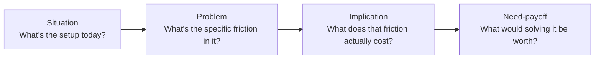

import LevelIntro from "../../../components/LevelIntro.astro";
import Checkpoint from "../../../components/Checkpoint.astro";

L1 established that Adri and Bex differed in one thing: whether the
call was built around talking or around asking. This level breaks that
difference down into a repeatable shape — the kinds of questions that
do the work, and the order to ask them in.

<LevelIntro
  items={[
    "Why closed questions confirm, and open questions reveal",
    "The situation → problem → implication → need-payoff flow",
    "What a discovery-first call looks like next to a pitch-first one",
  ]}
/>

## What's the actual difference between a closed and an open question?

A **closed question** has a small, fixed set of possible answers — often
just yes or no — and it usually contains the seller's own assumption
baked into the wording. "Do you need better reporting?" already assumes
reporting is the gap. Answer it "yes" and the seller learns almost
nothing beyond confirming a guess they walked in with.

An **open question** has no fixed answer shape at all — it hands the
floor to the prospect and asks them to describe something in their own
words. "What happens today when a handoff between teams gets missed?"
doesn't presuppose what the problem is; it invites the prospect to
describe a real situation, in their own vocabulary, which is exactly
where an unstated problem tends to surface.

|                            | Closed question                      | Open question                                                            |
| -------------------------- | ------------------------------------ | ------------------------------------------------------------------------ |
| Example                    | "Is 8 seats the right number?"       | "Walk me through who touches this work after your team is done with it." |
| What it can produce        | Yes / no / a number                  | A story, with specifics the seller didn't already know to ask for        |
| Where the assumption lives | In the question itself               | Nowhere — the prospect supplies it                                       |
| Best used for              | Confirming a detail late in the call | Surfacing the real problem, early in the call                            |

Closed questions aren't wrong — they're the right tool for confirming a
detail once the real problem is already understood. Used too early,
before that understanding exists, they just get the prospect nodding
along to the seller's first guess.

<Checkpoint question="A rep asks a prospect: 'So the main pain point is response time, right?' and the prospect says 'yeah, I guess.' Did this question surface the prospect's real problem, or something else?">

Something else — this is a closed question wearing an open question's
clothing. It states the seller's assumption ("the main pain point is
response time") and asks for a yes, and "yeah, I guess" is exactly the
kind of soft, uncommitted agreement a leading closed question produces
even when it's not quite right. The prospect didn't generate that
answer from their own situation; they accepted a framing that was
handed to them, likely because disagreeing felt like more effort than
going along with it. A genuinely open version — "What's been the most
frustrating part of how this works today?" — would have let the
prospect supply their own answer instead of rubber-stamping the rep's.

</Checkpoint>

## A structure for the conversation: situation → problem → implication → need-payoff

Asking open questions at random still risks a rambling, unfocused call.
A lightweight four-step progression gives the conversation a shape
without turning it into a script — each step's questions build on the
one before, and no step tries to do the next step's job.

1. **Situation** — understand the current setup before touching
   anything that sounds like a problem. "How many teams are involved
   in getting a piece of work from request to delivery?" This step is
   easy to over-invest in (it can feel like small talk); keep it to
   just enough context to ask a sharp problem question next.
2. **Problem** — ask about friction directly, but as an open
   question, not a leading one. "What tends to go wrong in that
   handoff?" not "Is the handoff slow?" The prospect names the
   friction in their own words, which is usually more specific and
   more telling than anything the seller could have guessed.
3. **Implication** — this is the step pitch-first conversations skip
   entirely, and it's usually where the real deal size lives. "What
   happens when that handoff gets missed — does it show up anywhere,
   in cost or in a client relationship?" A problem that sounds minor
   ("things get delayed sometimes") can have an implication that
   isn't minor at all ("we've paid rush-shipping fees on three
   projects this quarter to cover for it").
4. **Need-payoff** — instead of the seller declaring why a solution
   matters, the prospect says it, in their own words, having just
   walked themselves through the cost. "If missed handoffs stopped
   costing you those rush fees, what would that be worth to the
   team?" A need-payoff answer, spoken by the prospect, is a far
   stronger foundation for a pitch than anything the seller could
   assert unprompted — and it's the exact number `product-domain/value-based-selling`
   later teaches how to turn into a formal ROI case, once discovery
   has surfaced it.

<Checkpoint question="A rep asks the situation question, then the problem question, then jumps straight into the pitch. What step did they skip, and what's the practical cost of skipping it?">

They skipped implication — the step that turns a stated problem into a
felt cost. Naming a problem ("handoffs sometimes get missed") without
also surfacing what that problem actually costs leaves the prospect's
sense of urgency exactly where it started: mild. The pitch that follows
has to manufacture urgency on its own, from the seller's side, which is
a much harder sell than urgency the prospect already stated in their
own words. Worse, without an implication figure on the table, the
prospect has no anchor for judging whether the price that follows is
reasonable — everything after that point in the call is guesswork on
both sides.

</Checkpoint>

## Pitch-first vs. discovery-first, side by side

|                                               | Pitch-first (Adri)                                             | Discovery-first (Bex)                                                               |
| --------------------------------------------- | -------------------------------------------------------------- | ----------------------------------------------------------------------------------- |
| First words on the call                       | "Let me show you what we do"                                   | "What's driving the search for this right now?"                                     |
| Who talks more                                | The rep                                                        | The prospect                                                                        |
| What gets addressed                           | The stated ask, exactly as written                             | The stated ask, plus whatever's underneath it                                       |
| Risk if the stated ask isn't the real problem | Pitch answers the wrong question; prospect politely disengages | Real problem surfaces before the pitch is built, so the pitch answers the right one |
| Deal size ceiling                             | Capped at whatever was originally asked for                    | Set by the real problem's actual scope and cost                                     |

Neither rep was dishonest, lazy, or under-prepared — the entire
difference was in the shape of the conversation, not the skill behind
the product knowledge. That shape is learnable, and L3 walks a full
call, question by question, to show exactly how a rep's understanding
of the real problem evolves in real time.
