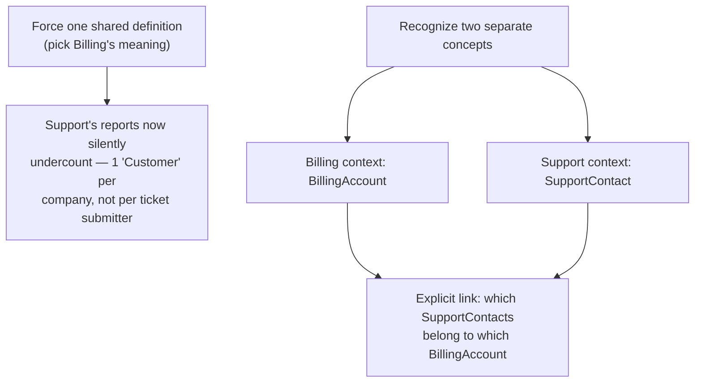

import LevelIntro from "../../../components/LevelIntro.astro";
import Checkpoint from "../../../components/Checkpoint.astro";

L1 showed the "Customer" collision and named the fix in outline form —
this level walks through why forcing one definition doesn't actually
resolve it, and what a bounded context has to include to work in
practice.

<LevelIntro
  items={[
    "Why forcing one shared definition backfires",
    "Bounded contexts and the explicit relationship at their boundary",
    "Modeling a business rule instead of a loose data field",
  ]}
/>

## Why can't there just be one correct definition of "Customer"?

**If Billing and Support disagree about what "Customer" means, isn't the
fix just to pick whichever definition is more correct and make everyone
use it?**



Forcing one definition doesn't resolve the disagreement — it just makes
one team's model silently wrong for the other team's actual questions.
Support genuinely needs to count individual ticket submitters; collapsing
that into "one Customer per paying account" doesn't simplify anything, it
deletes information Support actually needs. The two concepts aren't in
conflict — they're both real, and both deserve their own name.

## Bounded contexts: where a term's meaning holds

**If both definitions are legitimate, how do they coexist in the same
system without colliding?** A **bounded context** is an explicit boundary
— usually matching how the business itself is organized (a team, a
subsystem, a business process) — inside which a term has one precise,
agreed meaning. Outside that boundary, the same word may mean something
else entirely, and that's expected, not a bug:

For example, Billing may be a team, "invoices" may be a subsystem, and
"collecting payment" may be a business process. The shared idea is: this
is the area where one meaning is true.

```text
Billing context:
  "Customer" = BillingAccount (the thing/account that owns invoices)

Support context:
  "Customer" = SupportContact (the person who opened the ticket)

Explicit relationship at the boundary:
  Each SupportContact belongs to exactly one BillingAccount
  (a company's employees all link to their employer's billing account)
```

The critical piece isn't just naming things differently — it's the
**explicit relationship at the boundary**. Without it, the two contexts
just silently disagree with no way to reconcile a cross-team report. With
it, a report combining both can correctly say "4,800 support contacts
across 1,200 billing accounts" instead of two contradictory "customer
counts."

<Checkpoint question="A new team, Onboarding, starts tracking 'Customer' too — meaning whoever signed the initial contract. Is the fix to have Onboarding just adopt Billing's BillingAccount, since Billing already solved this?">

Not automatically. The question isn't which existing definition is closest — it's
whether Onboarding's "whoever signed the initial contract" is actually the same
concept as Billing's "the account that owns invoices," or a third, genuinely
different one that happens to overlap with both. In many companies the contract
signer and the invoice-paying account are the same entity, in which case
Onboarding really can reuse `BillingAccount` directly. But if a parent company
signs the contract while a subsidiary's account pays the invoices, that's a real
third concept, and forcing it into `BillingAccount` just recreates the original
problem one level up — a shared name standing in for two different things. The
bounded-context boundary has to be drawn around where the meaning actually
diverges, not assumed from which team spoke up first.

</Checkpoint>

## Modeling rules, not just fields

**Does "modeling the domain" just mean picking better names for database
columns?** Not quite — it means capturing the actual rules the business
operates by, as concepts the code enforces, not just data it stores.

The names in backticks below are examples of names that might exist in
code. The important part is not the syntax; it is that the name carries a
business rule instead of being a loose storage box.

| Just storing data                         | Modeling the domain                                                                        |
| ----------------------------------------- | ------------------------------------------------------------------------------------------ |
| A `status` column that accepts any string | A `SubscriptionStatus` that can only move active → grace-period → cancelled, in that order |
| A `discount_percent` field with no bounds | A `Discount` concept that enforces "never exceeds 40% without manager approval"            |
| A `customer_type` flag                    | Separate `BillingAccount` and `SupportContact` concepts, each with their own real behavior |

The right-hand column isn't more code for its own sake — each of those
constraints is an actual rule a domain expert would state out loud
("a subscription can't jump straight from active to cancelled without
the grace period"). A model that doesn't enforce it lets code elsewhere
silently violate a rule the business actually depends on.

<Checkpoint question="A teammate argues the SubscriptionStatus rule (active → grace-period → cancelled, no skipping) belongs in the UI layer, as a dropdown that only shows the 'legal next' options — not in the domain model itself. What's the risk of leaving it only there?">

The UI is one path into the system, not the only one. A background job that
processes a batch cancellation, an internal admin tool, an API called directly by
another service, or a future integration can all set `status` without ever
touching that dropdown — and if the rule lives only in the UI's allowed options,
every one of those paths can silently violate it. Modeling the rule in the domain
itself means any caller, present or future, gets the same guarantee: an
active subscription cannot jump straight to cancelled, no matter which door it
came through. The UI dropdown is a nice-to-have reflection of the rule for
humans; the domain model is what actually enforces it.

</Checkpoint>

## The generalizable lesson

**Is the takeaway "always split every ambiguous word into two concepts"?**
Not automatically — splitting has a real cost (more concepts to maintain,
an explicit relationship to keep in sync). The actual skill is noticing
_when_ a shared word is masking two genuinely different concepts with
different rules and different questions asked of them — as opposed to a
single concept that's simply described two ways — and only introducing a
boundary where the underlying meanings have actually diverged.

That is how the code stops fighting the business: it stops forcing
everyone to use one word with a false or incomplete meaning.
