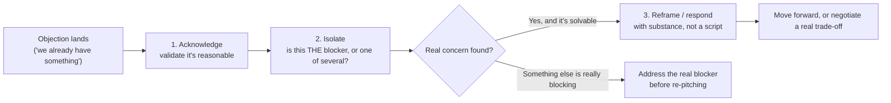

import LevelIntro from "../../../components/LevelIntro.astro";
import Checkpoint from "../../../components/Checkpoint.astro";

L1 showed that arguing back on an objection makes it harder, and
agreeing-then-asking makes it easier. That's not a trick specific to
one line — it's a repeatable three-step structure that works the same
way for almost any objection a prospect raises.

<LevelIntro
  items={[
    "The acknowledge → isolate → reframe model",
    "What good and bad responses actually sound like, by objection type",
    "Concession trading, anchoring, and knowing when to walk away",
  ]}
/>

## What actually happens in the ten seconds after an objection lands?

Most reps do one of two things badly: they argue immediately (Rep A in
L1), which makes the prospect defend their position instead of
examining it, or they cave immediately — "okay, let me see what I can
do about the price" — which signals the objection was never solid in
the first place and invites the prospect to push for more. Both skip a
step that has to happen first.

- **Acknowledge** buys you the prospect's trust before you ask them
  anything else. Arguing immediately signals "I heard a wall, not a
  person," and people defend harder against something that feels like
  an attack on a decision they've already made (using the incumbent, or
  believing the price is too high).
- **Isolate** is the step both bad responses skip entirely. A stated
  objection is sometimes the real blocker and sometimes a stand-in for
  something the prospect hasn't said yet — the isolating question is
  simply asking, directly, whether solving this one thing would
  actually unblock a decision. This is the live-conversation cousin of
  what **buyer psychology** teaches about diagnosing the gap between a
  stated and a real objection — here, you're not guessing at the real
  concern from the outside, you're asking for it directly, in a way
  that doesn't feel like an interrogation.
- **Reframe** only happens once you know what you're actually
  responding to. For a price objection, the reframe is very often a
  return to **value-based selling**'s territory — connecting the price
  to a number the prospect already tracks — rather than a discount.

<Checkpoint question="A prospect says 'it's too expensive' and the rep immediately offers 10% off. What step did the rep skip, and what's the risk of skipping it?">

The rep skipped both acknowledge and isolate, and jumped straight to a
concession. The risk isn't just giving away margin for nothing — it's
that an immediate discount treats "too expensive" as a literal budget
fact without ever checking whether that's true. Often the prospect
hasn't seen enough value yet to justify the number, in which case a
discount doesn't fix anything: the same prospect can come back next
month feeling exactly as unconvinced, just at a lower price. Isolating
first — asking whether the number is genuinely outside budget or
whether the value case hasn't landed yet — determines whether the real
fix is a lower price or a better reframe of the value already on the
table.

</Checkpoint>

## What do weak and strong responses actually sound like?

The acknowledge → isolate → reframe structure is easy to state and easy
to skip under pressure, especially live on a call. Seeing it side by
side against the reflexive, weak version makes the gap concrete.

| Objection                              | Weak response (argues or caves immediately)           | Strong response (acknowledge → isolate → reframe)                                                                                           |
| -------------------------------------- | ----------------------------------------------------- | ------------------------------------------------------------------------------------------------------------------------------------------- |
| "It's too expensive"                   | "I can knock 10% off if that helps"                   | "Totally fair to raise — is the number itself outside budget, or is it that we haven't shown enough value yet to justify it?"               |
| "We already have something that works" | "Here's why we're better on every feature"            | "Makes sense, switching costs are real — is there anything about the current setup that still costs you time, even if it's mostly working?" |
| "We need to think about it"            | "No problem, just following up" (then silence)        | "Of course — what specifically do you want to think through, so I can make sure you have what you need for that?"                           |
| "It's not the right time"              | "When would be a better time?" (then waits passively) | "Understood — is timing the only thing in the way, or is there something else that would need to be true even at a better time?"            |

Notice the strong column never argues the prospect out of their
position — it validates the position, then asks a specific question
that either surfaces the real concern or confirms the stated one is the
real one. Only after that does a reframe with actual substance make
sense.

<Checkpoint question="Looking at the 'not the right time' row: why does the strong response ask if timing is 'the only thing in the way' instead of just asking 'when would be better'?">

Asking "when would be better" accepts the stated objection at face
value and treats the conversation as a scheduling problem, which is
exactly the isolate step being skipped. If timing genuinely is the only
issue, that question wastes a beat but does no harm. But if timing is
covering for something else — no budget approved yet, a stakeholder who
hasn't bought in, uncertainty about whether the product actually solves
the problem — agreeing to follow up "at a better time" just delays
finding that out, and the deal can stall indefinitely across several
"better times" that never actually arrive. Asking whether timing is the
only blocker forces that distinction to surface now, while there's
still a live conversation to work with.

</Checkpoint>

## What happens once a real trade-off is actually on the table?

Acknowledge → isolate → reframe gets you to a genuine, substantive
conversation. Sometimes that conversation still ends at a real
trade-off — the prospect wants a lower price, or better terms, and
that's a legitimate ask, not a sign the reframe failed. That's where
basic negotiation mechanics take over:

- **Never give something away for nothing.** A one-way discount trains
  the prospect that your price was never real, and invites them to ask
  for more next time. A concession only in exchange for something back
  — a longer contract term, a case study reference, faster payment,
  a referral — keeps the exchange a trade instead of a giveaway, and
  the thing received back often makes the deal worth more overall even
  after the discount.
- **The first number anchors the rest of the negotiation.** Whoever
  states a number first pulls the conversation toward it — which is why
  a prospect opening with "can you do 20% off?" is itself a form of
  anchoring, and why a counter-offer with reasoning behind it (not just
  a smaller discount) resets that anchor rather than just haggling
  downward from theirs.
- **Walking away from a bad deal is sometimes the correct outcome.**
  Not every objection resolves into a deal that's worth doing. If a
  concession would need to be so large that the deal stops being
  profitable, or sets a precedent that undermines every future
  negotiation, saying no — and leaving the relationship open for later —
  is a better outcome than closing a deal that costs more than it's
  worth.

L3 walks one deal through both canonical objections in sequence, with a
real concession trade, an amateur-response contrast, and what changes
when the objection turns out to be a smokescreen or the budget
constraint turns out to be genuinely real.
