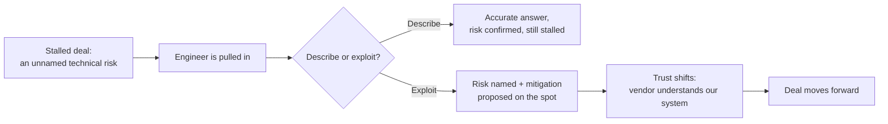

import LevelIntro from "../../../components/LevelIntro.astro";
import Checkpoint from "../../../components/Checkpoint.astro";

L1 showed the moment: the same question, answered two ways, six weeks
apart from each other in effect even though only minutes apart in the
same call. This level breaks down why that gap exists structurally, and
what separates an engineer who answers questions accurately from one
who actively shapes a deal.

<LevelIntro
  items={[
    "Why a peer engineer's risk assessment carries structurally different trust",
    "Describing a capability vs. exploiting an opportunity — and how to tell them apart",
    "What a VP/CTO audience is actually optimizing for in the room",
  ]}
/>

## Why can't a salesperson's reassurance do what Dara did?

Renata's skepticism wasn't personal, and it wasn't really about
Vantable's product. It was about who was answering.

|                                  | Account executive                                                | Presales engineer                                                                 |
| -------------------------------- | ---------------------------------------------------------------- | --------------------------------------------------------------------------------- |
| Incentive in the room            | Close the deal — compensated on it                               | Get the technical answer right — no commission tied to the outcome                |
| What a wrong answer costs them   | Nothing immediate; the risk lands on the customer post-signature | Their own credibility, on the next call and the one after that                    |
| What the audience can verify     | Confidence and tone, not substance                               | Whether the mechanism they described actually holds up under a follow-up question |
| Default read from a skeptical VP | "Incentivized to say yes"                                        | "Has to actually be right, or gets caught being wrong"                            |

A VP of Engineering evaluating a vendor isn't running a pure logic
check on the words being said — she's running a trust check on the
speaker, because she can't independently verify a claim about her own
infrastructure in real time. An account exec is structurally the wrong
person to pass that check, no matter how good they are at their job:
their incentive to say yes is visible, and Renata knows it. A peer
engineer with nothing to gain from a specific answer, who demonstrates
they actually understand the failure mode in Harborline's own terms,
passes a check that a persuasive pitch never could — not because
engineers are more honest people, but because the audience has a
structural reason to weight their answer differently.

<Checkpoint question="Dara isn't a better communicator than Vantable's account exec — by all accounts he's an excellent salesperson. So why did Renata trust Dara's answer and not his, on the exact same question?">

It isn't a communication-skill gap — it's an incentive-structure gap
that Renata can see from her seat. The account exec's job is to make
the deal happen, and his compensation is tied to that outcome; Renata
has no way to separate his confidence from that incentive, no matter
how genuinely he believes what he's saying. Dara's answer, by contrast,
is falsifiable in a way Renata can test immediately — she can ask a
follow-up about the shadow-write mechanism and see whether it holds up,
the same way she'd cross-examine one of her own engineers. The trust
isn't given because Dara sounds more credible; it's earned because her
answer is the kind of claim that would visibly break under scrutiny if
it were wrong, and a persuasive pitch never puts itself at that kind of
risk.

</Checkpoint>

## Describing a capability vs. exploiting an opportunity

Passing the trust check is necessary but not sufficient — it only gets
a presales engineer to "accurate." The staff-level move is what happens
next: whether the engineer stops at answering the question asked, or
uses what they can see that the other side can't to move the deal
forward on its own.

|                       | Describing                                                                                                                         | Exploiting                                                                                                                                                                                 |
| --------------------- | ---------------------------------------------------------------------------------------------------------------------------------- | ------------------------------------------------------------------------------------------------------------------------------------------------------------------------------------------ |
| Posture               | Reactive — answers the question that was asked                                                                                     | Proactive — surfaces something the other side hadn't asked about yet                                                                                                                       |
| Dara's cutover answer | "A migration would take about 40 minutes of write-locking, given your volume." (true, complete, and leaves the risk sitting there) | "A migration at your write volume would lock the table for ~40 minutes — here's a shadow-write approach that gets that under two minutes, and I can sketch the cutover plan on this call." |
| What it requires      | Knowing the answer                                                                                                                 | Recognizing the risk was going to be a dealbreaker before it was named as one, and having a real mitigation ready                                                                          |
| Effect on the deal    | Confirms the risk is real — often _stalls_ the deal further                                                                        | Converts the biggest open risk into evidence the vendor understands the customer's system better than the customer expected                                                                |

"Describing" isn't wrong — it's honest, and it's what most technical
people default to when they're pulled into a sales call: answer
exactly what's asked, accurately, and stop. But an accurate answer to
"how long would a migration lock the table?" that stops at "about 40
minutes" doesn't move the deal — it just confirms the fear that's been
stalling it for six weeks. "Exploiting" the opportunity means the
engineer saw the risk was going to be the actual blocker, had already
thought through a mitigation, and used the moment to solve the problem
in the room instead of promising to solve it later. That's the
difference between being a credible witness and being an active
participant in getting the deal done.

<Checkpoint question="Suppose Dara had answered Renata's question with 'yes, a migration at your volume would lock the table for about 40 minutes' and stopped there — technically accurate, nothing false in it. Would that have unstalled the deal?">

No — it would have done the opposite. An accurate answer that stops at
naming the problem doesn't relieve Renata's concern, it confirms it:
the exact fear that's been stalling the deal for six weeks turns out to
be real. Describing the risk correctly earns Dara the trust check from
the table above, but trust alone doesn't move a deal forward if the
blocker is still sitting there unresolved. What actually unstalled the
conversation was the second half — proposing a concrete mitigation, on
the spot, that changed the 40-minute lock into a two-minute one. The
accurate description was necessary for Renata to believe Dara at all;
it was the proactive mitigation that gave her a reason to say yes.

</Checkpoint>

## What is the executive audience actually optimizing for?

Renata isn't reading Vantable's feature list — she's weighing three
things a feature list doesn't answer, the same shift
`translating-capability-into-their-vocabulary-cfo` describes for a
different audience: risk (what could break, and how badly), integration
cost (what this actually takes from her own team, not just Vantable's),
and strategic fit (does this partnership make Harborline's own roadmap
easier or harder over the next two years). A presales engineer who
walks in ready to talk about API response times and dashboard features
is answering questions nobody in that room is asking. The engineer who
walks in ready to talk about cutover risk, what Harborline's team would
actually need to do, and how this fits Harborline's own five-year
infrastructure direction is speaking the language the room is actually
thinking in — the same translation instinct `translating-capability-
into-their-vocabulary-cfo` teaches for a CFO, applied here to a
VP Engineering and, above her, a CTO who cares even less about features
and even more about strategic fit and risk exposure at scale.

## Why does this matter more, not less, at the executive level?

A junior technical contact on the customer side might genuinely want a
feature walkthrough. A VP or CTO in a strategic-partnership
conversation almost never does — they've already had someone on their
team vet the feature set before this call happened. What they're
personally in the room to evaluate is exactly the kind of judgment call
a feature demo can't answer: is this a risk we can manage, and is the
person telling us so someone we'd trust to manage it. That's precisely
why the presales engineer's credibility, not the product's spec sheet,
is the actual selling instrument in this room — and why L3 follows one
all the way through a real deal, including the part where the first
proposed mitigation isn't quite right either.
