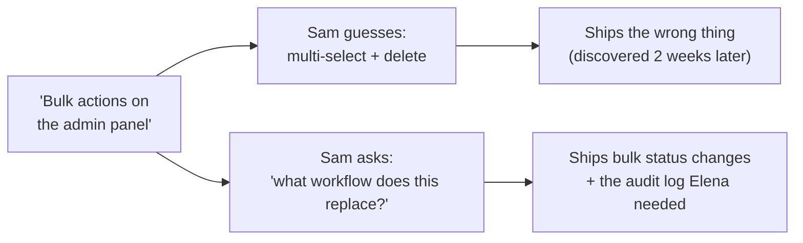

import Scenario from "../../../components/Scenario.astro";

<Scenario>
  <Fragment slot="facts">
    

      
🎫 Ticket: "We need bulk actions on the admin panel."

      
🧑‍💻 Sam reads it, assumes "bulk actions" = multi-select + delete

      
✅ Sam ships it — fully working, well-tested

      
😕 Two weeks later: "not really what we needed"

    

    
What Elena actually needed

    

      
📋 Bulk <strong>status changes</strong> (verify 30-50 accounts/week)

      
🗑️ Deletion — not part of her workflow at all

      
🧾 An audit log entry, matching existing single-item behavior

    

  </Fragment>

Elena, an ops lead, files a ticket: "We need bulk actions on the admin
panel." Sam, the engineer, reads it, picks the most common interpretation
of "bulk actions" he's seen elsewhere — multi-select plus a delete button —
and builds exactly that: checkboxes, a "Delete selected" button, a
confirmation dialog. It works. It's well-tested. It ships.

**Before reading on: was there anything wrong with Sam's implementation?**
And if not — why does Elena say, two weeks later, that it's "not really
what we needed"?

</Scenario>

Nothing was wrong with Sam's code. The bug was upstream of any code at
all: "bulk actions" was never actually specified beyond two words in a
ticket, and Sam filled the gap with a guess instead of a checked fact.
Elena's actual workflow was bulk **status changes** — marking many
accounts "verified" at once — not deletion, which she never uses. This
unit is about closing that gap before implementation starts, not after.

- A vague ask ("make it faster," "add bulk actions") is not a requirement — it's a starting point that still needs specific, checkable questions answered before anyone can build the right thing or know when it's done. This unit is about that translation step, distinct from `product-domain/understanding-user-s-problem-solution`'s question of _whether the underlying problem is even validated_ — this unit assumes the problem is real and asks how to specify a solution to it precisely.
- **A good requirement is falsifiable** — there's a concrete way to check whether it's been met. "Improve the dashboard" can't be checked; "the dashboard's initial load time should be under 2 seconds on a typical connection" can be checked, by anyone, without asking the original requester what they meant.
- **User stories** are a lightweight format for capturing a requirement's _who_ and _why_, not just its _what_: "As a [role], I want [capability], so that [benefit]" — the "so that" clause is often the most valuable part, because it's what lets an engineer make a reasonable judgment call on details the story didn't explicitly specify.
- **Acceptance criteria** are the falsifiable checklist attached to a story — specific, testable conditions that must hold for the story to be considered done. Without them, "done" is a judgment call made separately by whoever built it and whoever asked for it, which is exactly where scope disagreements come from after the fact.
- A recurring failure this unit targets: **stakeholders describing a solution instead of a need** (the same trap covered from a different angle in `understanding-user-s-problem-solution`) — "bulk actions" already smuggled in an assumed solution shape (deletion-style bulk actions); requirements gathering has to actively probe past the first-offered solution to find the actual constraint or goal underneath it.
- **Ambiguity found during requirements gathering is cheap to resolve; ambiguity discovered during implementation or QA is expensive** — the entire practical argument for investing real time in this step is that the cost of an unclear requirement doesn't stay constant, it compounds the later it's caught.
- The practical skill: turning "we need bulk actions" into a specific, falsifiable, role-and-reason-attached requirement with acceptance criteria — before a single line of implementation work starts, not as an afterthought once something's already been built.

