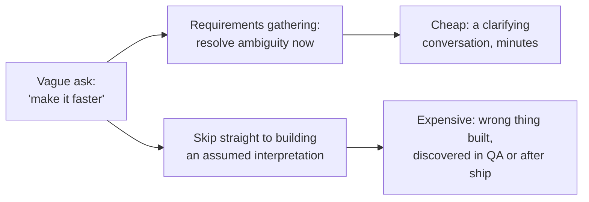

## The cost-of-ambiguity curve



The ambiguity in "make it faster" doesn't disappear if it's not resolved up front — it just moves downstream, to wherever someone first has to make a concrete decision about what "faster" actually means (which page, how much faster, faster for which users, under what load). Resolving it during a conversation costs minutes; resolving it after the wrong thing has been built and QA'd costs the entire implementation cycle, redone.

## Turning a vague ask into a falsifiable requirement

| Vague ask                        | Clarifying questions to ask                                                   | Resulting falsifiable requirement                                                                                                                     |
| -------------------------------- | ----------------------------------------------------------------------------- | ----------------------------------------------------------------------------------------------------------------------------------------------------- |
| "Make the dashboard faster"      | Faster at what, specifically? How much faster is enough? For which users?     | "Initial dashboard load completes in under 2 seconds on a typical broadband connection, for the 95th percentile of users"                             |
| "Add a way to filter the report" | Filter by what fields? Single or multiple selection? Does it need to persist? | "Users can filter the report by date range and status, selecting multiple statuses at once; the filter persists across page reloads within a session" |
| "Improve error messages"         | Improve how — more detail, plain language, actionable next steps?             | "Every user-facing error message states what went wrong in plain language and includes one concrete next step (retry, contact support, check input)"  |

Each right-column requirement can be checked by someone who wasn't in the original conversation — that's the actual test for "falsifiable": a new engineer, or QA, or the original requester six months later, can look at the built thing and the requirement side by side and get the same yes/no answer independently.

## User stories: capturing who and why, not just what

```
As a [role], I want [capability], so that [benefit].

Example:
As a support agent, I want to filter tickets by customer tier,
so that I can prioritize enterprise customer issues first.
```

The "so that" clause is doing real work beyond documentation — it's what lets an engineer make a reasonable call on a detail the story didn't explicitly cover. If a question comes up mid-implementation ("should the filter reset when a new ticket comes in?"), the answer isn't guessable from "I want to filter tickets by customer tier" alone, but it _is_ reasonably inferable from "so that I can prioritize enterprise issues first" — a filter that silently resets would undermine exactly the prioritization the story exists to support, so keeping the filter sticky is the answer that serves the stated reason.

## Acceptance criteria: the falsifiable checklist

```
Story: As a support agent, I want to filter tickets by customer tier,
       so that I can prioritize enterprise customer issues first.

Acceptance criteria:
- [ ] A filter control lets the agent select one or more customer tiers
- [ ] Selecting a tier immediately updates the visible ticket list, no page reload
- [ ] The selected filter persists if the agent navigates away and back within the same session
- [ ] With no tier selected, all tickets are shown (the default, unfiltered state)
```

Without acceptance criteria, "done" is a private judgment call made twice — once by whoever built it, once by whoever asked for it — and those two judgment calls agreeing is a matter of luck, not design. A checklist like this is exactly what makes "done" a shared, checkable fact instead of two potentially different opinions.
