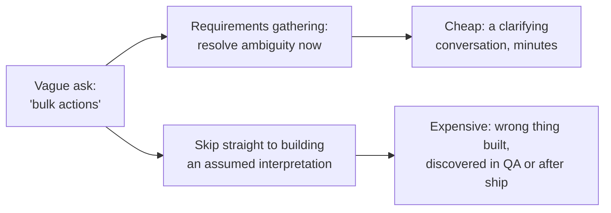
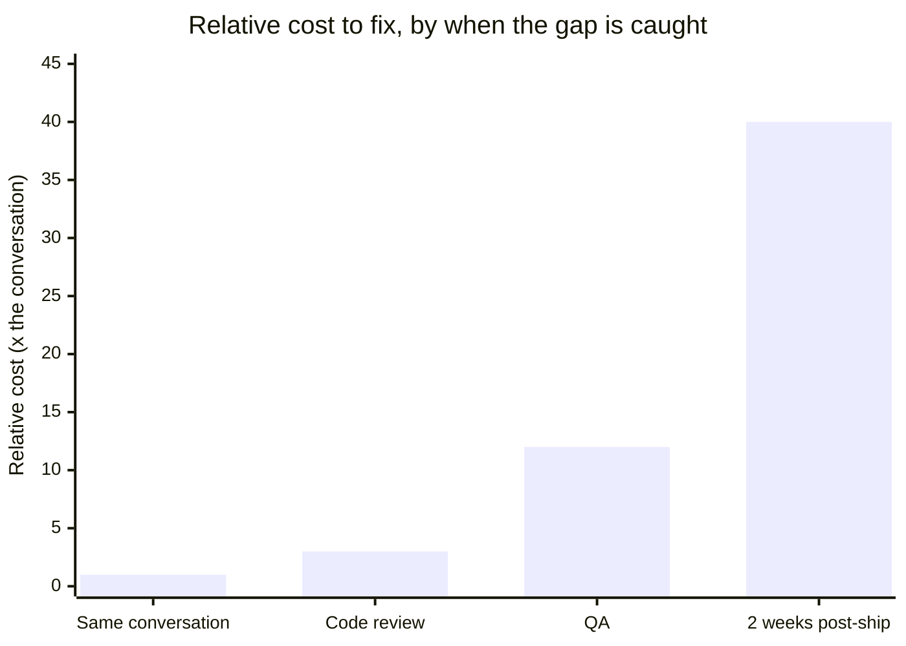

import LevelIntro from "../../../components/LevelIntro.astro";
import Checkpoint from "../../../components/Checkpoint.astro";

L1 showed the shape of the mistake: Sam guessed at "bulk actions" instead
of asking, and shipped the wrong thing. This level looks at why that gap
is so much cheaper to close early than late, and gives the concrete tools
— falsifiable requirements, user stories, acceptance criteria — for
closing it before implementation starts.

<LevelIntro
  items={[
    "Why the same gap gets costlier the later it's caught",
    "Turning a vague ask into a falsifiable requirement",
    "User stories and acceptance criteria as shared, checkable tools",
  ]}
/>

## Why did the same two weeks of work cost so much more the second time?

Sam's first attempt at "bulk actions" (from L1) took about three days to
build and ship. Fixing it — after Elena flagged it as wrong — took another
four days: ripping out the delete flow, building status-change logic from
scratch, and adding the audit log entry nobody had mentioned. **The exact
same information (bulk status changes, not deletion, plus an audit log)
would have taken Sam and Elena about ten minutes to establish in a
conversation, before any code existed.** What made the same gap in
knowledge cost ten minutes in one telling and four days in the other?



The ambiguity in "bulk actions" doesn't disappear if it's not resolved up
front — it just moves downstream, to wherever someone first has to make a
concrete decision about what "bulk actions" actually means (which
operation, at what scale, with what side effects). Resolving it during a
conversation costs minutes; resolving it after the wrong thing has been
built and shipped costs the entire implementation cycle, redone. And the
cost doesn't grow at a flat rate — the later the gap is caught, the more
work sits on top of the wrong assumption:

The numbers in the chart are illustrative, not a measurement from this
team. They make one pattern visible: the later an unclear requirement is
discovered, the more already-built work may need to be rethought.



Catching a wrong assumption in the same conversation costs roughly the
conversation itself. Catching it in code review means some implementation
work is thrown away. Catching it in QA means implementation _and_ test
work are thrown away, and the schedule slips. Catching it after ship — as
happened to Sam — means all of that, plus the cost of whatever the
stakeholder did wrong or didn't do at all in the two weeks the tool didn't
actually help them.

## Turning a vague ask into a falsifiable requirement

| Vague ask                        | Clarifying questions to ask                                                   | Resulting falsifiable requirement                                                                                                                     |
| -------------------------------- | ----------------------------------------------------------------------------- | ----------------------------------------------------------------------------------------------------------------------------------------------------- |
| "We need bulk actions"           | What workflow does this replace? What operation, specifically? What scale?    | "Reviewers can select multiple accounts and change their status in one action; tested up to 50 selections; deletion is out of scope"                  |
| "Make the dashboard faster"      | Faster at what, specifically? How much faster is enough? For which users?     | "Initial dashboard load completes in under 2 seconds on a typical broadband connection, for the 95th percentile of users"                             |
| "Add a way to filter the report" | Filter by what fields? Single or multiple selection? Does it need to persist? | "Users can filter the report by date range and status, selecting multiple statuses at once; the filter persists across page reloads within a session" |

Each right-column requirement can be checked by someone who wasn't in the
original conversation — that's the actual test for "falsifiable": a new
engineer, or QA, or the original requester six months later, can look at
the built thing and the requirement side by side and get the same yes/no
answer independently.

Two phrases in that table are easy to overread. **95th percentile** means
roughly "even the 95th slowest user out of 100 should pass this target,"
not just the average user. **Persists** means the filter stays applied
after the page reloads, instead of disappearing.

<Checkpoint question="A stakeholder says 'the search should feel more responsive.' Is that already a falsifiable requirement, or does it still need work — and if it needs work, what's the one question that would turn it into one?">

It still needs work — "feel more responsive" has no concrete way to check
whether it's been met, so two people could disagree about whether it's
done even after looking at the same finished feature. The question that
closes the gap is something like "how fast is fast enough, and measured
how?" — for example, asking for a specific latency target and the
condition it should hold under (a typical connection, a specific
percentile of users). Once the answer comes back as a number with a
measurable condition attached, like "results appear within 300ms for 95%
of searches," anyone can independently check it against the shipped
feature and get the same yes/no answer, which is exactly what "feel more
responsive" could never provide on its own.

</Checkpoint>

## User stories: capturing who and why, not just what

**If Sam's requirement had only said "bulk status changes for accounts," would he have known to add an audit log entry?** Almost certainly not — nothing in "bulk status changes" implies logging. This is exactly the gap a user story's "so that" clause exists to close.

A user story is a short way to write three things together: who needs the
change, what capability they need, and why that capability matters.

```
As a [role], I want [capability], so that [benefit].

Example:
As an account reviewer, I want to select multiple accounts and change
their status in one action, so that I can process a weekly batch of
verifications without updating each account individually.
```

The "so that" clause is doing real work beyond documentation — it's what
lets an engineer make a reasonable call on a detail the story didn't
explicitly cover. If a question comes up mid-implementation ("should this
log the same way single-item changes do?"), the answer isn't guessable
from "change status in one action" alone, but it _is_ reasonably inferable
once the reason is stated: the story exists to replace an existing,
already-logged workflow, so silently dropping the logging would undermine
the very thing the story is for.

<Checkpoint question="Two engineers are handed the same user story but only one of them reads the 'so that' clause before starting. Mid-build, an edge case comes up that the acceptance criteria don't cover. Which engineer is better positioned to make a reasonable call on it, and why?">

The one who read the "so that" clause. The rest of the story describes the
capability being built, but the "so that" clause describes the underlying
reason it's needed — and a reason generalizes to cases the acceptance
criteria never explicitly listed, while the capability description alone
does not. An engineer who only knows "select multiple accounts and change
their status" has no basis for guessing whether an uncovered edge case
should preserve some existing behavior; an engineer who also knows the
story exists to replace "clicking into each account individually to
verify a weekly batch" can reason that anything the current one-at-a-time
workflow already guarantees — like an audit log entry — should probably
still hold in the bulk version, even though nobody wrote that down as a
separate line item.

</Checkpoint>

## Acceptance criteria: the falsifiable checklist

```
Story: As an account reviewer, I want to select multiple accounts and
       change their status in one action, so that I can process a weekly
       batch of verifications without updating each account individually.

Acceptance criteria:
- [ ] Multi-select checkboxes on the account list
- [ ] A status-change control appears when 1+ accounts are selected
- [ ] Applying a change updates all selected accounts and creates one
      audit log entry per account, consistent with single-item changes
- [ ] Bulk delete is explicitly OUT of scope for this story
```

**Out of scope** means "not promised in this version," even if it sounds
related. Writing that down prevents the team from silently assuming
delete is included just because the phrase "bulk actions" was broad.

Without acceptance criteria, "done" is a private judgment call made
twice — once by whoever built it, once by whoever asked for it — and those
two judgment calls agreeing is a matter of luck, not design. A checklist
like this is exactly what makes "done" a shared, checkable fact instead of
two potentially different opinions.

| Without acceptance criteria                       | With acceptance criteria                                       |
| ------------------------------------------------- | -------------------------------------------------------------- |
| "Done" is whatever the builder judged sufficient  | "Done" is a checklist anyone can independently verify          |
| Disagreements surface after delivery, expensively | Disagreements surface while writing the checklist, cheaply     |
| Scope (e.g. "is delete included?") stays implicit | Scope is explicit — including what's deliberately out of scope |
