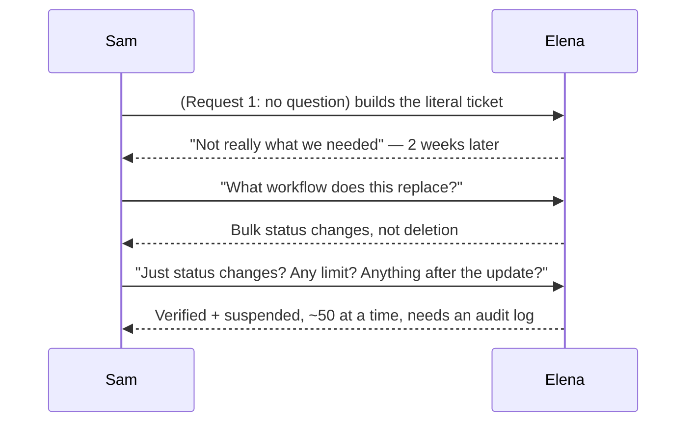
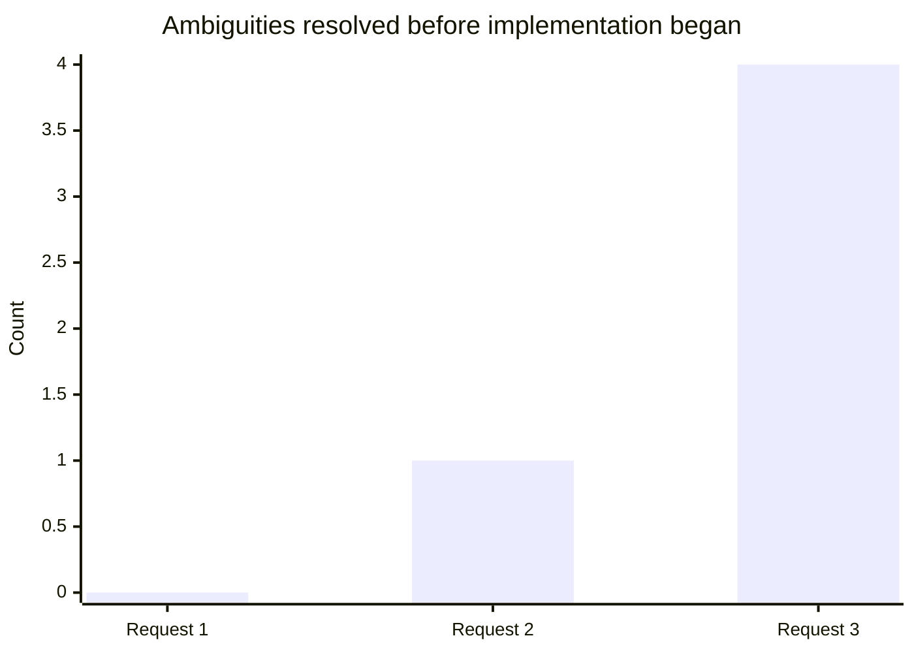

import Scenario from "../../../components/Scenario.astro";

<Scenario label="The scenario">
  <Fragment slot="facts">
    <div class="not-prose flex flex-col gap-1.5 text-sm text-slate-700 dark:text-slate-300">
      <div class="flex items-center gap-1.5"><span>🎫</span> Ticket: "We need bulk actions on the admin panel."</div>
      <div class="flex items-center gap-1.5"><span>👩‍💼</span> Elena — ops lead, files the ticket</div>
      <div class="flex items-center gap-1.5"><span>🧑‍💻</span> Sam — engineer, picks up the ticket</div>
      <div class="flex items-center gap-1.5"><span>🔁</span> Same ticket, same facts available — three different ways Sam could handle it</div>
    </div>

    <p class="not-prose mt-3 mb-1 text-xs font-semibold tracking-wide text-slate-400 uppercase">Elena's actual workflow</p>
    <div class="not-prose flex flex-col gap-1 text-sm text-slate-700 dark:text-slate-300">
      <div class="flex items-center gap-1.5"><span>📥</span> 30-50 new accounts/week to verify</div>
      <div class="flex items-center gap-1.5"><span>🖱️</span> Today: opens each one, sets status, saves — one at a time</div>
      <div class="flex items-center gap-1.5"><span>🧾</span> Compliance requires an audit log entry per change, today</div>
    </div>

  </Fragment>

A stakeholder submits a ticket: "We need bulk actions on the admin panel."
That's the entire ask as written. What follows is three different ways
Sam could pick this ticket up — same words, same stakeholder, same facts
sitting one conversation away — and what each one actually produces.

</Scenario>

## Request 1: build the literal ticket

**Sam does:** reads "bulk actions on the admin panel," decides that
reasonably means multi-select plus a delete button (the most common "bulk
action" pattern he's seen elsewhere), and builds it: checkboxes on each
row, a "Delete selected" button, a confirmation dialog. No questions
asked — the ticket read like enough to start from.

**Result, two weeks later:** Elena reports it's "not really what we
needed." What she actually wanted was **bulk status updates** (marking
many accounts "verified" at once), not bulk deletion — deletion isn't
part of her workflow at all, and the confirmation dialog she never asked
for adds friction to an action she doesn't use. Sam built a real, working
feature — just not the one that was needed, because "bulk actions" was
never specified beyond the two words in the ticket.

## Request 2: one clarifying question, but not enough of them

**Sam asks:** "When you say bulk actions — what's the specific workflow
this would replace?"

**Elena answers:** "Every week we get a batch of maybe 30-50 new accounts
to verify. Right now I click into each one, change its status to
'verified,' and save — one at a time."

**Sam builds:** multi-select checkboxes and a "Verified" status button.
Closer — this is the actual operation Elena needs. But Sam stopped asking
after the first answer. He never found out that Elena also occasionally
needs to bulk-mark accounts "suspended," and he never found out that every
existing single-item status change creates a compliance audit log entry —
something Elena didn't think to restate, because to her it's just how
status changes already work. The bulk version ships without it, and it
takes a compliance review to notice the gap.

## Request 3: scoped, and probed for what wasn't said

**Sam asks a second round:** "Got it — is deletion or any other bulk
operation part of this, or just the status change? And is there a limit
on how many you'd select at once, or anything that needs to happen after
the update — a notification, a log entry — for compliance reasons?"

**Elena answers:** "Just status changes for now. Verified is the main
one, but occasionally 'suspended' too. Usually under 50 at a time. And
yes — we need an audit log entry showing who did the bulk change and
when, same as we require for single-item changes today."

**Resulting story:**

```
As an account reviewer, I want to select multiple accounts and change
their status in one action, so that I can process a weekly batch of
verifications without updating each account individually.

Acceptance criteria:
- [ ] Multi-select checkboxes on the account list
- [ ] A status-change control appears when 1+ accounts are selected,
      offering "Verified" and "Suspended" (matching existing single-item
      options)
- [ ] Applying a status change updates all selected accounts and creates
      one audit log entry per account, consistent with single-item changes
- [ ] No upper limit is enforced in v1, but the UI is tested up to 50
      selections (the stated typical batch size)
- [ ] Bulk delete is explicitly OUT of scope for this story
```



## What changed across the three requests, counted

This isn't a vague impression of "the later requests were better" — it's
countable directly from what each conversation actually surfaced. Counting
concrete, checkable facts resolved before any code was written (the
operation, the scale, the compliance requirement — not word count, which
doesn't track this at all):



Request 1 (0): no question asked, so nothing was resolved before
building — every detail was Sam's guess. Request 2 (1): one fact resolved
(the operation is status changes, not deletion) — real progress, but the
conversation stopped one round too early. Request 3 (4): operation,
allowed statuses, scale, and the audit-log requirement — everything
needed to write the acceptance criteria above was on the table before
implementation started.

## At a glance

| &nbsp;                    | Request 1: no question          | Request 2: one question, then stop      | Request 3: probed for what wasn't said              |
| ------------------------- | ------------------------------- | --------------------------------------- | --------------------------------------------------- |
| **What Sam learns**       | Nothing checkable               | The core operation (status change)      | The operation, scale, and the audit-log requirement |
| **What gets built**       | The wrong feature (bulk delete) | The right operation, missing compliance | The actual requirement, acceptance-criteria-ready   |
| **When the gap is found** | Two weeks after ship            | During a compliance review, post-ship   | Before a line of code is written                    |

## Failure modes

| Failure                                                  | What it looks like                                                                                      | The fix                                                                                                                                                     |
| -------------------------------------------------------- | ------------------------------------------------------------------------------------------------------- | ----------------------------------------------------------------------------------------------------------------------------------------------------------- |
| Treating the first-mentioned solution as the requirement | "Bulk actions" already smuggled in an assumption (that deletion-style bulk actions were the model)      | Ask what workflow is being replaced before assuming what operation is meant                                                                                 |
| Stopping after one clarifying question                   | Request 2: learns the operation, never asks about scale or implicit norms like logging                  | Keep probing until scope, scale, and existing norms are all covered — not just the first answer                                                             |
| Treating requirements as frozen once gathered            | Mid-build, Sam discovers the account list has 10,000+ rows, making unpaginated multi-select impractical | Go back to Elena with the new information — don't silently pick an interpretation and hope it's close enough                                                |
| Writing acceptance criteria that describe implementation | "Use a `Set` to track selected IDs" is an implementation detail, not an acceptance criterion            | A criterion should be checkable by someone who never sees the code — the falsifiability test from L2                                                        |
| Skipping this step because the request "feels small"     | "Bulk actions" was two words in a ticket                                                                | The size of the request text has no relationship to how much ambiguity it hides — scope the conversation to the actual ambiguity, not the length of the ask |

## Beyond this example

Sam and Elena's ticket is one case, not the whole territory — a few
questions to test whether the model actually transferred:

- What changes if the stakeholder isn't available for a second round of
  questions — say, Elena is on leave and Sam only gets one async message
  before a deadline? Does Request 2's "one question, then stop" become the
  realistic ceiling, and if so, which single question would recover the
  most value?
- What if Elena's answer to the scale question had been "thousands, not
  dozens"? Would the resulting acceptance criteria need to change beyond
  just the number — does "no upper limit enforced in v1" still hold?
- Where in your own queue is there a ticket that reads like "bulk
  actions" — short, plausible, and quietly hiding an implicit norm (a
  compliance rule, an existing convention) that nobody will think to
  restate unless it's specifically asked about?
