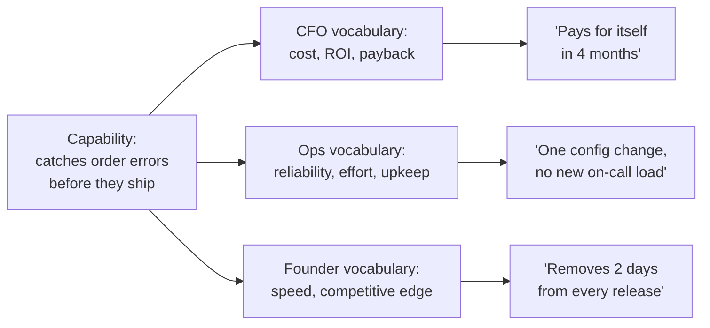

import LevelIntro from "../../../components/LevelIntro.astro";
import Checkpoint from "../../../components/Checkpoint.astro";

L1 named the problem: one pitch, three stakeholders, three different
jobs, and a generic framing that answered none of their questions. L2
works out the actual method — how to figure out who is in the room,
what each of them is accountable for, and how to translate one
capability into each person's vocabulary before the pitch happens.

<LevelIntro
  items={[
    "The stakeholder map: accountability, vocabulary, translation",
    "One capability branching into three framings",
    "Finding out who's in the room before you pitch",
  ]}
/>

## Why "know your audience" isn't specific enough here

**If everyone already agrees you should "know your audience," why do
pitches like the one in L1 still go generic?** Because "know your
audience" is usually applied at the level of the whole company being
pitched, not at the level of the individual people sitting in the
room — a vendor can correctly research that they're selling to a
mid-size logistics company and still walk in with one script, because
nobody asked what each specific person in that room is personally on
the hook for. The fix isn't more audience research in general; it's a
concrete map from **who's in the room** to **what they're
accountable for** to **what they listen for**.

## The stakeholder map

| Stakeholder                     | Accountable for                                  | Listens for                                     | A capability translated for them                                                                  |
| ------------------------------- | ------------------------------------------------ | ----------------------------------------------- | ------------------------------------------------------------------------------------------------- |
| **CFO / finance stakeholder**   | The budget, and whether spending is justified    | Cost, ROI, payback period, budget risk          | "This pays for itself in 4 months by cutting the cost of fixing shipped errors."                  |
| **Ops / technical stakeholder** | Whether things keep running, day to day          | Reliability, uptime, integration effort, upkeep | "It plugs into the existing order pipeline with one config change and needs no new on-call load." |
| **Founder / exec stakeholder**  | Whether the company is moving fast enough to win | Speed to market, competitive position, growth   | "It removes the manual review step that currently slows every release by two days."               |

Read the table by row, not just by column: each row is the **same
underlying capability** — a tool that catches order errors before
they ship — described three separate times, once per stakeholder,
using only the terms that stakeholder already uses to judge whether
something is worth doing. Nothing in any cell is invented; each is a
true fact about the product, restated in different vocabulary.

One box on the left, three separate paths out of it — the capability
never changes shape, only the vocabulary attached to it does.

<Checkpoint question="A vendor tells an ops lead: 'this saves the company $40,000 a year.' Using the map above, is that translated into the ops lead's vocabulary, or someone else's?">

That's the CFO's vocabulary, not the ops lead's — a dollar-savings
figure answers "is this worth the budget," which is the CFO's
question, not "will this make my job harder or my systems less
reliable," which is what an ops lead is actually accountable for. The
capability might genuinely save $40,000 a year, but stating it that
way to an ops lead asks them to do a translation themselves (from a
dollar figure back to "so does this add integration work or new
failure points for me?") instead of answering their real question
directly. The ops-translated version would talk about how it plugs
into the existing pipeline and whether it adds on-call burden — not
what it costs or saves the company.

</Checkpoint>

## Translating one capability three ways

**Given one true fact about a product, how do you actually produce
three different, honest framings of it?** The method is the same
three-step move for every stakeholder:

1. **State the capability plainly, with no framing yet** — what the
   product actually does, as a neutral fact ("it catches order
   errors before they ship").
2. **Ask what this stakeholder is accountable for** — using the map
   above, or direct knowledge of their role, not a guess.
3. **Restate the capability as an answer to the question that
   accountability implies** — not a new claim, the same fact, phrased
   so the connection to their job is immediate rather than something
   they have to infer.

This differs from the general "so what" ladder used in _value framing
over feature framing_ in one specific way: that ladder climbs from a
feature toward value for **one** listener. Here, the same value-level
fact still has to be re-aimed multiple times, once per stakeholder,
because "value" itself isn't singular in a multi-stakeholder deal —
what counts as value to the CFO isn't what counts as value to the ops
lead, even though both are legitimately past the feature stage.

## Finding out who's actually in the room

**None of this works if you don't know, before the pitch, who is
sitting across the table and what they're accountable for — so how do
you find that out?** A few concrete, low-friction ways:

- **Ask directly, before the meeting.** "Who else will be joining, and
  what does each of them own?" is a normal scheduling question, not an
  intrusive one — most people answer it plainly.
- **Read titles literally, then verify.** A title like "VP of
  Operations" is a strong hint, not a guarantee — the actual scope of
  what someone owns can differ from the title, so a short confirming
  question ("what's the piece of this you're most focused on?") early
  in the meeting is worth the thirty seconds it costs.
- **Watch what each person asks about first.** The first question
  someone asks in a meeting is usually a live clue to what they're
  actually accountable for, even if their title didn't make it
  obvious — a "how does this affect our current uptime numbers"
  question reveals an ops accountability regardless of the badge they
  wear.
- **When in doubt, prepare more than one framing and lead with the
  neutral capability first.** If the room's makeup is genuinely
  unclear beforehand, state the capability plainly first (step 1
  above), then watch which follow-up question comes back, and
  translate live from there rather than guessing wrong up front.

<Checkpoint question="A salesperson is told only that they're meeting 'someone from the client side' with no title given. Based on the discovery methods above, what's the single best first move once the meeting starts, before pitching anything?">

Ask a direct, low-friction question about what that person is
focused on, or watch for it in how they open the conversation — either
one gives a real signal instead of a guess. Guessing from vague
context risks translating the capability into the wrong vocabulary
before the conversation even starts, which is exactly the failure
from L1's first meeting: a generic pitch landed flat because nobody
had confirmed who was actually listening or what they were
accountable for. A thirty-second confirming question costs almost
nothing and removes that risk entirely, so it's the better move than
opening with a framing chosen on a guess.

</Checkpoint>

## Failure modes at this level

- **Translating into the wrong stakeholder's vocabulary.** Handing a
  cost figure to an ops lead, or an uptime figure to a CFO, still
  leaves each of them doing translation work themselves — the fact
  reached them, but not in a form that answers what they're
  accountable for.
- **Assuming one person in the room speaks for everyone.** A founder
  saying yes doesn't mean the CFO or ops lead are convinced — each
  stakeholder needs their own translation, not a single pitch aimed
  at whoever seems most senior.
- **Guessing a role from a title and never confirming it.** Titles are
  a hint, not a certainty; treating them as certain skips the
  thirty-second check that would have caught a wrong guess.
